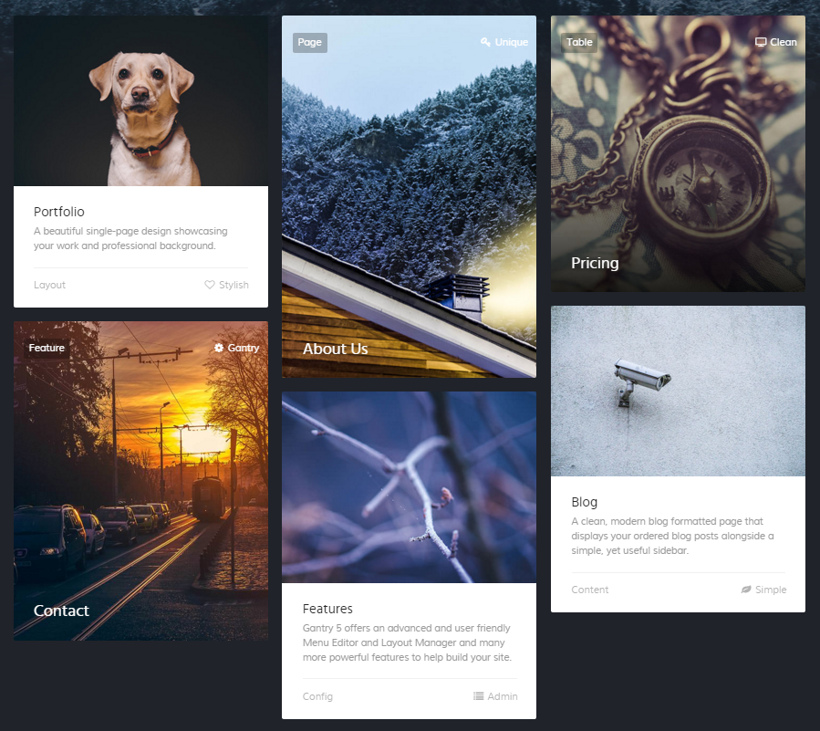
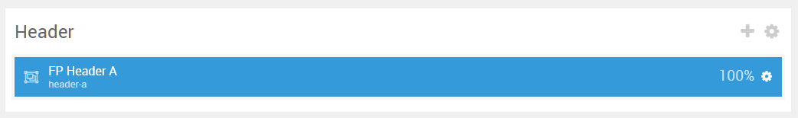

## Introduction

The **Header** section includes a single **Mosaic Grid** particle assigned to the **Header A** module position.

Here is a breakdown of the module(s) and particle(s) that appear in this section:

* [Mosaic Grid (particle)](#mosaic-grid-(particle)-1)

## Section Settings

| Option           | Setting                   |
| :--------------- | :----------               |
| Layout           | Fullwidth (Boxed Content) |
| CSS Classes      | Blank                     |
| Tag Attributes   | Blank                     |

## Mosaic Grid (Particle) 1

The **Mosaic Grid** particle is a **Gantry 5 Particle** module placed within the **header-a** module position. Adding a particle to a module position can be done by creating a **Gantry 5 Particle** module, adding the particle using the settings found in the section below, and assigning it to the position.

### Module Position Particle Settings

#### Particle Settings

| Option        | Setting       |
| :-----        | :-----        |
| Particle Name | `FP Header A` |
| Key           | `header-a`    |
| Chrome        | `gantry`      |

#### Block Settings

| Option         | Setting   |
| :-----         | :-----    |
| CSS ID         | Blank     |
| CSS Classes    | Blank     |
| Variations     | Blank     |
| Tag Attributes | Blank     |
| Fixed Size     | Unchecked |
| Block Size     | `100%`    |

### Mosaic Grid Particle Settings

#### Particle Settings

| Option                    | Setting                     |
| :-----                    | :-----                      |
| Particle Name             | `Mosaic Grid`               |
| CSS Classes               | Blank                       |
| Title                     | Blank                       |
| Grid Columns              | 3 Columns                   |
| Item 1 Name               | `Item 1`                    |
| Item 1 Style              | Style 1                     |
| Item 1 Image              | Custom                      |
| Item 1 Title Label        | `Portfolio`                 |
| Item 1 Title Link         | `index.php/pages/portfolio` |
| Item 1 Title Link Target  | Self                        |
| Item 1 Description        | ``                          |
| Item 1 Animations         | `g-mosaicgrid-zoom`         |
| Item 1 Button Label       | Blank                       |
| Item 1 Button Link        | Blank                       |
| Item 1 Button Link Target | Self                        |
| Item 1 Button Classes     | Blank                       |
| Tag                       | `Layout`                    |
| Tag Icons 1 Name          | `Tag 1`                     |
| Tag Icons 1 Icon          | `fa fa-heart-o-fa-fw`       |
| Tag Icons 1 Icon Text     | `Stylish`                   |