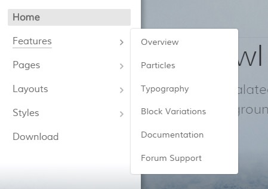
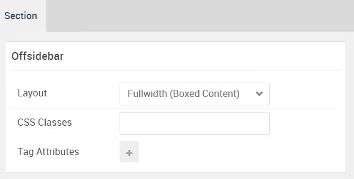

## Introduction

The **Offsidebar** section includes a single **Menu** particle. This section is activated by an **OffSidebar Toggle** particle placed in the **Navigation** section.

Here is a breakdown of the module(s) and particle(s) that appear in this section:

* [Menu (particle)](#menu-(particle))

## Section Settings

| Option           | Setting                   |
| :--------------- | :----------               |
| Layout           | Fullwidth (Boxed Content) |
| CSS Classes      | Blank                     |
| Tag Attributes   | Blank                     |

## Menu (Particle)

### Particle Settings

| Option        | Setting                               |
| :-----        | :-----                                |
| Particle Name | `Menu`                                |
| Menu          | Use Default Menu                      |
| Base Item     | Active                                |
| Start Level   | 1                                     |
| Max Levels    | 0                                     |
| Render Titles | Unchecked                             |
| Mobile Target | Unchecked                             |

### Block Settings

| Option         | Setting   |
| :-----         | :-----    |
| CSS ID         | Blank     |
| CSS Classes    | Blank     |
| Variations     | Blank     |
| Tag Attributes | Blank     |
| Fixed Size     | Unchecked |
| Block Size     | `100%`    |