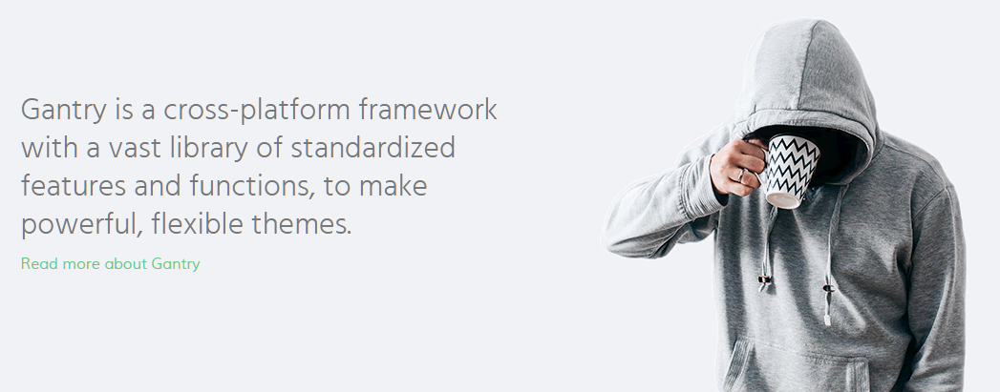
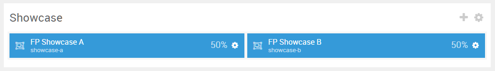
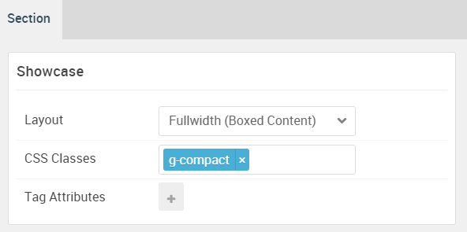

## Introduction

:   1. **Custom HTML** [10%, 5%, se]
    2. **Logo / Image** [65%, 5%, se]

The **Showcase** section includes a **Custom HTML** and a **Logo / Image** particle assigned to the **Showcase A** and **Showcase B** module positions.

Here is a breakdown of the module(s) and particle(s) that appear in this section:

* [Custom HTML (particle)](#custom-html-(particle))
* [Logo / Image (Particle)](#logo-image-(particle))

## Section Settings

| Option           | Setting                   |
| :--------------- | :----------               |
| Layout           | Fullwidth (Boxed Content) |
| CSS Classes      | `g-compact`               |
| Tag Attributes   | Blank                     |

## Custom HTML (Particle)

The **Custom HTML** particle is a **Gantry 5 Particle** module placed within the **showcase-a** module position. Adding a particle to a module position can be done by creating a **Gantry 5 Particle** module, adding the particle using the settings found in the section below, and assigning it to the position.

### Module Position Particle Settings

#### Particle Settings

| Option        | Setting         |
| :-----        | :-----          |
| Particle Name | `FP Showcase A` |
| Key           | `showcase-a`    |
| Chrome        | `gantry`        |

#### Block Settings

| Option         | Setting             |
| :-----         | :-----              |
| CSS ID         | Blank               |
| CSS Classes    | `g-center-vertical` |
| Variations     | Blank               |
| Tag Attributes | Blank               |
| Fixed Size     | Unchecked           |
| Block Size     | `50%`               |

### Custom HTML Particle Settings

#### Particle Settings

| Option             | Setting       |
| :-----             | :-----        |
| Particle Name      | `Custom HTML` |
| Process Shortcodes | Unchecked     |

**Custom HTML**

~~~ .html
<h2 class="g-title">Gantry is a cross-platform framework with a vast library of standardized features and functions, to make powerful, flexible themes.</h2>

<a href="http://www.gantry.org" class="readon">Read more about Gantry</a>

~~~

## Logo Image (Particle)

The **Logo / Image** particle is a **Gantry 5 Particle** module placed within the **showcase-b** module position. Adding a particle to a module position can be done by creating a **Gantry 5 Particle** module, adding the particle using the settings found in the section below, and assigning it to the position.

### Module Position Particle Settings

#### Particle Settings

| Option        | Setting         |
| :-----        | :-----          |
| Particle Name | `FP Showcase B` |
| Key           | `showcase-b`    |
| Chrome        | `gantry`        |

#### Block Settings

| Option         | Setting                            |
| :-----         | :-----                             |
| CSS ID         | Blank                              |
| CSS Classes    | `nomarginbottom` `nopaddingbottom` |
| Variations     | Blank                              |
| Tag Attributes | Blank                              |
| Fixed Size     | Unchecked                          |
| Block Size     | `50%`                             |

### Logo / Image Particle Settings

#### Particle Settings

| Option        | Setting        |
| :-----        | :-----         |
| Particle Name | `Logo / Image` |
| URL           | Blank          |
| Image         | Custom         |
| Text          | Blank          |
| CSS Classes   | Blank          |
