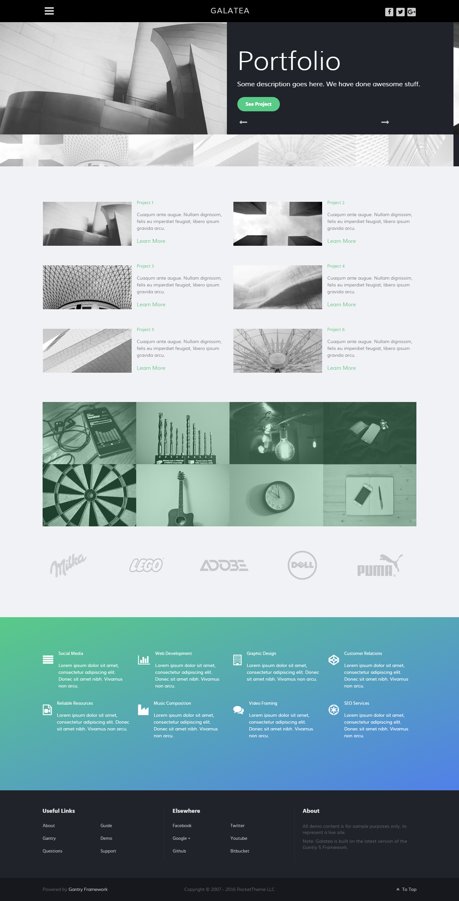
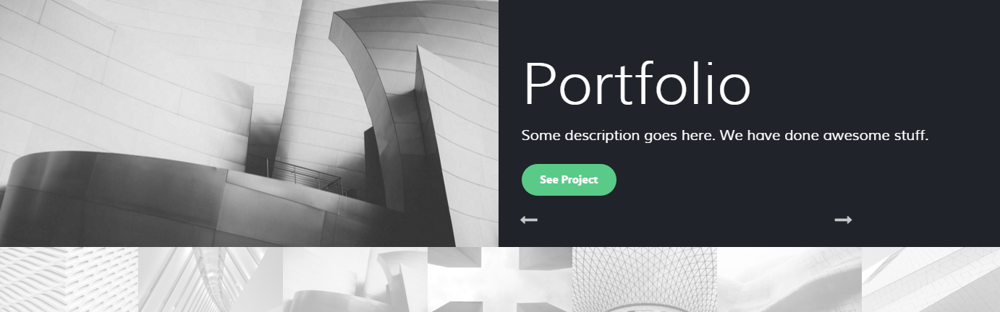
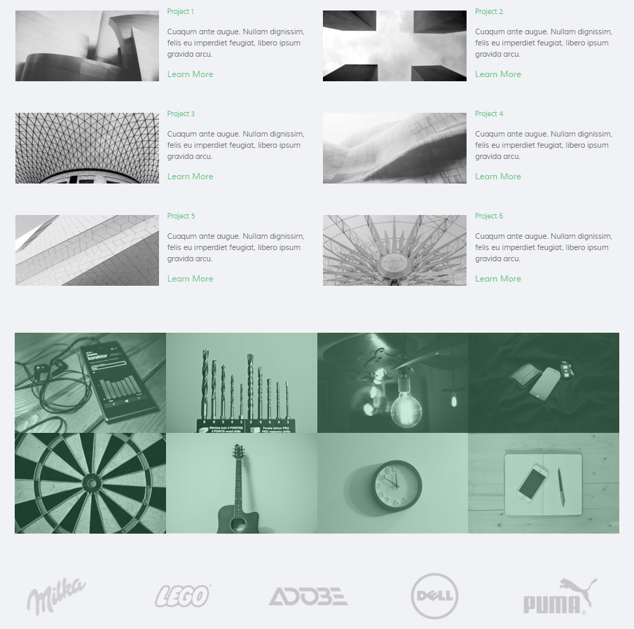
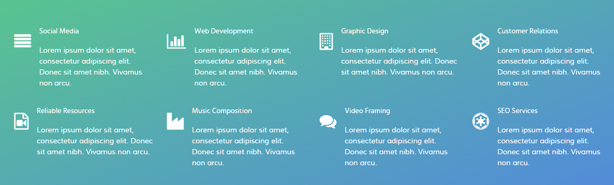
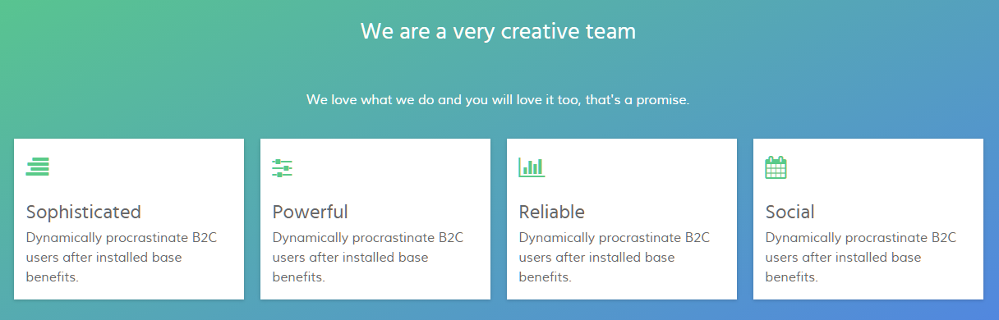

## Introduction

The **Portfolio** example page demonstrates how you can create a beautiful page with the Galatea template. Here is some information to help you replicate this page as it appears in the demo.

## Modules and Particles

Below is a brief rundown of the modules and particles used to make up the demo page.

:   1. **Header - Info List (particle)** [5%, 45%, se]
    2. **Above - Content List (particle)** [13%, 6%, se]
    3. **Mainbar - Promo Image (particle)** [28%, 6%, se]
    4. **Expanded - Info List (particle)** [53%, 6%, se]
    5. **Extension - Info List (particle)** [65%, 30%, se]
    6. **Bottom - Custom HTML (Module)** [78%, 8%, se]
    7. **Bottom - Newsletter (Particle)** [78%, 35%, se]
    8. **Bottom - Custom HTML (Module)** [78%, 65%, se]

1. [Header](#header-section)
2. [Above](#above-section)
3. [Mainbar](#mainbar-section)
4. [Expanded](#expanded-section)
3. [Extension](#extension-section)
4. [Bottom](#bottom-section)

## Header Section

This area of the page is an **Info List** particle. You will find the settings used in our demo below.

### Info List Particle

#### Gantry 5 Particle Module Details

| Field      | Setting             |
| :-----     | :-----              |
| Title      | `Portfolio - Header` |
| Show Title | Hide                |
| Position   | `header-a`          |
| Status     | Published           |

### Particle Settings

| Option                              | Setting                                |
| :----------                         | :----------                            |
| CSS Classes                         | `center`, `g-layercontent`, `noborder` |
| Title                               | Blank                                  |
| Intro                               | Blank                                  |
| Grid Column                         | 1 Column                               |
| Info Lists Item 1 Name              | `Portfolio`                            |
| Info Lists Item 1 Image             | Blank                                  |
| Info Lists Item 1 Image Location    | Left                                   |
| Info Lists Item 1 Text Style        | Header                                 |
| Info Lists Item 1 Image Style       | Compact                                |
| Info Lists Item 1 Description       | `What We Have Already Done`            |
| Info Lists Item 1 Tag               | Blank                                  |
| Info Lists Item 1 Sub Tag           | Blank                                  |
| Info Lists Item 1 Label             | Blank                                  |
| Info Lists Item 1 Link              | Blank                                  |
| Info Lists Item 1 Icon              | Blank                                  |
| Info Lists Item 1 Read More Classes | Blank                                  |

## Above Section

This area of the page is a **Content List** particle rendered via a **Gantry 5 Particle** module placed in the `above-a` position.

### Content List (Particle)

#### Gantry 5 Particle Module Details

| Field      | Setting                   |
| :-----     | :-----                    |
| Title      | `Galatea Premium Project` |
| Show Title | Hide                      |
| Position   | `above-a`                 |
| Status     | Published                 |

#### Details

| Field                    | Setting                                                                                                                                                                                                                         |
| :-----                   | :-----                                                                                                                                                                                                                          |
| Particle Name            | `Content List`                                                                                                                                                                                                                  |
| CSS Classes              | Blank                                                                                                                                                                                                                           |
| Title                    | Blank                                                                                                                                                                                                                           |
| Image                    | Custom                                                                                                                                                                                                                          |
| Image Tag                | `On Going`                                                                                                                                                                                                                      |
| Headline                 | `Galatea Premium Project`                                                                                                                                                                                                       |
| Subtitle                 | `Website Redesign and Publishing`                                                                                                                                                                                               |
| Description              | `Collaboratively administrate empowered markets via plug-and-play networks. Dynamically procrastinate B2C users after installed base benefits. Dramatically visualize customer directed convergence without revolutionary ROI.` |
| Label                    | `Check Project`                                                                                                                                                                                                                 |
| Link                     | `#`                                                                                                                                                                                                                             |
| Icon                     | Blank                                                                                                                                                                                                                           |
| Read More Classes        | Blank                                                                                                                                                                                                                           |
| Grid Column              | 2 Columns                                                                                                                                                                                                                       |
| Content List Item 1 Name | `Mr. Great Client`                                                                                                                                                                                                              |
| Content List Item 1 Icon | `fa fa-user fa-fw`                                                                                                                                                                                                              |
| Content List Item 1 Text | `Mr. Great Client`                                                                                                                                                                                                              |
| Content List Item 1 Link | Blank                                                                                                                                                                                                                           |

## Mainbar Section

This area of the page is a series of six **Promo Image** particles. We have included the details of one of these particles, placed in the `mainbar-a` module position, below.

### Promo Image (Particle)

#### Gantry 5 Particle Module Details

| Field      | Setting                |
| :-----     | :-----                 |
| Title      | `Magazine Promo Image` |
| Show Title | Hide                   |
| Position   | `mainbar-a`            |
| Status     | Published              |

#### Details

| Field                        | Setting                                                                     |
| :-----                       | :-----                                                                      |
| Particle Name                | `Promo Image`                                                               |
| Title                        | `Magazine`                                                                  |
| Promo Image                  | Custom                                                                      |
| Promo Image Title            | `Magazine`                                                                  |
| Description                  | `Short project description here`                                            |
| Icon Button                  | `fa fa-file-text-o`                                                         |
| Icons                        | Blank                                                                       |

## Extension Section

This area of the page is an **Info List** particle rendered via a **Gantry 5 Particle** module placed in the `extension-a` position.

### Info List (Particle)

#### Gantry 5 Particle Module Details

| Field      | Setting             |
| :-----     | :-----              |
| Title      | `Upcoming Projects` |
| Show Title | Hide                |
| Position   | `extension-a`       |
| Status     | Published           |

#### Details

| Field                        | Setting                                                                     |
| :-----                       | :-----                                                                      |
| Particle Name                | `Info List`                                                                 |
| CSS Classes                  | Blank                                                                       |
| Title                        | `Upcoming Projects`                                                         |
| Intro                        | Blank                                                                       |
| Grid Column                  | 3 Columns                                                                   |
| Info List Item 1 Name        | `404 Pages`                                                                 |
| Info List Item 1 Location    | Left                                                                        |
| Info List Item 1 Text Style  | Compact                                                                     |
| Info List Item 1 Image Style | Compact                                                                     |
| Info List Item 1 Description | `Collaboratively administrate empowered markets via plug-and-play networks` |
| Info List Item 1 Tag         | Blank                                                                       |
| Info List Item 1 Sub Tag     | Blank                                                                       |
| Info List Item 1 Label       | Blank                                                                       |
| Info List Item 1 Link        | `#`                                                                         |
| Info List Item 1 Icon        | Blank                                                                       |
| Info List Item 1 CSS Classes | Blank                                                                       |

## Bottom Section

This area of the page is an **Info List** particle. You will find the settings used in our demo below.

### Info List Particle

#### Gantry 5 Particle Module Details

| Field      | Setting                                           |
| :-----     | :-----                                            |
| Title      | `Portfolio - 100% Satisfaction Guaranteed` |
| Show Title | Hide                                              |
| Position   | `bottom-a`                                        |
| Status     | Published                                         |

#### Particle Settings

| Option                              | Setting                                               |
| :----------                         | :----------                                           |
| CSS Classes                         | `center`, `g-layercontent`, `noborder`                |
| Title                               | Blank                                                 |
| Intro                               | Blank                                                 |
| Grid Column                         | 1 Column                                              |
| Info Lists Item 1 Name              | `100% Satisfaction Guaranteed`                        |
| Info Lists Item 1 Image             | Blank                                                 |
| Info Lists Item 1 Image Location    | Left                                                  |
| Info Lists Item 1 Text Style        | Header                                                |
| Info Lists Item 1 Image Style       | Compact                                               |
| Info Lists Item 1 Description       | `Will You be the Next to Join Our Happy Clients?`     |
| Info Lists Item 1 Tag               | Blank                                                 |
| Info Lists Item 1 Sub Tag           | Blank                                                 |
| Info Lists Item 1 Label             | `Join Now`                                            |
| Info Lists Item 1 Link              | `http://www.rockettheme.com/joomla/templates/galatea` |
| Info Lists Item 1 Icon              | Blank                                                 |
| Info Lists Item 1 Read More Classes | Blank                                                 |

## Bottom Section

:   1. **Custom HTML (Module)** [20%, 2%, se]
    2. **Newsletter (Particle)** [20%, 35%, se]
    3. **Custom HTML (Module)** [20%, 67%, se]

This area of the page is made up of three items. Two of them are **Custom HTML** modules, with a **Newsletter** particle in-between. These items are placed in the **Bottom A**, **Bottom B**, and **Bottom C** module positions which each are set at `33.3%` width.

### Custom HTML (Module)

The **Custom HTML** module here was placed in the **Bottom A** module position. The module position is created within the layout manager by using a **Module Position** particle. The particle is assigned `bottom-a` as a key and `gantry` as its Chrome.

Below, you will find the module settings we used in the demo:

### Module Settings

| Field      | Setting                                                                                                                                  |
| :-----     | :-----                                                                                                                                   |
| Title      | `About Galatea`                                                                                                                          |
| Content    | `Galatea is available for purchase or part of a club membership from RocketTheme, inclusive of the RocketLauncher, template and addons.` |
| Show Title | Show                                                                                                                                     |
| Position   | bottom-a                                                                                                                                 |

### Newsletter (Particle)

The **Newsletter** particle here was placed in the **Bottom B** widget position. The widget position is created within the layout manager by using a **Particle Position** particle. The particle is assigned `bottom-b` as a key and `gantry` as its Chrome.

Below, you will find the particle settings we used in the demo:

### Particle Settings

| Field          | Setting                                                                                       |
| :-----         | :-----                                                                                        |
| Particle Name  | `Newsletter`                                                                                  |
| CSS Classes    | Blank                                                                                         |
| Title          | `Subscribe Here`                                                                              |
| Heading Text   | `Subscribe to our newsletter and stay updated on the latest developments and special offers!` |
| InputBox Text  | `Email Address`                                                                               |
| Button Text    | `Join`                                                                                        |
| Feedburner URI | Custom                                                                                        |
| Button Classes | `button-4`                                                                                    |

### Custom HTML (Module)

The **Custom HTML** module here was placed in the **Bottom C** module position. The module position is created within the layout manager by using a **Module Position** particle. The particle is assigned `bottom-c` as a key and `gantry` as its Chrome.

Below, you will find the module settings we used in the demo:

### Module Settings

| Field      | Setting          |
| :-----     | :-----           |
| Title      | `Sample Sitemap` |
| Show Title | Show             |
| Position   | `bottom-c`       |

**Content**

~~~ .html

  

    <ul class="nomarginall noliststyle">
      <li><a href="index.php">Home</a></li>
      <li><a href="index.php?option=com_gantry5&amp;view=custom&amp;Itemid=105">Features</a></li>
      <li><a href="index.php?option=com_gantry5&amp;view=custom&amp;Itemid=106">TypographyContent</a></li>
      <li><a href="index.php?option=com_gantry5&amp;view=custom&amp;Itemid=168">Particles</a></li>
      <li><a href="index.php?option=com_content&amp;view=article&amp;id=3&amp;Itemid=107">Variations</a></li>
    </ul>
  

  

    <ul class="nomarginall noliststyle">
      <li><a href="index.php?option=com_gantry5&amp;view=custom&amp;Itemid=106">Buttons</a></li>
      <li><a href="index.php?option=com_gantry5&amp;view=custom&amp;Itemid=105">Pages</a></li>
      <li><a href="http://www.rockettheme.com/docs/joomla/templates/galatea">Guide</a></li>
      <li><a href="http://www.rockettheme.com/forum/joomla-template-galatea">Support</a></li>
      <li><a href="http://www.rockettheme.com/joomla/templates/galatea">Download</a></li>
    </ul>   
  
  

~~~