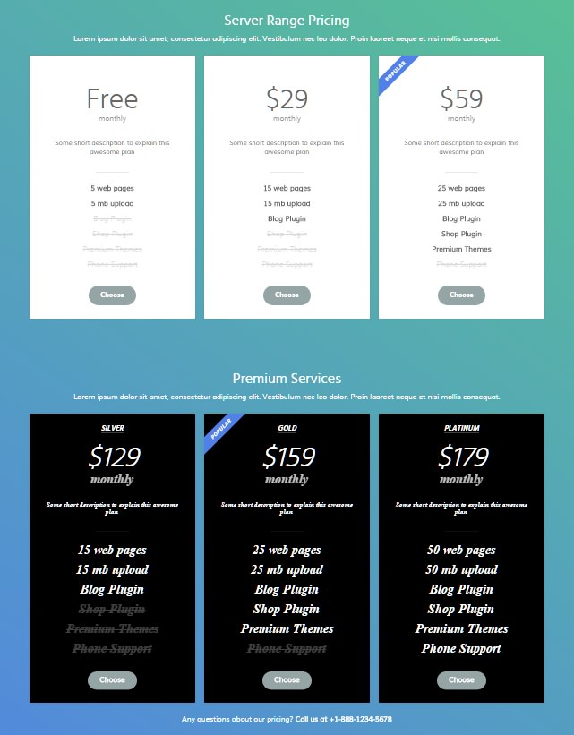

## Introduction

The **Pricing** example page demonstrates how you can create a beautiful page with the Galatea template. Here is some information to help you replicate this page as it appears in the demo.

## Modules and Particles

Below is a brief rundown of the modules and particles used to make up the demo page.

:   1. **Above** Custom HTML (particle) [7%, 5%, se]
    2. **Feature** Pricing Table (particle) [20%, 10%, se]
    3. **Feature** Pricing Table (particle) [50%, 10%, se]

* [Above](#above-section)
* [Feature](#feature-section)

# Above Section

This area of the page is a **Custom HTML** particle. You will find the settings used in our demo below.

## Section Settings

| Field          | Setting                   |
| :-----         | :-----                    |
| Layout         | Fullwidth (Boxed Content) |
| CSS Classes    | Blank                     |
| Tag Attributes | Blank                     |

## Particle Settings

| Option             | Setting       |
| :-----             | :-----        |
| Particle Name      | `Custom HTML` |
| Process Shortcodes | Blank         |

**Custom HTML**

~~~ .html
<h2 class="g-title">Gantry is a cross-platform framework with a vast library of standardized features and functions, to make powerful, flexible themes.</h2>

<a href="http://www.gantry.org" class="readon">Read more about Gantry</a>

~~~

## Block Settings

| Option         | Setting   |
| :-----         | :-----    |
| CSS ID         | Blank     |
| CSS Classes    | Blank     |
| Variations     | `Center`  |
| Tag Attributes | Blank     |
| Fixed Size     | Unchecked |
| Block Size     | `100%`    |

# Feature Section

This area of the page features two **Pricing Table** particles. You will find the settings used in our demo below.

## Section Settings

| Field          | Setting                   |
| :-----         | :-----                    |
| Layout         | Fullwidth (Boxed Content) |
| CSS Classes    | Blank                     |
| Tag Attributes | Blank                     |

## Particle Settings (First Pricing Table Particle)

| Option                 | Setting                                                                                                                            |
| :-----                 | :-----                                                                                                                             |
| Particle Name          | `Pricing Table`                                                                                                                    |
| CSS Classes            | `center` `g-title-large`                                                                                                           |
| Title                  | `Server Range Pricing`                                                                                                             |
| Header Text            | `Lorem ipsum dolor sit amet, consectetur adipiscing elit. Vestibulum nec leo dolor. Proin laoreet neque et nisi mollis consequat.` |
| Footer Text            | `  `                                                                                                                     |
| Grid Columns           | 3 Columns                                                                                                                          |
| Item 1 Name            | `Bronze`                                                                                                                           |
| CSS Classes            | Blank                                                                                                                              |
| Ribbon Text            | Blank                                                                                                                              |
| Icon                   | Blank                                                                                                                              |
| Price                  | `Free`                                                                                                                             |
| Period                 | `monthly`                                                                                                                          |
| Description            | `Some short description to explain this awesome plan`                                                                              |
| Button Label           | `Choose`                                                                                                                           |
| Button Link            | `#`                                                                                                                                |
| Target                 | Self                                                                                                                               |
| Button Classes         | `button-2` `button-grey`                                                                                                           |
| Subitem 1 Name         | `Item 1`                                                                                                                           |
| Subitem 1 Text         | `5 web pages`                                                                                                                      |
| Subitem 1 Item Classes | `g-bold`                                                                                                                           |

## Block Settings (First Pricing Table Particle)

| Option         | Setting   |
| :-----         | :-----    |
| CSS ID         | Blank     |
| CSS Classes    | Blank     |
| Variations     | `Center`  |
| Tag Attributes | Blank     |
| Fixed Size     | Unchecked |
| Block Size     | `100%`    |

## Particle Settings (Second Pricing Table Particle)

| Option                 | Setting                                                                                                                            |
| :-----                 | :-----                                                                                                                             |
| Particle Name          | `Pricing Table`                                                                                                                    |
| CSS Classes            | `center` `g-title-large`                                                                                                           |
| Title                  | `Premium Services`                                                                                                                 |
| Header Text            | `Lorem ipsum dolor sit amet, consectetur adipiscing elit. Vestibulum nec leo dolor. Proin laoreet neque et nisi mollis consequat.` |
| Footer Text            | `Any questions about our pricing? <strong>Call us at +1-888-1234-5678</strong>`                                                    |
| Grid Columns           | 3 Columns                                                                                                                          |
| Item 1 Name            | `Silver`                                                                                                                           |
| CSS Classes            | `box3` `g-outer-box`                                                                                                               |
| Ribbon Text            | Blank                                                                                                                              |
| Icon                   | Blank                                                                                                                              |
| Price                  | `$129`                                                                                                                             |
| Period                 | `monthly`                                                                                                                          |
| Description            | `Some short description to explain this awesome plan`                                                                              |
| Button Label           | `Choose`                                                                                                                           |
| Button Link            | `#`                                                                                                                                |
| Target                 | Self                                                                                                                               |
| Button Classes         | `button-2` `button-grey`                                                                                                           |
| Subitem 1 Name         | `Item 1`                                                                                                                           |
| Subitem 1 Text         | `15 web pages`                                                                                                                     |
| Subitem 1 Item Classes | `g-bold`                                                                                                                           |

## Block Settings (Second Pricing Table Particle)

| Option         | Setting   |
| :-----         | :-----    |
| CSS ID         | Blank     |
| CSS Classes    | Blank     |
| Variations     | `Center`  |
| Tag Attributes | Blank     |
| Fixed Size     | Unchecked |
| Block Size     | `100%`    |