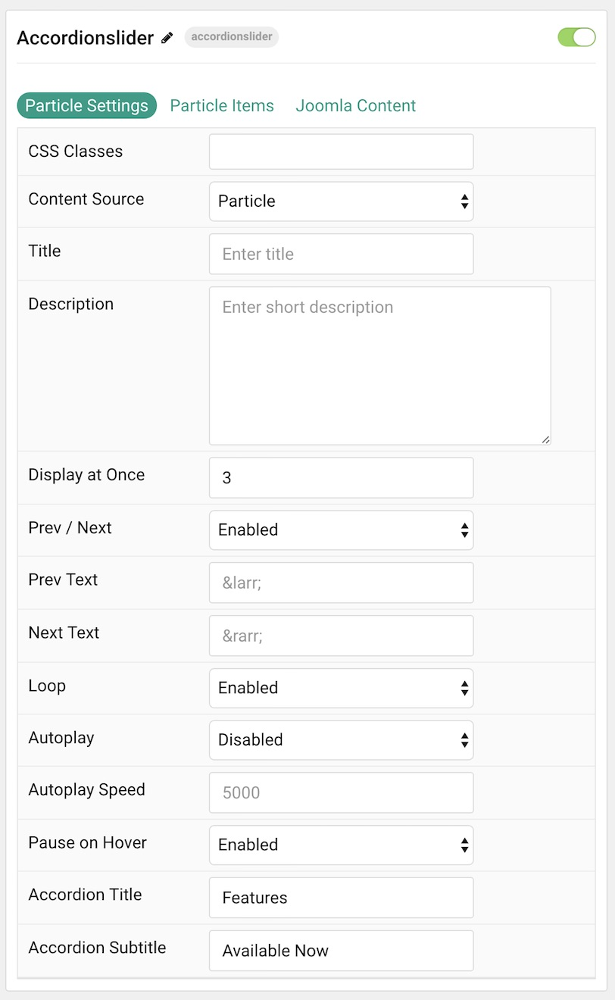
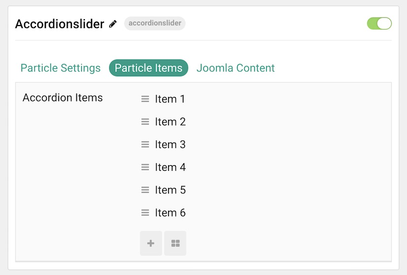
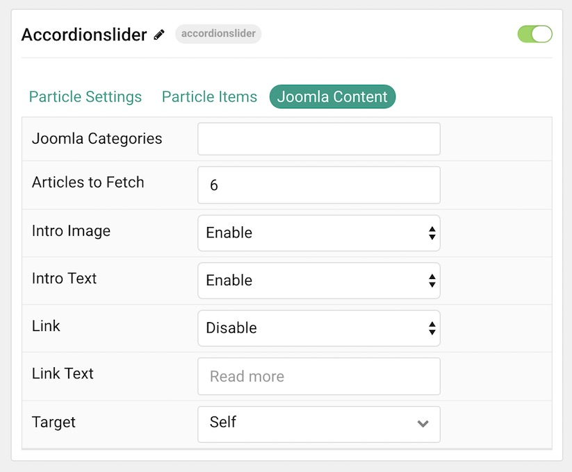
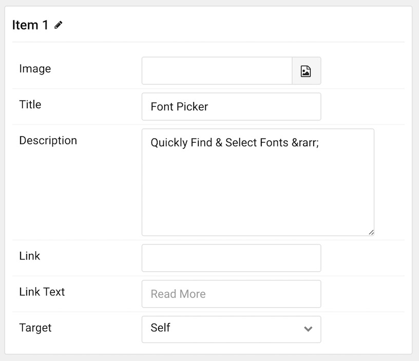

## Introduction

The **Accordion Slider** particle is a clean and easy way to display expandable content in a slider format. This maximizes the amount of content you can put in a limited space. It is a natural and modern part of the Gemini theme.

Here are the topics covered in this guide:

* [Configuration](#configuration)
    - [Main Options](#main-options)
        + [Particle Settings](#tab-a---particle-settings)
        + [Particle Items](#tab-b---particle-items)
        + [Joomla Content](#tab-c---joomla-content)
    - [Item Options](#item-options)

### Main Options

#### Tab A - Particle Settings

| Option             | Description                                                                                               |
| :-----             | :-----                                                                                                    |
| CSS Classes        | Sets the CSS class for the content of the particle.                                                       |
| Content Source     | Choose between **Particle** and **Joomla** as your content source.                                     |
| Title              | Sets the title of the particle, as it will appear on the front end.                                       |
| Description        | Enables you to enter a description for the particle. This is independent of individual item descriptions. |
| Display at Once    | Determines how many items are displayed at a given time in the particle.                                  |
| Prev Next          | Enables a previous / next switcher on the front end.                                                      |
| Prev Text          | Allows you to set text that appears in the Previous switch on the front end.                              |
| Next Text          | Allows you to set text that appears in the Next switch on the front end.                                  |
| Loop               | Enables or disables looping of content, going from finish to start continuously.                          |
| Autoplay           | Enables or disables autoplay, allowing the particle to automatically move through items.                  |
| Autoplay Speed     | Sets the speed at which items are automatically progressed in autoplay.                                   |
| Pause on Hover     | Pauses the automatic switching between items in autoplay.                                                 |
| Accordion Title    | Customize the accordion title text.                                                                       |
| Accordion Subtitle | Customize the accordion subtitle text.                                                                    |

#### Tab B - Particle Items

This tab enables you to create items that appear in the particle. It is useful if you choose the **Particle** content source.

#### Tab C - Joomla Content

This tab is where you configure how Joomla content appears as items in the particle. It is useful if you choose the **Joomla** content source.

| Option            | Description                                                                 |
| :-----            | :-----                                                                      |
| Joomla Categories | Select the categories of articles this particle will display.               |
| Articles to Fetch | Select the number of articles you would like the particle to fetch.         |
| Intro Image       | **Enable** or **Disable** the display of the article(s) featured image.     |
| Intro Text        | **Enable** or **Disable** the display of the article(s) intro text.         |
| Display Content   | **Enable** or **Disable** the display of the article(s) content or excerpt. |
| Link              | **Enable** or **Disable** the linking of the article(s).                    |
| Link Text         | Enter the text you wish to have displayed as the read more link.            |
| Target            | Select **Self** or **New Window** as the target for the link.               |

### Item Options

These items only appear on the front end if you select **Particle** as the **Content Source**.

| Option      | Description                                                               |
| :-----      | :-----                                                                    |
| Image       | Set an image for the item.                                                |
| Title       | Set a title for the item.                                                 |
| Description | Enables you to enter a descriptive paragraph to be displayed in the item. |
| Link        | Set a link for the item to link to.                                       |
| Link Text   | Enter text that appears as the link for the item.                         |
| Target      | Choose a target (self or new window) for the link.                        |
