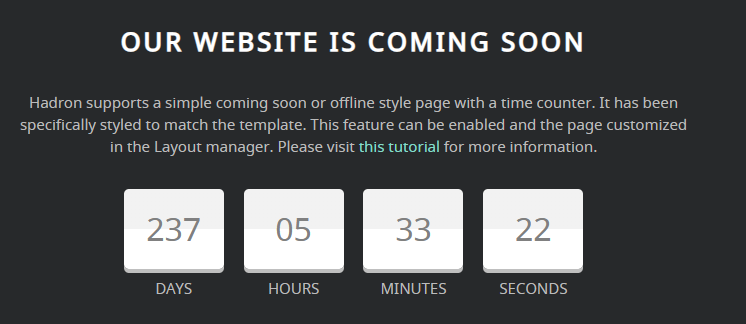

## Introduction

The **Simple Counter** particle gives you the ability to add a simple countdown timer to your website. This is especially useful for coming soon pages, limited-time events, and more.

Here are the topics covered in this guide:

* [Configuration](#configuration)
    - [Main Options](#main-options)

## Configuration

### Main Options 

These options affect the main area of the particle, and not the individual items within.

| Option        | Description                                                                                 |
| :-----        | :-----                                                                                      |
| Particle Name | Enter the name you would like to assign to the particle. This only appears in the back end. |
| CSS Classes   | Enter the CSS class(es) you want to use in the content of the particle.                     |
| Title         | Enter a title for the particle.                                                             |
| Description   | Enter a description that appears as a paragraph on the front end.                           |
| Date          | Set the date (day) of the month the timer will expire.                                      |
| Month         | Set the month the timer will expire.                                                        |
| Year          | Set the year the timer will expire.                                                         |
| Day Text      | Set the text used to describe the day.                                                      |
| Days Text     | Set the text used to describe the days (plural).                                            |
| Hour Text     | Set the text used to describe the hour.                                                     |
| Hours Text    | Set the text used to describe the hours (plural).                                           |
| Minute Text   | Set the text used to describe the minute.                                                   |
| Minutes Text  | Set the text used to describe the minutes (plural).                                         |
| Second Text   | Set the text used to describe the second.                                                   |
| Seconds Text  | Set the text used to describe the seconds (plural).                                         |

