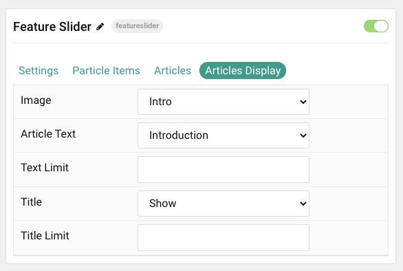

## Introduction

The **Feature Slider** particle displays text and images to feature various services. 

Here are the topics covered in this guide:

- [Configuration](#configuration)
  - [Settings](#settings)
  - [Particle Item Options](#particle-item-options)
  - [Articles](#articles)
  - [Display](#display)

## Configuration

### Settings 

These options affect the main area of the particle, and not the individual items within.

| Option           | Description                                                                                         |
| :-----           | :-----                                                                                              |
| Particle Name         | This is the name of the particle used for back end management. It does not appear on the front end.             |
| Content Source        | Choose between **Particle** and **Joomla** as the content source for the particle.                              |
| Autoplay              | **Enable** or **Disable** autoplay for the particle.                                                            |
| Autoplay Timeout      | Set the time (in milliseconds) between slides in autoplay mode.                                                 |
| Loop                  | **Enable** or **Disable** looping slides.                                                                       |
| Speed                 | Set the transition speed (in milliseconds).                                                                     |
| Height                | Particle minimum height..                                                                 |
| Touch Move            | **Enable** or **Disable** touch movements.                                                                      |
| Touch Move Tabs           | Decide if you want to be able to move tabs using touch.                                                                     |
| Hexagon Patterns               | **Enable** or **Disable** the pattern feature of the particle.                                         |

### Particle Item Options

These items make up the individual featured items in the particle. Items in this section will only appear if **Particle** is selected as the **Content Source**.

| Option                 | Description                                                      |
| :-----                 | :-----                                                           |
| Title             	 | This is the name of the item. This will appear on the frontend |
| Description            	 | Enter slide description. |
| Image                  | Select an image to appear in the slide.                          |

### Articles

| Option             | Description                                                                                                     |
| :----------------- | :-------------------------------------------------------------------------------------------------------------- |
| Categories         | Select the categories of articles this particle will display.                                                   |
| Articles           | Select the number of articles you would like the particle to fetch.                                             |
| Featured Articles  | Choose how Featured Articles should be filtered. Choose between **Include**, **Exclude**, or **Only Featured**. |
| Number of Articles | Enter the maximum number of articles to display.                                                                |
| Start From         | Enter offset specifying the first article to return. The default is '0' (the first article).                    |
| Order By           | Choose the type of factor to order by.                                                                          |
| Ordering Direction | Choose between **Ascending** and **Descending** as the article ordering method.                                 |

### Display

This section configures how articles are displayed.

| Option       | Description                                                                                        |
| :----------- | :------------------------------------------------------------------------------------------------- |
| Image         | Choose between the **Intro**, **Full**, or no image to display with each item.                      |
| Article Text  | Choose between **Introduction**, **Full Article**, or **none** content text to display.             |
| Text Limit    | Enter a limit (in characters) of article text to display with each item.                            |
| Title         | **Show** or **Hide** the article's title.                                                           |
| Title Limit   | Enter the maximum number of characters in the title to display.                                     |
| Button Link   | Select if the button should link to the page.                                                       |
| Button Label  | Enter the text you would like to have appear as the button link.                                    |
| Link Target   | Set the target for the button. You can choose between **Self** which opens the link in the current tab or **New Window** which opens links in a new tab. |
