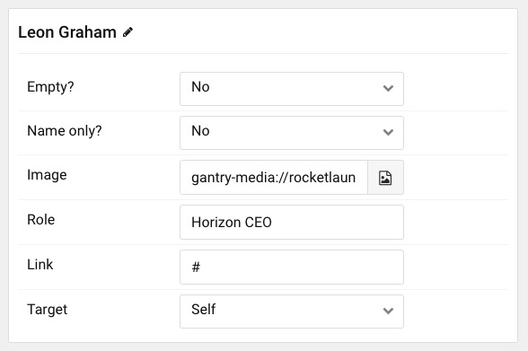

## Introduction

The **Team** particle is a great way to display your team members.

Here are the topics covered in this guide:

* [Configuration](#configuration)
    - [Main Options](#settings)
    - [Item Options](#particle-item-options)

## Configuration

### Settings 

These options affect the main area of the particle, and not the individual items within.

| Option           | Description                                                                                         |
| :-----           | :-----                                                                                              |
| Particle Name    | This is the name of the particle used for back end management. It does not appear on the front end. |
| CSS Classes      | **Enable** or **Disable** the prev / next navigation.                                               |
| Title            | **Enable** or **Disable** the prev / next navigation.                                               |
| Subtitle         | **Enable** or **Disable** autoplay.                                                                 |
| Hexagon Patterns | Set the time between each transition during autoplay.                                               |

### Particle Item Options

These items make up the individual featured items in the particle. Items in this section will only appear if **Particle** is selected as the **Content Source**.

| Option                 | Description                                                      |
| :-----                 | :-----                                                           |
| Full Name              | This is the name of the team member. It will appear in the front end. |
| Empty?                 | Select if you want to spice up the layout and add some empty cells.                         |
| Name only?             | Select if you want to display name only.                  |
| Image           		 | Select desired image.         |
| Role          		 | Enter team member role.         |
| Link          		 | Enter Link.         |
| Target           		 | Target browser window when item is clicked.         |
