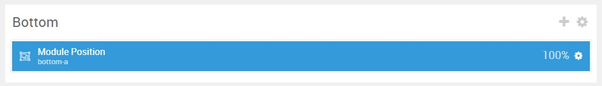
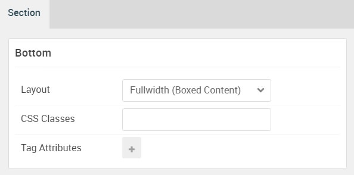

## Introduction

The **Bottom** section includes one **Pricing Table** particle. These particles are placed within the **Bottom A** module position.

Here is a breakdown of the module(s) and particle(s) that appear in this section:

* [Pricing Table (particle)](#pricing-table-(particle))

## Section Settings

| Option           | Setting                   |
| :--------------- | :----------               |
| Layout           | Fullwidth (Boxed Content) |
| CSS Classes      | Blank                     |
| Tag Attributes   | Blank                     |

## Pricing Table (Particle)

The **Pricing Table** particle is a **Gantry 5 Particle** module placed within the **bottom-a** module position. You can create a module position by dragging and dropping a **Module Position** particle into the desired location within the **Layout Manager**. The module position's settings are as follows.

### Module Position Particle Settings

#### Particle Settings

| Option        | Setting       |
| :-----        | :-----        |
| Particle Name | `FP Bottom A` |
| Key           | `bottom-a`    |
| Chrome        | `gantry`      |

#### Block Settings

| Option         | Setting   |
| :-----         | :-----    |
| CSS ID         | Blank     |
| CSS Classes    | Blank     |
| Variations     | Blank     |
| Tag Attributes | Blank     |
| Fixed Size     | Unchecked |
| Block Size     | `100%`    |

### Pricing Table Particle Settings

The next step involves assigning the particle to the module position. Adding a particle to a module position can be done by creating a **Gantry 5 Particle** module by navigating to **Admin > Bottoms > Modules** and clicking the green **New** button. Select the **Gantry 5 Particle** module type and create the particle using the settings found in the section below, and assigning it to the position.

#### Particle Settings

| Option                | Setting                           |
| :-----                | :-----                            |
| Particle Name         | `Pricing Table`                   |
| CSS Classes           | Blank                             |
| Header Text           | Blank                             |
| Footer Text           | Blank                             |
| Grid Columns          | 3 Columns                         |
| Item 1 Name           | `Part 1`                          |
| Item 1 Accent Color   | White                             |
| Item 1 Custom Color   | Blank                             |
| Item 1 CSS Classes    | Blank                             |
| Item 1 Ribbon Text    | Blank                             |
| Item 1 Icon           | Blank                             |
| Item 1 Price          | `$499`                            |
| Item 1 Period         | `Per Month*`                      |
| Item 1 Description    | `* Just kidding. No hidden fees.` |
| Item 1 Button Label   | Blank                             |
| Item 1 Button Link    | Blank                             |
| Item 1 Target         | Self                              |
| Item 1 Button Classes | Blank                             |
| Item 1 Items          | Blank                             |