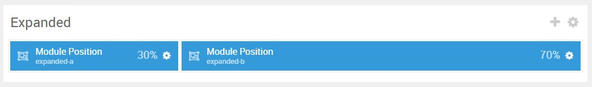

## Introduction

:   1. **Simple Content** [5%, 3%, se]
    2. **Image Grid** [5%, 40%, se]

The **Showcase** section includes two particles: **Simple Content** and **Simple Content**. The **Simple Content** particle is assigned to the **expanded-a** module position, while the **Image Grid** particle is assigned to the **expanded-b** module position.

Here is a breakdown of the module(s) and particle(s) that appear in this section:

* [Simple Content (particle)](#content-tabs-(particle))
* [Image Grid (particle)](#pricing-grid-(particle))

## Section Settings

| Option           | Setting                   |
| :--------------- | :----------               |
| Layout           | Fullwidth (Boxed Content) |
| CSS Classes      | Blank                     |
| Tag Attributes   | Blank                     |

## Simple Content (Particle)

The **Simple Content** particle is a **Gantry 5 Particle** module placed within the **expanded-a** module position. You can create a module position by dragging and dropping a **Module Position** particle into the desired location within the **Layout Manager**. The module position's settings are as follows.

### Module Position Particle Settings

#### Particle Settings

| Option        | Setting         |
| :-----        | :-----          |
| Particle Name | `FP Expanded A` |
| Key           | `expanded-a`    |
| Chrome        | `gantry`        |

#### Block Settings

| Option         | Setting   |
| :-----         | :-----    |
| CSS ID         | Blank     |
| CSS Classes    | Blank     |
| Variations     | Blank     |
| Tag Attributes | Blank     |
| Fixed Size     | Unchecked |
| Block Size     | `30%`     |

### Simple Content Particle Settings

The next step involves assigning the particle to the module position. Adding a particle to a module position can be done by creating a **Gantry 5 Particle** module by navigating to **Admin > Extensions > Modules** and clicking the green **New** button. Select the **Gantry 5 Particle** module type and create the particle using the settings found in the section below, and assigning it to the position.

#### Particle Settings

| Option                   | Setting          |
| :-----                   | :-----           |
| Particle Name            | `Simple Content` |
| CSS Classes              | Blank            |
| Title                    | Blank            |
| Item 1 Name              | `Portfolio`      |
| Item 1 Layout Style      | Standard         |
| Item 1 Created Date      | Blank            |
| Item 1 Content Title     | `Portfolio`      |
| Item 1 Author            | Blank            |
| Item 1 Main Content      | Blank            |
| Item 1 Read More Label   | `View more`      |
| Item 1 Read More Link    | Blank            |
| Item 1 Read More Classes | `button`         |
| Item 1 Target            | Self             |

**Leading Content**

~~~ .html
All demo content is for sample purposes only, to represent a live site.
 
Note: Interstellar is built on the latest version of the Gantry 5 Framework.
~~~

## Image Grid (Particle)

The **Image Grid** particle is a **Gantry 5 Particle** module placed within the **expanded-b** module position. You can create a module position by dragging and dropping a **Module Position** particle into the desired location within the **Layout Manager**. The module position's settings are as follows.

### Module Position Particle Settings

#### Particle Settings

| Option        | Setting         |
| :-----        | :-----          |
| Particle Name | `FP Expanded B` |
| Key           | `expanded-b`    |
| Chrome        | `gantry`        |

#### Block Settings

| Option         | Setting   |
| :-----         | :-----    |
| CSS ID         | Blank     |
| CSS Classes    | Blank     |
| Variations     | Blank     |
| Tag Attributes | Blank     |
| Fixed Size     | Unchecked |
| Block Size     | `70%`     |

### Image Grid Particle Settings

The next step involves assigning the particle to the module position. Adding a particle to a module position can be done by creating a **Gantry 5 Particle** module by navigating to **Admin > Extensions > Modules** and clicking the green **New** button. Select the **Gantry 5 Particle** module type and create the particle using the settings found in the section below, and assigning it to the position.

#### Particle Settings

| Option             | Setting      |
| :-----             | :-----       |
| Particle Name      | `Image Grid` |
| CSS Classes        | Blank        |
| Title              | Blank        |
| Description        | Blank        |
| Grid Column        | 3 Columns    |
| Album Name         | Blank        |
| Item 1 Name        | `New Item`   |
| Item 1 Promo Image | Custom       |
| Item 1 Caption     | Blank        |
