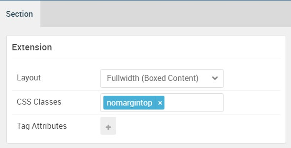

## Introduction

The **Extension** section includes one **Simple Content** and one **Block Content** particle. These particles are placed within the **Extension A** and **Extension B** module positions.

Here is a breakdown of the module(s) and particle(s) that appear in this section:

* [Simple Content (particle)](#owl-carousel-(particle))
* [Block Content (particle)](#block-content-(particle))

## Section Settings

| Option           | Setting                   |
| :--------------- | :----------               |
| Layout           | Fullwidth (Boxed Content) |
| CSS Classes      | `nomargintop`             |
| Tag Attributes   | Blank                     |

## Simple Content (Particle)

The **Simple Content** particle is a **Gantry 5 Particle** module placed within the **extension-a** module position. You can create a module position by dragging and dropping a **Module Position** particle into the desired location within the **Layout Manager**. The module position's settings are as follows.

### Module Position Particle Settings

#### Particle Settings

| Option        | Setting          |
| :-----        | :-----           |
| Particle Name | `FP Extension A` |
| Key           | `extension-a`    |
| Chrome        | `gantry`         |

#### Block Settings

| Option         | Setting   |
| :-----         | :-----    |
| CSS ID         | Blank     |
| CSS Classes    | Blank     |
| Variations     | Center    |
| Tag Attributes | Blank     |
| Fixed Size     | Unchecked |
| Block Size     | `100%`    |

### Simple Content Particle Settings

The next step involves assigning the particle to the module position. Adding a particle to a module position can be done by creating a **Gantry 5 Particle** module by navigating to **Admin > Extensions > Modules** and clicking the green **New** button. Select the **Gantry 5 Particle** module type and create the particle using the settings found in the section below, and assigning it to the position.

#### Particle Settings

| Option                   | Setting          |
| :-----                   | :-----           |
| Particle Name            | `Simple Content` |
| CSS Classes              | Blank            |
| Title                    | Blank            |
| Item 1 Name              | `Dream Team`     |
| Item 1 Layout Style      | Standard         |
| Item 1 Created Date      | Blank            |
| Item 1 Content Title     | `Dream Team`     |
| Item 1 Author            | Blank            |
| Item 1 Main Content      | Blank            |
| Item 1 Read More Label   | Blank            |
| Item 1 Read More Link    | Blank            |
| Item 1 Read More Classes | Blank            |
| Item 1 Target            | Self             |

**Leading Content**

~~~ .html
All demo content is for sample purposes only, to represent a live site. 
Use the RocketLauncher package to create a copy of our demo.
~~~

## Block Content (Particle)

The **Block Content** particle is a **Gantry 5 Particle** module placed within the **extension-a** module position. You can create a module position by dragging and dropping a **Module Position** particle into the desired location within the **Layout Manager**. The module position's settings are as follows.

### Module Position Particle Settings

#### Particle Settings

| Option        | Setting          |
| :-----        | :-----           |
| Particle Name | `FP Extension A` |
| Key           | `extension-a`    |
| Chrome        | `gantry`         |

#### Block Settings

| Option         | Setting   |
| :-----         | :-----    |
| CSS ID         | Blank     |
| CSS Classes    | Blank     |
| Variations     | Blank     |
| Tag Attributes | Blank     |
| Fixed Size     | Unchecked |
| Block Size     | `100%`    |

### Block Content Particle Settings

The next step involves assigning the particle to the module position. Adding a particle to a module position can be done by creating a **Gantry 5 Particle** module by navigating to **Admin > Extensions > Modules** and clicking the green **New** button. Select the **Gantry 5 Particle** module type and create the particle using the settings found in the section below, and assigning it to the position.

#### Particle Settings

| Option                | Setting         |
| :-----                | :-----          |
| Particle Name         | `Block Content` |
| CSS Classes           | Blank           |
| Title                 | Blank           |
| Icon                  | Blank           |
| Image                 | Blank           |
| Headline              | Blank           |
| Description           | Blank           |
| Button Label          | Blank           |
| Button Link           | Blank           |
| Button Classes        | Blank           |
| Target                | Self            |
| Item 1 Name           | `Jack Red`      |
| Item 1 Title          | `Jack Red`      |
| Item 1 Icon           | Blank           |
| Item 1 Image          | Custom          |
| Item 1 RokBox Image   | Blank           |
| Item 1 Caption        | Blank           |
| Item 1 Subtitle       | Blank           |
| Item 1 CSS Classes    | Blank           |
| Item 1 Button Label   | Blank           |
| Item 1 Button Link    | Blank           |
| Item 1 Button Classes | Blank           |
| Item 1 Target         | Self            |

**Description**

~~~ .html
Interstellar brings out the best in our business through its modern design, incredible feature set, and infinite versatility. 
<i class="fa fa-twitter-square"></i> <i class="fa fa-facebook-square"></i> <i class="fa fa-linkedin-square"></i>
~~~
