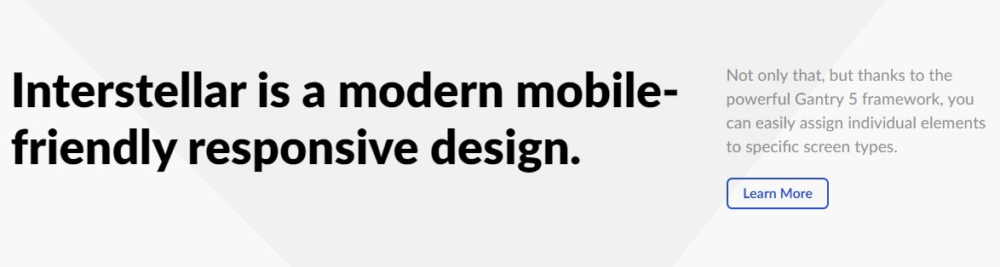

## Introduction

:	1. **Custom HTML** [10%, 3%, se]
	2. **Custom HTML** [10%, 70%, se]

The **Header** section includes two particles assigned to the **header-a** and **header-b** module positions.

Here is a breakdown of the module(s) and particle(s) that appear in this section:

* [Custom HTML (particle)](#custom-html-(particle))
* [Custom HTML (particle)](#custom-html-(particle)-2)

## Section Settings

| Option           | Setting                   |
| :--------------- | :----------               |
| Layout           | Fullwidth (Boxed Content) |
| CSS Classes      | Blank                     |
| Tag Attributes   | Blank                     |

## Custom HTML (Particle)

The **Custom HTML** particle is a **Gantry 5 Particle** module placed within the **header-a** module position. You can create a module position by dragging and dropping a **Module Position** particle into the desired location within the **Layout Manager**. The module position's settings are as follows.

### Module Position Particle Settings

#### Particle Settings

| Option        | Setting       |
| :-----        | :-----        |
| Particle Name | `FP Header A` |
| Key           | `header-a`    |
| Chrome        | `gantry`      |

#### Block Settings

| Option         | Setting   |
| :-----         | :-----    |
| CSS ID         | Blank     |
| CSS Classes    | Blank     |
| Variations     | Blank     |
| Tag Attributes | Blank     |
| Fixed Size     | Unchecked |
| Block Size     | `70%`     |

### Custom HTML Particle Settings

The next step involves assigning the particle to the module position. Adding a particle to a module position can be done by creating a **Gantry 5 Particle** module by navigating to **Admin > Extensions > Modules** and clicking the green **New** button. Select the **Gantry 5 Particle** module type and create the particle using the settings found in the section below, and assigning it to the position.

#### Particle Settings

| Option             | Setting       |
| :-----             | :-----        |
| Particle Name      | `Custom HTML` |
| Process Twig       | Blank         |
| Process Shortcodes | Blank         |

**Custom HTML**

~~~ .html
<h2 class="g-title">Interstellar is a modern mobile-friendly responsive design.</h2>
~~~

## Custom HTML (Particle) 2

The **Custom HTML** particle is a **Gantry 5 Particle** module placed within the **header-a** module position. You can create a module position by dragging and dropping a **Module Position** particle into the desired location within the **Layout Manager**. The module position's settings are as follows.

### Module Position Particle Settings

#### Particle Settings

| Option        | Setting       |
| :-----        | :-----        |
| Particle Name | `FP Header B` |
| Key           | `header-b`    |
| Chrome        | `gantry`      |

#### Block Settings

| Option         | Setting   |
| :-----         | :-----    |
| CSS ID         | Blank     |
| CSS Classes    | Blank     |
| Variations     | Blank     |
| Tag Attributes | Blank     |
| Fixed Size     | Unchecked |
| Block Size     | `30%`     |

### Custom HTML Particle Settings

The next step involves assigning the particle to the module position. Adding a particle to a module position can be done by creating a **Gantry 5 Particle** module by navigating to **Admin > Extensions > Modules** and clicking the green **New** button. Select the **Gantry 5 Particle** module type and create the particle using the settings found in the section below, and assigning it to the position.

#### Particle Settings

| Option             | Setting       |
| :-----             | :-----        |
| Particle Name      | `Custom HTML` |
| Process Twig       | Blank         |
| Process Shortcodes | Blank         |

**Custom HTML**

~~~ .html

Not only that, but thanks to the powerful Gantry 5 framework, you can easily assign individual elements to specific screen types.

~~~