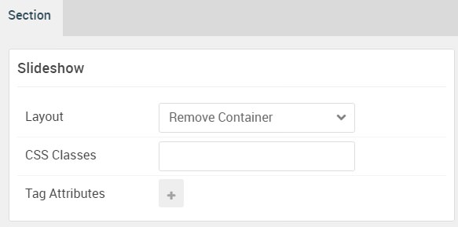

## Introduction

The **Slideshow** section includes one **Owl Carousel** particle. This particle is placed within the **Slideshow A** module position.

Here is a breakdown of the module(s) and particle(s) that appear in this section:

* [Owl Carousel (particle)](#owl-carousel-(particle))

## Section Settings

| Option           | Setting          |
| :--------------- | :----------      |
| Layout           | Remove Container |
| CSS Classes      | Blank            |
| Tag Attributes   | Blank            |

## Owl Carousel (Particle)

The **Owl Carousel** particle is a **Gantry 5 Particle** module placed within the **slideshow-a** module position. You can create a module position by dragging and dropping a **Module Position** particle into the desired location within the **Layout Manager**. The module position's settings are as follows.

### Module Position Particle Settings

#### Particle Settings

| Option        | Setting          |
| :-----        | :-----           |
| Particle Name | `FP Slideshow A` |
| Key           | `slideshow-a`    |
| Chrome        | `gantry`         |

#### Block Settings

| Option         | Setting               |
| :-----         | :-----                |
| CSS ID         | Blank                 |
| CSS Classes    | Blank                 |
| Variations     | No Margin, No Padding |
| Tag Attributes | Blank                 |
| Fixed Size     | Unchecked             |
| Block Size     | `100%`                |

### Owl Carousel Particle Settings

The next step involves assigning the particle to the module position. Adding a particle to a module position can be done by creating a **Gantry 5 Particle** module by navigating to **Admin > Extensions > Modules** and clicking the green **New** button. Select the **Gantry 5 Particle** module type and create the particle using the settings found in the section below, and assigning it to the position.

#### Particle Settings

| Option              | Setting                                                                                        |
| :-----              | :-----                                                                                         |
| Particle Name       | `Owl Carousel`                                                                                 |
| CSS Classes         | Blank                                                                                          |
| Title               | `Services`                                                                                     |
| Layout              | Showcase                                                                                       |
| Width               | Full Width                                                                                     |
| Out Animation       | default                                                                                        |
| In Animation        | default                                                                                        |
| Prev / Next         | Disable                                                                                        |
| Prev Text           | Blank                                                                                          |
| Next Text           | Blank                                                                                          |
| Dots                | Disable                                                                                        |
| Loop                | Enable                                                                                         |
| Autoplay            | Enable                                                                                         |
| Autoplay Speed      | `5000`                                                                                         |
| Pause on Hover      | Enable                                                                                         |
| Footer Shadow Color | `#20232a`                                                                                      |
| Item 1 Name         | `Icon Picker`                                                                                  |
| Item 1 Image        | Blank                                                                                          |
| Item 1 Icon         | `fa fa-mobile`                                                                                 |
| Item 1 Icon 2       | `fa fa-tablet`                                                                                 |
| Item 1 Title        | `Icon Picker`                                                                                  |
| Item 1 Subtitle     | `Integrate Font Awesome icons into your site’s content.`                                       |
| Item 1 Description  | `The Icon Picker makes it easier than ever to add modern icons from the Font Awesome Library.` |
| Item 1 Link         | Blank                                                                                          |
| Item 1 Link Text    | Blank                                                                                          |
| Item 1 Target       | Self                                                                                           |
| Item 1 Button Class | Blank                                                                                          |