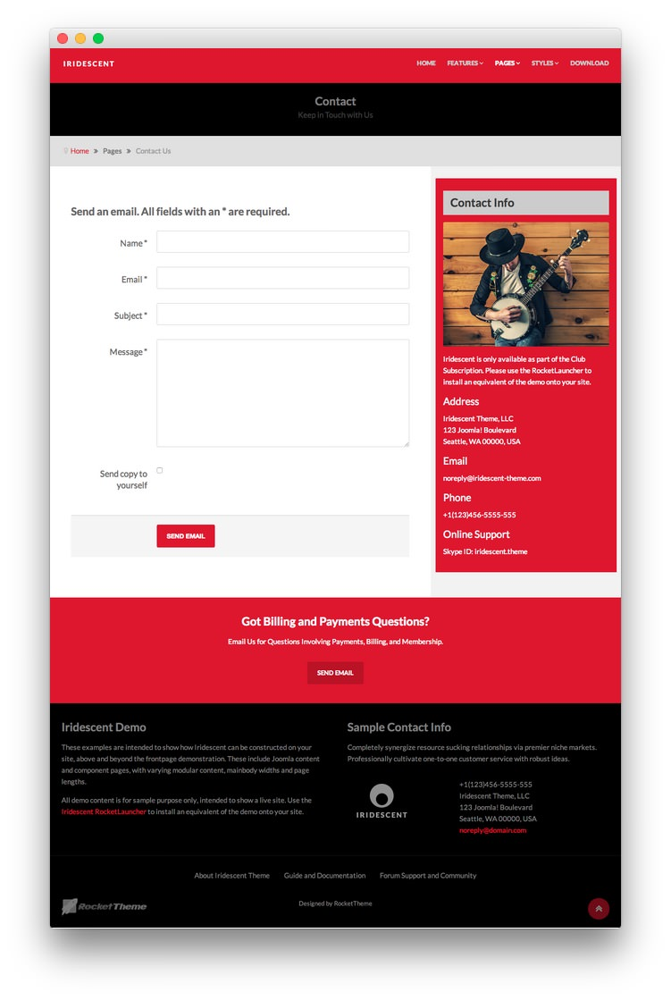
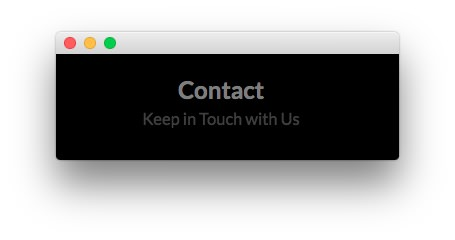
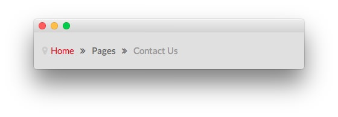
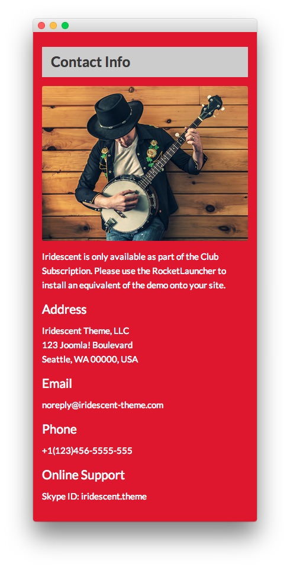
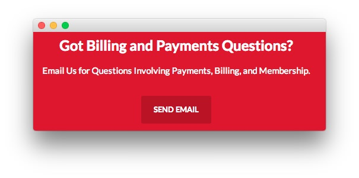

Introduction
-----

The **Contact Us** example page demonstrates how you can create a clean, functional contact page with the Iridescent template. Here is some information to help you replicate this page as it appears in the demo.

Modules
-----

Below is a brief rundown of the modules used to make up the demo page.

:   1. **Custom HTML - Contact Us** [11%, 45%, se]
    2. **Breadcrumbs** [15%, 12%, se]
    3. **Custom HTML - Contact Info** [20%, 66%, se]
    4. **Custom HTML - Got Billing and Payments Questions?** [63%, 35%, se]
    5. **Custom HTML - Iridescent Demo** [72%, 10%, se]
    6. **Custom HTML - Sample Contact Info** [72%, 52%, se]

1. [Custom HTML - Contact Us](contactus.md#custom-html---contact-us)
2. [Breadcrumbs](contactus.md#breadcrumbs)
3. [Custom HTML - Contact Info](contactus.md#custom-html---contact-info)
4. [Custom HTML - Got Billing and Payments Questions?](contactus.md#custom-html---got-billing-and-payments-questions?)
5. [Custom HTML - Iridescent Demo](contactus.md#custom-html---iridescent-demo)
6. [Custom HTML - Sample Contact Info](contactus.md#custom-html---sample-contact-info)

### Custom HTML - Contact Us

#### Module

|   Option   |                               Setting                               |
| :--------- | :------------------------------------------------------------------ |
| Title      | `Contact Us[span class="rt-title-tag"]Keep in Touch with Us[/span]` |
| Show Title | Yes                                                                 |
| Position   | showcase-a                                                          |
| Status     | Published                                                           |
| Access     | Public                                                              |

>> The title of this module requires RokCandy in order to appear properly on the screen due to the `[span]` tags present. See the main [RokCandy](../../extensions/rokcandy/rokcandy_use.md#rokcandy-use-in-rockettheme-template-demos) guide for additional instructions.

#### Options

| Option                    | Setting     |
| :----------               | :---------- |
| Prepare Content           | No          |
| Select a Background-Image | Blank       |

#### Advanced

| Option              | Setting                                                                        |
| :----------         | :----------                                                                    |
| Module Class Suffix | `rt-top-large-padding nomarginall rt-center rt-title-large rt-nomodulecontent` |

### Breadcrumbs

#### Module

|        Option       |    Setting    |
| :------------------ | :------------ |
| Title               | `Breadcrumbs` |
| Show You Are Here   | No            |
| Show Home           | Yes           |
| Text for Home Entry |               |
| Show Last           | Yes           |
| Text Separator      |               |
| Show Title          | Hide          |
| Position            | breadcrumb    |
| Status              | Published     |
| Access              | Public        |

##### Advanced

|        Option       |     Setting     |
| :------------------ | :-------------- |
| Module Class Suffix | ` hidden-phone` |

### Custom HTML - Contact Info

#### Module

|   Option   |    Setting     |
| :--------- | :------------- |
| Title      | `Contact Info` |
| Show Title | Yes            |
| Position   | sidebar-a      |
| Status     | Published      |
| Access     | Public         |

#### Content

~~~ .html

Iridescent is only available as part of the Club Subscription. Please use the RocketLauncher to install an equivalent of the demo onto your site.

<h4>Address</h4>

    Iridescent Theme, LLC 
    123 Joomla! Boulevard 
    Seattle, WA 00000, USA

<h4>Email</h4>

    noreply@iridescent-theme.com 
    noperson@iridescent-theme.com

<h4>Phone</h4>

    +1(123)456-5555-555 
    +1(123)456-6666-666

<h4>Online Support</h4>

    Skype ID: iridescent.theme 
    BBM PIN: 12ABC345

~~~

#### Options

|           Option          | Setting |
| :------------------------ | :------ |
| Prepare Content           | No      |
| Select a Background-Image | Blank   |

#### Advanced

|        Option       |    Setting    |
| :------------------ | :------------ |
| Module Class Suffix | `box1 title3` |

### Custom HTML - Got Billing and Payments Questions?

#### Module

|   Option   |                Setting                |
| :--------- | :------------------------------------ |
| Title      | `Got Billing and Payments Questions?` |
| Show Title | Yes                                   |
| Position   | extension-a                           |
| Status     | Published                             |
| Access     | Public                                |

#### Content

~~~ .html

Email Us for Questions Involving Payments, Billing, and Membership.

<a href="http://www.rockettheme.com/forum/joomla-template-iridescent" class="readon largemargintop">Send Email</a>

~~~

#### Options

| Option                    | Setting     |
| :----------               | :---------- |
| Prepare Content           | No          |
| Select a Background-Image | Blank       |

#### Advanced

|        Option       |   Setting   |
| :------------------ | :---------- |
| Module Class Suffix | `rt-center` |

### Custom HTML - Iridescent Demo

#### Module

|   Option   |      Setting      |
| :--------- | :---------------- |
| Title      | `Iridescent Demo` |
| Show Title | Yes               |
| Position   | bottom-a          |
| Status     | Published         |
| Access     | Public            |

#### Content

~~~ .html

These examples are intended to show how Iridescent can be constructed on your site, above and beyond the frontpage demonstration. These include Joomla content and component pages, with varying modular content, mainbody widths and page lengths.

All demo content is for sample purpose only, intended to show a live site. Use the <a href="http://www.rockettheme.com/joomla/templates/iridescent">Iridescent RocketLauncher</a> to install an equivalent of the demo onto your site.

~~~

#### Options

| Option                    | Setting     |
| :----------               | :---------- |
| Prepare Content           | No          |
| Select a Background-Image | Blank       |

#### Advanced

| Option              | Setting           |
| :----------         | :----------       |
| Module Class Suffix | `rt-phone-center` |

### Custom HTML - Sample Contact Info

#### Module

| Option      | Setting               |
| :---------- | :-----------          |
| Title       | `Sample Contact Info` |
| Show Title  | Yes                   |
| Position    | bottom-b              |
| Status      | Published             |
| Access      | Public                |

#### Content

~~~ .html

Completely synergize resource sucking relationships via premier niche markets. Professionally cultivate one-to-one customer service with robust ideas.

    

        

            
        

    

    

        

            +1(123)456-5555-555 
            Iridescent Theme, LLC 
            123 Joomla! Boulevard 
            Seattle, WA 00000, USA 
            <a href="#">noreply@domain.com</a>
        

    

~~~

#### Options

| Option                    | Setting     |
| :----------               | :---------- |
| Prepare Content           | No          |
| Select a Background-Image | Blank       |

#### Advanced

| Option              | Setting           |
| :----------         | :----------       |
| Module Class Suffix | `rt-phone-center` |
