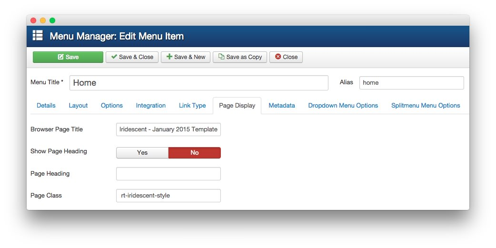

What are Iridescent template features?
-----

Please check our [Template Info page][features] for all Iridescent features in one complete list.

Is Iridescent compatible for Joomla 1.5?
-----

No, Iridescent is only compatible with Joomla 2.5 and Joomla 3.x. Joomla 1.5 support was discontinued in September 2012 by Joomla.

What is RokSprocket?
-----

[RokSprocket][roksprocket] is a powerful content display extension for Joomla 2.5 and above. It was designed as the successor to our legacy content extensions: RokStories, RokTabs, RokNewsPager, RokNewsflash, RokMicronews, and basically any module in the RT arsenal that manipulates and displays articles.

What is Gantry?
-----

[Gantry][gantry] is, as a basic definition, a framework used for assembling, building and maintaining a RocketTheme template. It is an advanced platform for dramatically extending the capabilities of the entire theming system of Joomla.

What is DropDown Menu?
-----

[DropDown Menu][dropdown] is a menu theme of the RokNavMenu extension, the addon that drives many RocketTheme template menus. It is primarily a CSS enhanced dropdown menu, with subtext line, multi-columns, icons and more.

Can I Change the Direction the Dropdown Menu Drops?
-----

Yes! You can control this by navigating to **Administrator > Menu Manager > Menu Item > Dropdown Menu Options** and toggle the direction the dropdown drops to for large, desktop, and tablet displays.

What is Splitmenu?
-----

A static menu system that displays 1st level items in the main horizontal menu and further children in the Sidebar.

What extensions are integrated with the template?
-----

A few of our RocketTheme extensions have been given individual styling by the template, these are RokAjaxSearch, RokNavMenu, RokSprocket, and Third party extension K2.

Can I install RocketLauncher onto an existing Joomla! website?
-----

No. RocketLauncher will install both Joomla and the demo sample content and images, so you will need a fresh Joomla! installation.

I installed Iridescent RocketLauncher but the images are different with the demo site.
-----

To avoid image license copyright issues, all sample content images shown in our demo site will be replaced with blank versions in the RocketLauncher version.

How to Change the Logo as it Appears in the Main Menu
-----

The Iridescent template features a text logo, with some accents (such as the white underlined) defined in CSS. You can make changes to this to meet your individual needs.

#### Step 1: Create a New Logo File

The first thing you will want to do is create a **logo.png** file featuring your new logo. The **png** file type enables you to maintain transparency and preserve quality. Our current text logo consumes **132px by 24px** of space, so when creating your logo image, keep this in mind.

Once you've created your **logo.png** (keep it a PNG so you can retain transparency to not hide the background) upload it to your `JOOMLA_ROOT/templates/rt_iridescent/images/logo` folder. There will likely be a file there already featuring the default Iridescent logo. Just replace this file with your own.

#### Step 2: Create a CSS File

Next, you will want to add the following to a file you create in `JOOMLA_ROOT/templates/rt_iridescent/css/` called **rt_iridescent-custom.css**.

~~~ .css
/* non-destructive removal of text logo */
li.rt-menu-logo > a > span {
    opacity: 0;
    height: 0;
}
 
/* addition of background image logo */
.menu-block .gf-menu .rt-menu-logo {
    background: url(../images/logo/logo.png);
    background-repeat: no-repeat;
    background-position: left center;
    width: 148px;
    height: 60px;
}
 
/* Adjust menu-logo underline position */
.menu-block .gf-menu .rt-menu-logo:after {
    bottom: 0px !important;
}
/* If needed use this Code Block to increase <a> area to match logo size*/
.menu-block .gf-menu .rt-menu-logo .item {
    padding-right: 180px !important;
}
/* Remove the meno-logo white underline */
/**** to use remove this comment line
.menu-block .gf-menu .rt-menu-logo:after {
    background: transparent !important;
}
**** to use remove this comment line /
~~~

You can adjust the **width, height, bottom, and padding-right** settings to meet your logo's needs. Some trial and error may be necessary to find the perfect settings for your site.

#### Step 3: Check Your Menu Settings

>> NOTE: Step 3 and 4 of this tutorial may already be completed if you are using the RocketLauncher. It is still good practice to check these files to ensure that the proper settings are in place.

The next step involved visiting the **Menu Manager** in your Joomla Administrator and locating the **Iridescent** menu item. The **Menu Item Type** should be listed as a **Menu Item Alias**. The settings should appear as pictured below:

:   1. **Menu Item** This setting should be set to **Home**. [34%, 19%, se]

Here is a look at the settings used in the **Dropdown Menu Options** tab.

:   1. **Custom CSS Class** This setting should be set to `rt-menu-logo`. [35%, 24%, se]
    2. **Child Item Type** This setting should be set to **Menu Items**. [83%, 24%, se]

#### Step 4: Check Home Page Class

The final step you should complete is checking to make sure that ` rt-iridescent-style` (note the space before the text begins) is in the **Page Class** field located in the **Page Display** tab of the **Home** page's Menu Item editing page.

Once all these steps are complete, you should be able to check your site to see that your changes have been completed. 

#### Optional: Remove that White Line

The white line can be removed by deleting the comment lines from the CSS file we created earlier. These are lines **25** and **29** in the example listed in **Step 2**.

[gantry]: http://gantry.org/
[features]: http://demo.rockettheme.com/joomla-templates/iridescent/index.php/features/features-overview
[forum]: http://www.rockettheme.com/forum/joomla-template-iridescent
[roksprocket]: http://www.rockettheme.com/joomla/extensions/roksprocket
[dropdown]: http://demo.rockettheme.com/joomla-templates/iridescent/features/menu-options
[splitmenu]: http://demo.rockettheme.com/joomla-templates/iridescent/features/menu-options
[dropdownoptions]: assets/dropdown.jpg
