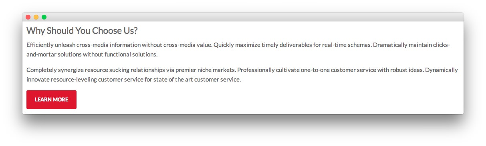
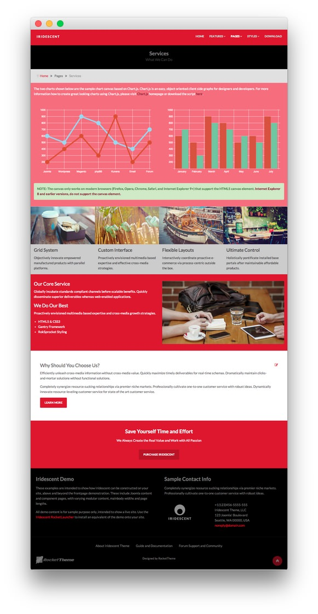
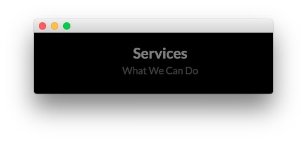
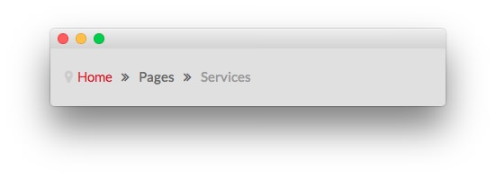
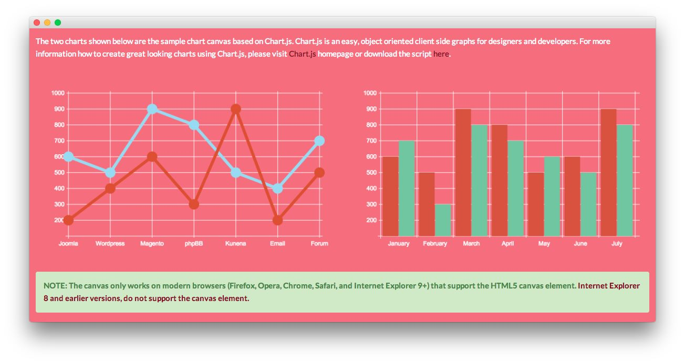
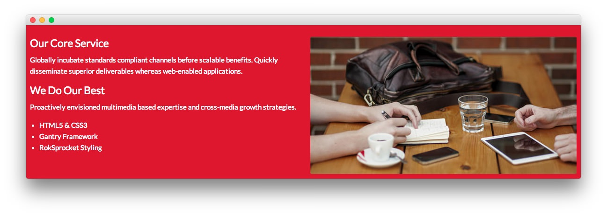
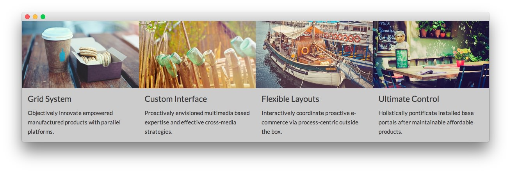
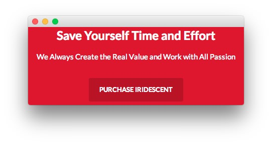
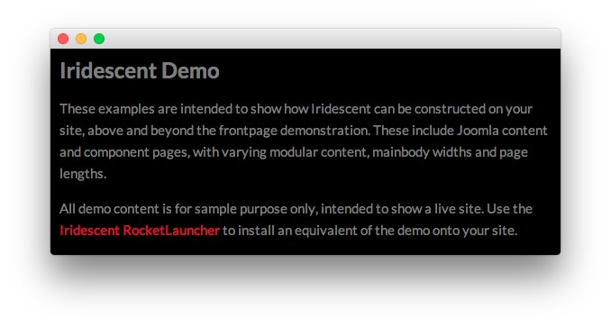
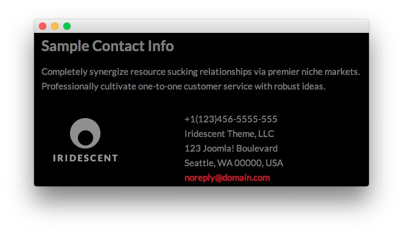

Introduction
-----

The **Services** example page demonstrates how you can create a content rich page with the Iridescent template. Here is some information to help you replicate this page as it appears in the demo.

Mainbody
-----

The page's content body is set in the **Services** article. You will find the content used in the article below.

~~~ .html
<h3>Why Should You Choose Us?</h3>

Efficiently unleash cross-media information without cross-media value. Quickly maximize timely deliverables for real-time schemas. Dramatically maintain clicks-and-mortar solutions without functional solutions.

Completely synergize resource sucking relationships via premier niche markets. Professionally cultivate one-to-one customer service with robust ideas. Dynamically innovate resource-leveling customer service for state of the art customer service.

<a href="http://www.rockettheme.com/joomla/templates/iridescent" class="readon">Learn More</a>

~~~

Modules
-----

Below is a brief rundown of the modules used to make up the demo page.

:   1. **Custom HTML - Services** [9%, 45%, se]
    2. **Breadcrumbs** [12%, 12%, se]
    3. **Custom HTML - Services: Chart JS** [15%, 12%, se]
    4. **Custom HTML - Our Core Service** [46%, 12%, se]
    5. **Article Content** [60%, 12%, se]
    6. **Custom HTML - Grid System** [35%, 12%, se]
    7. **Custom HTML - Save Yourself Time and Effort** [71%, 33%, se]
    8. **Custom HTML - Iridescent Demo** [78%, 12%, se]
    9. **Custom HTML - Sample Contact Info** [78%, 52%, se]

1. [Custom HTML - Services](services.md#custom-html---services)
2. [Breadcrumbs](services.md#breadcrumbs)
3. [Custom HTML - Services: Chart JS](services.md#custom-html---services:-chart-js)
4. [Custom HTML - Our Core Service](services.md#custom-html---our-core-service)
5. [Article Content](services.md#mainbody)
6. [Custom HTML - Grid System](services.md#custom-html---grid-system)
7. [Custom HTML - Save Yourself Time and Effort](services.md#custom-html---save-your-time-and-effort)
8. [Custom HTML - Iridescent Demo](services.md#custom-html---iridescent-demo)
9. [Custom HTML - Sample Contact Info](services.md#custom-html---sample-contact-info)

### Custom HTML - Services

#### Module

| Option      | Setting                                                    |
| :---------- | :-----------                                               |
| Title       | `Services[span class="rt-title-tag"]What We Can Do[/span]` |
| Show Title  | Yes                                                        |
| Position    | showcase-a                                                 |
| Status      | Published                                                  |
| Access      | Public                                                     |

>> The title of this module requires RokCandy in order to appear properly on the screen due to the `[span]` tags present. See the main [RokCandy](../../extensions/rokcandy/rokcandy_use.md#rokcandy-use-in-rockettheme-template-demos) guide for additional instructions.

#### Content

~~~ .html
&nbsp;
~~~

#### Options

| Option                    | Setting     |
| :----------               | :---------- |
| Prepare Content           | No          |
| Select a Background-Image | Blank       |

#### Advanced

| Option              | Setting                                                                        |
| :----------         | :----------                                                                    |
| Module Class Suffix | `rt-top-large-padding nomarginall rt-center rt-title-large rt-nomodulecontent` |

### Breadcrumbs

#### Module

| Option              | Setting       |  
| :------------------ | :------------ |  
| Title               | `Breadcrumbs` |  
| Show You Are Here   | No            |  
| Show Home           | Yes           |  
| Text for Home Entry |               |  
| Show Last           | Yes           |  
| Text Separator      |               |  
| Show Title          | Hide          |  
| Position            | breadcrumb    |  
| Status              | Published     |  
| Access              | Public        |  

##### Advanced

| Option              | Setting                                                    |  
| :------------------ | :--------------------------------------------------------- |  
| Module Class Suffix | ` hidden-phone nomarginall medpaddingtop medpaddingbottom` |  

### Custom HTML - Services: Chart JS

>> More information about Chart.js support can be found [here](charts.md).

#### Module

| Option      | Setting              |
| :---------- | :-----------         |
| Title       | `Services: Chart JS` |
| Show Title  | Hide                 |
| Position    | maintop-a            |
| Status      | Published            |
| Access      | Public               |

#### Content

~~~ .html

The two charts shown below are the sample chart canvas based on Chart.js. Chart.js is an easy, object oriented client side graphs for designers and developers. For more information how to create great looking charts using Chart.js, please visit <a href="http://www.chartjs.org/">Chart.js</a> homepage or download the script <a href="https://github.com/nnnick/Chart.js">here</a>.

 

    

        

            

                <canvas id="myChart-a" width="600" height="320"></canvas>

                
            

        

        

            

                <canvas id="myChart-b" width="600" height="320"></canvas>

                
            

        

    

 

NOTE: The canvas only works on modern browsers (Firefox, Opera, Chrome, Safari, and Internet Explorer 9+) that support the HTML5 canvas element. <a target="_blank" href="http://www.w3schools.com/html/html5_canvas.asp">Internet Explorer 8 and earlier versions, do not support the canvas element.</a>

~~~

#### Options

|           Option          | Setting |
| :------------------------ | :------ |
| Prepare Content           | No      |
| Select a Background-Image | Blank   |

#### Advanced

|        Option       |      Setting       |
| :------------------ | :----------------- |
| Module Class Suffix | `box2 nomarginall` |

### Custom HTML - Our Core Service

#### Module

|   Option   |                    Setting                    |
| :--------- | :-------------------------------------------- |
| Title      | `Services: Our Core Service - We Do Our Best` |
| Show Title | Hide                                          |
| Position   | expandedtop-a                                 |
| Status     | Published                                     |
| Access     | Public                                        |

#### Content

~~~ .html

    

        

            

                <h3>Our Core Service</h3>
                
Globally incubate standards compliant channels before scalable benefits. Quickly disseminate superior deliverables whereas web-enabled applications.

                

                    <h3>We Do Our Best</h3>
                    
Proactively envisioned multimedia based expertise and cross-media growth strategies.

                    <ul>
                        <li>HTML5 &amp; CSS3</li>
                        <li>Gantry Framework</li>
                        <li>RokSprocket Styling</li>
                    </ul>
                

            

        

        

            

                
            

        

    

~~~

#### Options

|           Option          | Setting |
| :------------------------ | :------ |
| Prepare Content           | No      |
| Select a Background-Image | Blank   |

#### Advanced

|        Option       |      Setting       |
| :------------------ | :----------------- |
| Module Class Suffix | `box1 nomarginall` |

### Custom HTML - Grid System

#### Module

|   Option   |                                     Setting                                      |
| :--------- | :------------------------------------------------------------------------------- |
| Title      | `Services: Grid System - Custom Interface - Flexible Layouts - Ultimate Control` |
| Show Title | Hide                                                                             |
| Position   | maintop-a                                                                        |
| Status     | Published                                                                        |
| Access     | Public                                                                           |

#### Content

~~~ .html

    

        
        

            <h4>Grid System</h4>
            
Objectively innovate empowered manufactured products with parallel platforms.

        

    

    

            
        

            <h4>Custom Interface</h4>
            
Proactively envisioned multimedia based expertise and effective cross-media strategies.

        

    

    

        
        

            <h4>Flexible Layouts</h4>
            
Interactively coordinate proactive e-commerce via process-centric outside the box.

        

    

    

        
        

            <h4>Ultimate Control</h4>
            
Holistically pontificate installed base portals after maintainable affordable products.

        

    

~~~

#### Options

|           Option          | Setting |
| :------------------------ | :------ |
| Prepare Content           | No      |
| Select a Background-Image | Blank   |

#### Advanced

|        Option       |             Setting             |
| :------------------ | :------------------------------ |
| Module Class Suffix | `box3 nomarginall nopaddingall` |

### Custom HTML - Save Yourself Time and Effort

#### Module

|   Option   |             Setting             |
| :--------- | :------------------------------ |
| Title      | `Save Yourself Time and Effort` |
| Show Title | Show                            |
| Position   | extension-a                     |
| Status     | Published                       |
| Access     | Public                          |

#### Content

~~~ .html

We Always Create the Real Value and Work with All Passion

<a href="http://www.rockettheme.com/joomla/templates/iridescent" class="readon largemargintop">Purchase Iridescent</a>

~~~

#### Options

| Option                    | Setting     |
| :----------               | :---------- |
| Prepare Content           | No          |
| Select a Background-Image | Blank       |

#### Advanced

| Option              | Setting     |
| :----------         | :---------- |
| Module Class Suffix | `rt-center` |

### Custom HTML - Iridescent Demo

#### Module

|   Option   |      Setting      |
| :--------- | :---------------- |
| Title      | `Iridescent Demo` |
| Show Title | Yes               |
| Position   | footer-a          |
| Status     | Published         |
| Access     | Public            |

#### Content

~~~ .html

These examples are intended to show how Iridescent can be constructed on your site, above and beyond the frontpage demonstration. These include Joomla content and component pages, with varying modular content, mainbody widths and page lengths.

All demo content is for sample purpose only, intended to show a live site. Use the <a href="http://www.rockettheme.com/joomla/templates/iridescent">Iridescent RocketLauncher</a> to install an equivalent of the demo onto your site.

~~~

#### Options

| Option                    | Setting     |
| :----------               | :---------- |
| Prepare Content           | No          |
| Select a Background-Image | Blank       |

#### Advanced

| Option              | Setting           |
| :----------         | :----------       |
| Module Class Suffix | `rt-phone-center` |

### Custom HTML - Sample Contact Info

#### Module

| Option      | Setting               |
| :---------- | :-----------          |
| Title       | `Sample Contact Info` |
| Show Title  | Yes                   |
| Position    | footer-b              |
| Status      | Published             |
| Access      | Public                |

#### Content

~~~ .html

Completely synergize resource sucking relationships via premier niche markets. Professionally cultivate one-to-one customer service with robust ideas.

    

        

            
        

    

    

        

            +1(123)456-5555-555 
            Iridescent Theme, LLC 
            123 Joomla! Boulevard 
            Seattle, WA 00000, USA 
            <a href="#">noreply@domain.com</a>
        

    

~~~

#### Options

| Option                    | Setting     |
| :----------               | :---------- |
| Prepare Content           | No          |
| Select a Background-Image | Blank       |

#### Advanced

| Option              | Setting           |
| :----------         | :----------       |
| Module Class Suffix | `rt-phone-center` |
