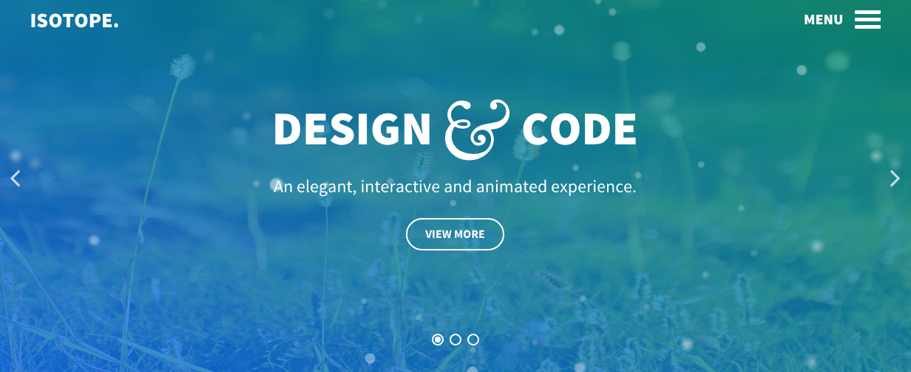

Introduction
-----

Isotope is an elegant, interactive and animated template, bursting with colors and imagery, in a highly flexible structure. Stylistic features include Parallax backgrounds and the versatile FlexSlider particle, with several layout options and animation effects.

Requirements
-----

* Apache 2.2+ or Microsoft IIS 7
* PHP 5.4+ (PHP 5.5+ Recommended)
* MySQL 5.1+
* Joomla 3.4+

>> NOTE: Gantry v5.2.1+ is required for Isotope to work correctly. For more details on the Gantry Framework, please visit its [Dedicated Website](http://gantry.org).

Key Features
-----

* Responsive Layout
* 6 Preset Styles
* Block Variations
* Headroom Support
* Custom Typography
* Unlimited Positions
* Custom Particles
* Horizontal Menu
* Social Icons
* Mobile Menu
* Coming Soon Page
* Font Awesome Icons
* YAML-based Configuration
* Twig Templating
* Powerful Particle System
* Visual Menu Editor
* MegaMenu Support
* Off-Canvas Panel
* Ajax Admin
* Layout Manager
* Theme Inheritance
* Fluid Width Option
* Fixed Width Option
* SCSS Support
* Sophisticated Fields
* Unlimited Undo/Redo

## Particles

The template features a range of custom particles, including Popup Grid, a mosaic styled content element. It supports a custom modal effect which is a full screen overlay for an enlarged image and full length content items, with easy configuration.

## Menu Overlay

Isotope features two custom menu options. The Menu Overlay is displayed in a fixed, full width overlay, with support for additional blocks. An inline, horizontal option is also available, with Headroom support for dynamic scrolling.

## Responsive

Isotope is a responsive template which means it adapts to the viewing device's width, such as mobile, tablet or desktop. Mobile modes have a unique menu to aid usability. Support classes can also be used to display or hide various types of content for each device.
