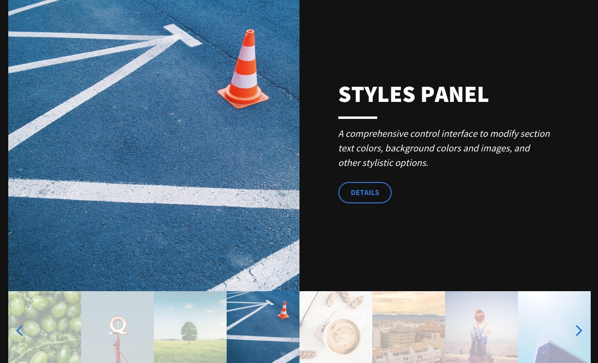
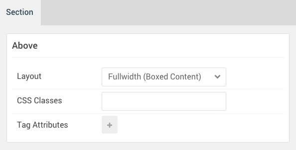

## Introduction

The **Above** section includes one module position, **Above**. In that module position we placed a **Gantry 5 Particle** module with the **FlexSlider** particle assigned.

Here is a breakdown of the module(s) and particle(s) that appear in this section:

* [Module Position (Above)](#module-position-(above))
	* [FlexSlider (particle)](#flexslider-(particle))

## Section Settings

| Option           | Setting                   |
| :--------------- | :----------               |
| Layout           | Fullwidth (Boxed Content) |
| CSS Classes      | Blank                     |
| Tag Attributes   | Blank                     |

## Module Position (Above)

### Particle Settings

| Option        | Setting   |
| :-----        | :-----    |
| Particle Name | `Above A` |
| Key           | `above-a` |
| Chrome        | `gantry`  |

### Block Settings

| Option         | Setting    |
| :-----         | :-----     |
| CSS ID         | Blank      |
| CSS Classes    | `fp-above` |
| Variations     | Blank      |
| Tag Attributes | Blank      |
| Fixed Size     | Unchecked  |
| Block Size     | `100%`     |

### Assigned Particle(s)

Using the **Gantry 5 Particle** module, we assigned a **FlexSlider** particle to this position. You will find the settings used in this particle, below.

#### FlexSlider (Particle)

##### Particle Settings

| Option                                 | Setting                                                                                                                                              |
| :-----                                 | :-----                                                                                                                                               |
| Particle Name                          | `FlexSlider`                                                                                                                                         |
| CSS Classes                            | Blank                                                                                                                                                |
| Title                                  | Blank                                                                                                                                                |
| Layout                                 | Showcase                                                                                                                                             |
| Thumbnail Width                        | `150`                                                                                                                                                |
| Autoplay                               | Enable                                                                                                                                               |
| Autoplay Speed                         | `5000`                                                                                                                                               |
| Pause on Hover                         | Enable                                                                                                                                               |
| RTL Mode                               | Disable                                                                                                                                              |
| FlexSlider Item 1 Name                 | `Parallax`                                                                                                                                           |
| FlexSlider Item 1 Background Image     | Custom                                                                                                                                               |
| FlexSlider Item 1 Overlay Image        | Blank                                                                                                                                                |
| FlexSlider Item 1 Overlay Parallax     | Enabled                                                                                                                                              |
| FlexSlider Item 1 Parallax Ratio       | `0.3`                                                                                                                                                |
| FlexSlider Item 1 Title                | `Parallax`                                                                                                                                           |
| FlexSlider Item 1 Description          | `<em>Parallax adjusts the position of an image, relative to the scroll and viewing angle of the page, providing an extra layer of interaction.</em>` |
| FlexSlider Item 1 Testimonial Image    | Blank                                                                                                                                                |
| FlexSlider Item 1 Testimonial Name     | Blank                                                                                                                                                |
| FlexSlider Item 1 Testimonial Position | Blank                                                                                                                                                |
| FlexSlider Item 1 Link                 | `#`                                                                                                                                                  |
| FlexSlider Item 1 Link Text            | `Details`                                                                                                                                            |
| FlexSlider Item 1 Target               | Self                                                                                                                                                 |
| FlexSlider Item 1 Button Class         | `button-3`                                                                                                                                           |
