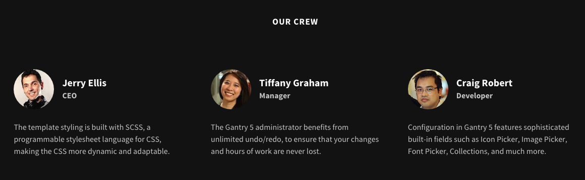
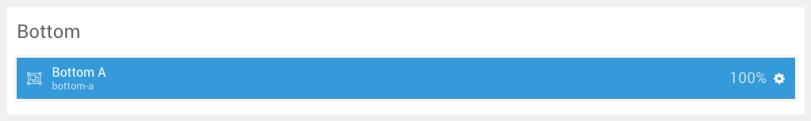
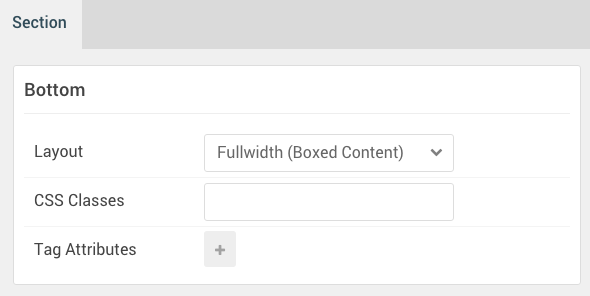

## Introduction

The **Bottom** section includes one module position, **Bottom**. In that module position we placed a **Gantry 5 Particle** module with the **Testimonials** particle assigned.

Here is a breakdown of the module(s) and particle(s) that appear in this section:

* [Module Position (Bottom)](#module-position-(bottom))
	* [Testimonials (particle)](#block-content-(particle))

## Section Settings

| Option                | Setting                            |
| :---------------      | :----------                        |
| Layout                | Fullwidth (Boxed Content)          |
| CSS Classes           | Blank                              |
| Tag Attributes Item 1 | `data-enllax-ratio` -> `0.3`       |
| Tag Attributes Item 2 | `data-enllax-type` -> `background` |

## Module Position (Bottom)

### Particle Settings

| Option        | Setting    |
| :-----        | :-----     |
| Particle Name | `Bottom A` |
| Key           | `bottom-a` |
| Chrome        | `gantry`   |

### Block Settings

| Option         | Setting   |
| :-----         | :-----    |
| CSS ID         | Blank     |
| CSS Classes    | Blank     |
| Variations     | Blank     |
| Tag Attributes | Blank     |
| Fixed Size     | Unchecked |
| Block Size     | `100%`    |

### Assigned Particle(s)

Using the **Gantry 5 Particle** module, we assigned a **Testimonials** particle to this position. You will find the settings used in this particle, below.

#### Testimonials (Particle)

##### Particle Settings

| Option                   | Setting                                                                                                                           |
| :-----                   | :-----                                                                                                                            |
| Particle Name            | `Testimonials`                                                                                                                    |
| CSS Classes              | `title-center`                                                                                                                    |
| Title                    | `Our Crew`                                                                                                                        |
| Intro                    | Blank                                                                                                                             |
| Grid Column              | 3 Columns                                                                                                                         |
| Item 1 Title             | `Jerry Ellis`                                                                                                                     |
| Item 1 Testimonial Style | Standard                                                                                                                          |
| Item 1 Image             | Custom                                                                                                                            |
| Item 1 Content           | `The template styling is built with SCSS, a programmable stylesheet language for CSS, making the CSS more dynamic and adaptable.` |
| Item 1 Author            | `Jerry Ellis`                                                                                                                     |
| Item 1 Company           | `CEO`                                                                                                                             |
| Item 1 Link              | `#`                                                                                                                               |
