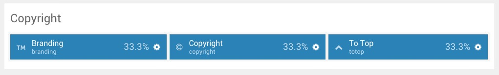
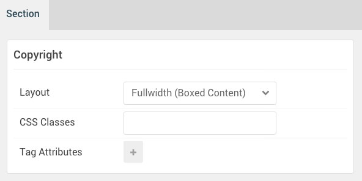

## Introduction

:   1. **Branding (Particle)** [10%, 2%, se]
    2. **Copyright (Particle)** [10%, 40%, se]
    3. **To Top (Particle)** [10%, 90%, se]

The **Copyright** section includes three particles, **Branding**, **Copyright**, and **To Top**. 

Here is a breakdown of the module(s) and particle(s) that appear in this section:

* [Branding (particle)](#logo-(particle))
* [Copyright (Particle)](#copyright-(particle))
* [To Top (particle)](#to-top-(particle))

## Section Settings

| Option           | Setting                   |
| :--------------- | :----------               |
| Layout           | Fullwidth (Boxed Content) |
| CSS Classes      | Blank                     |
| Tag Attributes   | Blank                     |

## Branding (Particle)

### Particle Settings

| Option        | Setting      |
| :-----        | :-----       |
| Particle Name | `Branding`   |
| CSS Classes   | `g-branding` |

**Custom HTML**

~~~ .html
Powered by <a href="http://www.gantry.org/" title="Gantry Framework" class="g-powered-by">Gantry Framework</a>
~~~

### Block Settings

| Option         | Setting   |
| :-----         | :-----    |
| CSS ID         | Blank     |
| CSS Classes    | Blank     |
| Variations     | Blank     |
| Tag Attributes | Blank     |
| Fixed Size     | Unchecked |
| Block Size     | `33.3%`   |

## Copyright (Particle)

### Particle Settings

| Option            | Setting           |
| :-----            | :-----            |
| Particle Name     | `Copyright`       |
| Start Year        | `2007`            |
| End Year          | `now`             |
| Copyright Owner   | `RocketTheme LLC` |
| Owner Link        | Blank             |
| Owner Link Target | New Window        |
| CSS Classes       | Blank             |

### Block Settings

| Option         | Setting   |
| :-----         | :-----    |
| CSS ID         | Blank     |
| CSS Classes    | Blank     |
| Variations     | Blank     |
| Tag Attributes | Blank     |
| Fixed Size     | Unchecked |
| Block Size     | `33.3%`   |

## To Top (Particle)

### Particle Settings

| Option            | Setting                         |
| :-----            | :-----                          |
| Particle Name     | `To Top`                        |
| CSS Classes       | `totop`                         |
| Icon              | `fa fa-arrow-circle-o-up fa-2x` |
| Copyright Owner   | `RocketTheme LLC`               |
| Text              | `To Top`                        |

### Block Settings

| Option         | Setting   |
| :-----         | :-----    |
| CSS ID         | Blank     |
| CSS Classes    | Blank     |
| Variations     | Blank     |
| Tag Attributes | Blank     |
| Fixed Size     | Unchecked |
| Block Size     | `33.3%`   |