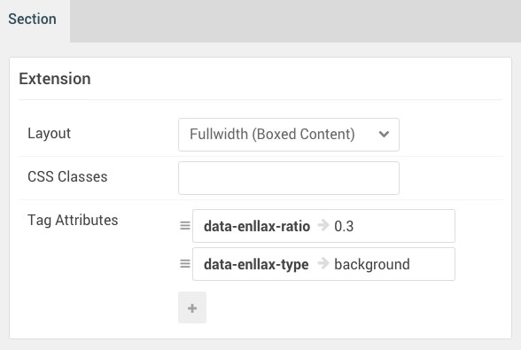

## Introduction

The **Extension** section includes one module position, **Extension**. In that module position we placed a **Gantry 5 Particle** module with the **Block Content** particle assigned.

Here is a breakdown of the module(s) and particle(s) that appear in this section:

* [Module Position (Extension)](#module-position-(extension))
	* [Block Content (particle)](#block-content-(particle))

## Section Settings

| Option                | Setting                            |
| :---------------      | :----------                        |
| Layout                | Fullwidth (Boxed Content)          |
| CSS Classes           | Blank                              |
| Tag Attributes Item 1 | `data-enllax-ratio` -> `0.3`       |
| Tag Attributes Item 2 | `data-enllax-type` -> `background` |

## Module Position (Extension)

### Particle Settings

| Option        | Setting       |
| :-----        | :-----        |
| Particle Name | `Extension A` |
| Key           | `extension-a` |
| Chrome        | `gantry`      |

### Block Settings

| Option         | Setting   |
| :-----         | :-----    |
| CSS ID         | Blank     |
| CSS Classes    | Blank     |
| Variations     | Blank     |
| Tag Attributes | Blank     |
| Fixed Size     | Unchecked |
| Block Size     | `100%`    |

### Assigned Particle(s)

Using the **Gantry 5 Particle** module, we assigned a **Block Content** particle to this position. You will find the settings used in this particle, below.

#### Block Content (Particle)

##### Particle Settings

| Option                | Setting                                                                                                                           |
| :-----                | :-----                                                                                                                            |
| Particle Name         | `Block Content`                                                                                                                   |
| CSS Classes           | `title-center`                                                                                                                    |
| Title                 | `Extras`                                                                                                                          |
| Image                 | Blank                                                                                                                             |
| Headline              | Blank                                                                                                                             |
| Description           | Blank                                                                                                                             |
| Link                  | Blank                                                                                                                             |
| Link Text             | Blank                                                                                                                             |
| Item 1 Title          | `Fast`                                                                                                                            |
| Item 1 Icon           | `fa fa-paper-plane fa-fw fa-3x`                                                                                                   |
| Item 1 Image          | Blank                                                                                                                             |
| Item 1 RokBox Image   | Blank                                                                                                                             |
| Item 1 Caption        | Blank                                                                                                                             |
| Item 1 Sub Title      | Blank                                                                                                                             |
| Item 1 Description    | `The Gantry 5 Framework has been written from the ground out to focus on speed and performance, whether the frontend or backend.` |
| Item 1 CSS Classes    | Blank                                                                                                                             |
| Item 1 Button Label   | Blank                                                                                                                             |
| Item 1 Button Link    | Blank                                                                                                                             |
| Item 1 Button Classes | Blank                                                                                                                             |
