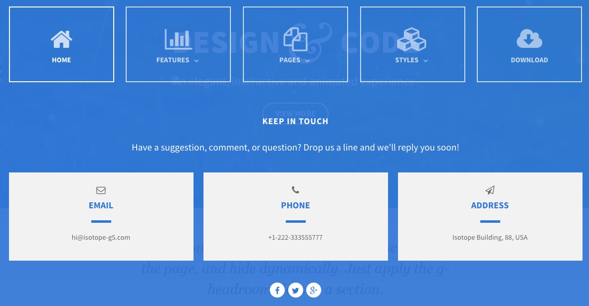
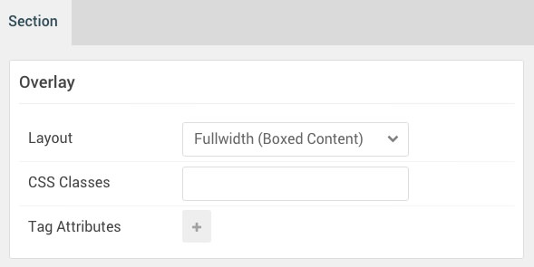

## Introduction

:   1. **Menu (Particle)** [5%, 2%, se]
    2. **Block Content (Particle)** [35%, 5%, se]
    3. **Social (Particle)** [90%, 40%, se]

The **Overlay** section includes three particles, **Menu** and two **Module Position** particles. Assigned to these module positions are **Block Content** and **Social** particles.

Here is a breakdown of the module(s) and particle(s) that appear in this section:

* [Menu (particle)](#logo-(particle))
* [Module Position (Overlay A)](#module-position-(overlay-a))
	* [Block Content (particle)](#block-content-(particle))
* [Module Position (Overlay B)](#module-position-(overlay-b))
	* [Block Content (particle)](#social-(particle))

## Section Settings

| Option           | Setting                   |
| :--------------- | :----------               |
| Layout           | Fullwidth (Boxed Content) |
| CSS Classes      | Blank                     |
| Tag Attributes   | Blank                     |

## Menu (Particle)

### Particle Settings

| Option        | Setting          |
| :-----        | :-----           |
| Particle Name | `Menu`           |
| Menu          | Use Default Menu |
| Base Item     | Active           |
| Start Level   | `1`              |
| Max Levels    | `0`              |
| Render Titles | Unchecked        |
| Mobile Target | Unchecked        |

### Block Settings

| Option         | Setting   |
| :-----         | :-----    |
| CSS ID         | Blank     |
| CSS Classes    | Blank     |
| Variations     | Blank     |
| Tag Attributes | Blank     |
| Fixed Size     | Unchecked |
| Block Size     | `100%`     |

## Module Position (Overlay A)

### Particle Settings

| Option        | Setting     |
| :-----        | :-----      |
| Particle Name | `Overlay A` |
| Key           | `overlay-a` |
| Chrome        | `gantry`    |

### Block Settings

| Option         | Setting   |
| :-----         | :-----    |
| CSS ID         | Blank     |
| CSS Classes    | Blank     |
| Variations     | Blank     |
| Tag Attributes | Blank     |
| Fixed Size     | Unchecked |
| Block Size     | `100%`     |

### Assigned Particle(s)

Using the **Gantry 5 Particle** module, we assigned a **Block Content** particle to this position. You will find the settings used in this particle, below.

#### Block Content (Particle)

##### Particle Settings

| Option                | Setting                                                                             |
| :-----                | :-----                                                                              |
| Particle Name         | `Block Content`                                                                     |
| CSS Classes           | `center` `g-overlay-blockcontent`                                                   |
| Title                 | `Keep in Touch`                                                                     |
| Image                 | Blank                                                                               |
| Headline              | Blank                                                                               |
| Description           | `Have a suggestion, comment, or question? Drop us a line and we'll reply you soon!` |
| Link                  | Blank                                                                               |
| Link Text             | Blank                                                                               |
| Item 1 Name           | `Email`                                                                             |
| Item 1 Title          | `Email`                                                                             |
| Item 1 Icon           | `fa fa-envelope-o`                                                                  |
| Item 1 Image          | Blank                                                                               |
| Item 1 RokBox Image   | Blank                                                                               |
| Item 1 Caption        | Blank                                                                               |
| Item 1 Sub Title      | Blank                                                                               |
| Item 1 Description    | `hi@isotope-g5.com`                                                                 |
| Item 1 CSS Classes    | `box4`                                                                              |
| Item 1 Button Label   | Blank                                                                               |
| Item 1 Button Link    | Blank                                                                               |
| Item 1 Button Classes | Blank                                                                               |

## Module Position (Overlay B)

### Particle Settings

| Option        | Setting    |
| :-----        | :-----     |
| Particle Name | `Overlay B` |
| Key           | `overlay-b` |
| Chrome        | `gantry`   |

### Block Settings

| Option         | Setting   |
| :-----         | :-----    |
| CSS ID         | Blank     |
| CSS Classes    | Blank     |
| Variations     | Blank     |
| Tag Attributes | Blank     |
| Fixed Size     | Unchecked |
| Block Size     | `100%`    |

### Assigned Particle(s)

Using the **Gantry 5 Particle** module, we assigned a **Social** particle to this position. You will find the settings used in this particle, below.

#### Social (Particle)

##### Particle Settings

| Option        | Setting                               |
| :-----        | :-----                                |
| Particle Name | `Social`                              |
| CSS Classes   | `g-social`                            |
| Title         | Blank                                 |
| Target        | New Window                            |
| Item 1 Name   | `Facebook`                            |
| Item 1 Icon   | `fa fa-facebook fa-fw`                |
| Item 1 Text   | Blank                                 |
| Item 1 Link   | `http://www.facebook.com/RocketTheme` |