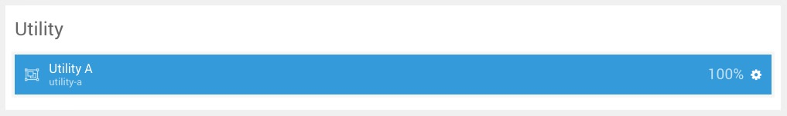

## Introduction

The **Utility** section includes one module position, **Utility**. In that module position we placed a **Gantry 5 Particle** module with the **Promo Content** particle assigned.

Here is a breakdown of the module(s) and particle(s) that appear in this section:

* [Module Position (Utility)](#module-position-(utility))
	* [Promo Content (particle)](#promo-content-(particle))

## Section Settings

| Option           | Setting                   |
| :--------------- | :----------               |
| Layout           | Fullwidth (Boxed Content) |
| CSS Classes      | Blank                     |
| Tag Attributes   | Blank                     |

## Module Position (Utility)

### Particle Settings

| Option        | Setting     |
| :-----        | :-----      |
| Particle Name | `Utility A` |
| Key           | `utility-a` |
| Chrome        | `gantry`    |

### Block Settings

| Option         | Setting      |
| :-----         | :-----       |
| CSS ID         | Blank        |
| CSS Classes    | `fp-utility` |
| Variations     | Blank        |
| Tag Attributes | Blank        |
| Fixed Size     | Unchecked    |
| Block Size     | `100%`       |

### Assigned Particle(s)

Using the **Gantry 5 Particle** module, we assigned a **Promo Content** particle to this position. You will find the settings used in this particle, below.

#### Promo Content (Particle)

##### Particle Settings

| Option           | Setting                                                                                                                                                                                            |
| :-----           | :-----                                                                                                                                                                                             |
| Particle Name    | `Promo Content`                                                                                                                                                                                    |
| CSS Classes      | `center`                                                                                                                                                                                           |
| Title            | `Navigation`                                                                                                                                                                                       |
| Promo Style      | Promo                                                                                                                                                                                              |
| Promo Text       | `An innovative menu design with overlay and animations`                                                                                                                                            |
| Description      | `Activate the menu from the menu button or icon, where the items will appear in an overlay with large, stylistic buttons for the menu items. All featuring engaging but non-intrusive animations.` |
| Readmore Text    | `Read More`                                                                                                                                                                                        |
| Readmore Classes | `button-3`                                                                                                                                                                                         |
| Link             | `#`                                                                                                                                                                                                |
| Readmore Style   | Block                                                                                                                                                                                              |
| Tags Item 1 Name | `Flexible & Intuitive`                                                                                                                                                                             |
| Tags Item 1 Icon | Blank                                                                                                                                                                                              |
| Tags Item 1 Text | `Flexible &amp; Intuitive`                                                                                                                                                                         |
| Tags Item 1 Link | `#`                                                                                                                                                                                                |
