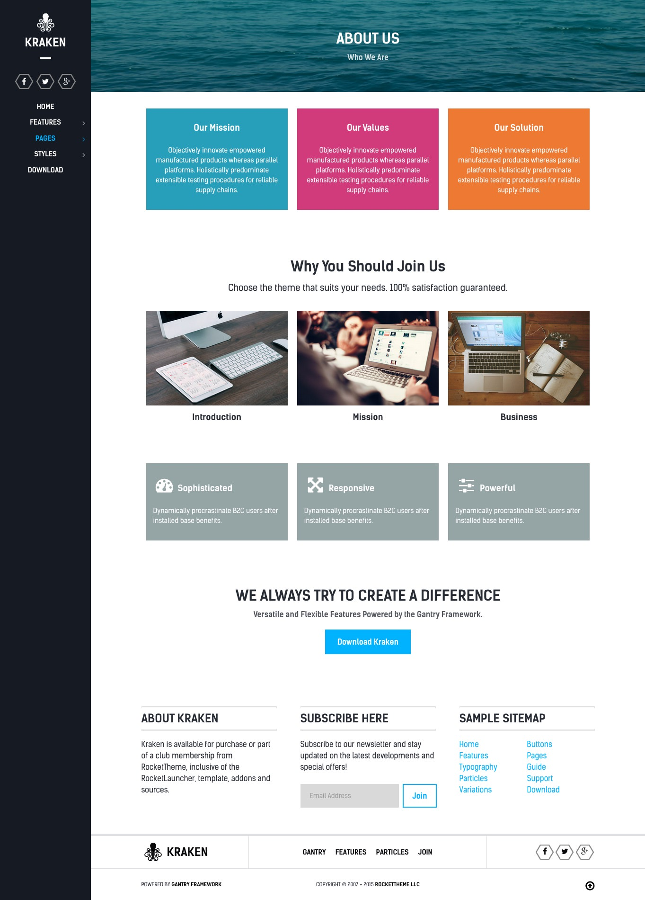
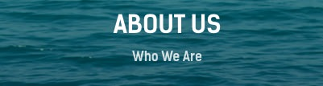
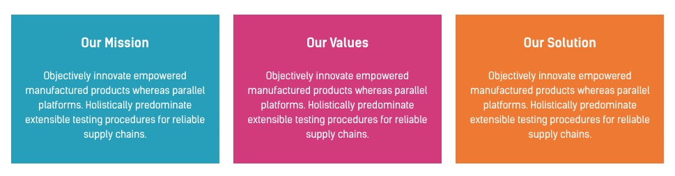
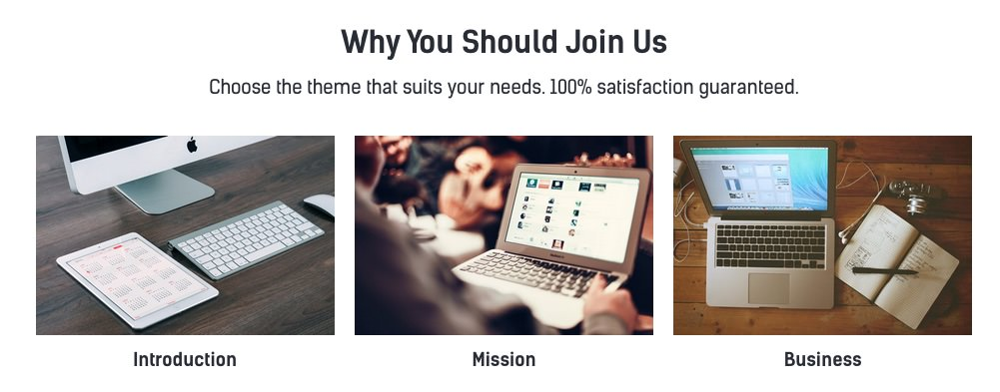
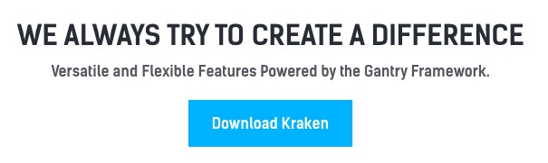

## Introduction

The **About Us** example page demonstrates how you can create a beautiful page with the Kraken template. Here is some information to help you replicate this page as it appears in the demo.

## Modules and Particles

Below is a brief rundown of the modules and particles used to make up the demo page.

:   1. **Header - Custom HTML (Module)** [4%, 45%, se]
    2. **Above - Custom HTML (Module)** [13%, 22%, se]
    3. **Mainbar - Page Content** [32%, 22%, se]
    4. **Extension - Custom HTML (Module)** [53%, 22%, se]
    5. **Bottom - Custom HTML (Module)** [66%, 35%, se]

1. [Header](#header-section)
2. [Above](#above-section)
3. [Mainbar](#mainbar-section)
4. [Extension](#extension-section)
5. [Bottom](#bottom-section)

## Header Section

This area of the page is an **Info List** particle. You will find the settings used in our demo below.

### Info List Particle

#### Gantry 5 Particle Module Details

| Field      | Setting             |
|:-----------|:--------------------|
| Title      | `About Us - Header` |
| Show Title | Hide                |
| Position   | `header-a`          |
| Status     | Published           |

### Particle Settings

| Option                              | Setting                                |
|:------------------------------------|:---------------------------------------|
| CSS Classes                         | `center`, `g-layercontent`, `noborder` |
| Title                               | Blank                                  |
| Intro                               | Blank                                  |
| Grid Column                         | 1 Column                               |
| Info Lists Item 1 Name              | `About Us`                             |
| Info Lists Item 1 Image             | Blank                                  |
| Info Lists Item 1 Image Location    | Left                                   |
| Info Lists Item 1 Text Style        | Header                                 |
| Info Lists Item 1 Image Style       | Compact                                |
| Info Lists Item 1 Description       | `Who We Are`                           |
| Info Lists Item 1 Tag               | Blank                                  |
| Info Lists Item 1 Sub Tag           | Blank                                  |
| Info Lists Item 1 Label             | Blank                                  |
| Info Lists Item 1 Link              | Blank                                  |
| Info Lists Item 1 Icon              | Blank                                  |
| Info Lists Item 1 Read More Classes | Blank                                  |

## Above Section

This area of the page is a **Block Content** particle. You will find the settings used in our demo below.

### Info List Particle

#### Gantry 5 Particle Module Details

| Field      | Setting                                  |
|:-----------|:-----------------------------------------|
| Title      | `About Us - Mission - Values - Solution` |
| Show Title | Hide                                     |
| Position   | `above-a`                                |
| Status     | Published                                |

### Particle Settings

| Option                        | Setting                                                                                                                                                               |
|:------------------------------|:----------------------------------------------------------------------------------------------------------------------------------------------------------------------|
| Image                         | Blank                                                                                                                                                                 |
| Headline                      | Blank                                                                                                                                                                 |
| Description                   | Blank                                                                                                                                                                 |
| Link                          | Blank                                                                                                                                                                 |
| Link Text                     | Blank                                                                                                                                                                 |
| CSS Classes                   | Blank                                                                                                                                                                 |
| Content Item 1 Name           | `Our Mission`                                                                                                                                                         |
| Content Item 1 Title          | `Our Mission`                                                                                                                                                         |
| Content Item 1 Icon           | Blank                                                                                                                                                                 |
| Content Item 1 Image          | Blank                                                                                                                                                                 |
| Content Item 1 Sub title      | Blank                                                                                                                                                                 |
| Content Item 1 Description    | `Objectively innovate empowered manufactured products whereas parallel platforms. Holistically predominate extensible testing procedures for reliable supply chains.` |
| Content Item 1 CSS Classes    | `center`, `box-blue`                                                                                                                                                  |
| Content Item 1 Button Label   | Blank                                                                                                                                                                 |
| Content Item 1 Button Link    | Blank                                                                                                                                                                 |
| Content Item 1 Button Classes | Blank                                                                                                                                                                 |

## Mainbar Section

The **Mainbar** section includes the **About Us** article, displayed through the **Page Content** particle. Here are the settings found in the **About Us** article.

| Option   | Setting        |
|:---------|:---------------|
| Title    | `About Us`     |
| Alias    | `about-us`     |
| Status   | Published      |
| Featured | No             |
| Category | `Sample Pages` |

**Content Body**

~~~ .html

  

    

      

        <h2 class="g-layercontent-title">
          Why You Should Join Us
        </h2>
        

          Choose the theme that suits your needs. 100% satisfaction guaranteed.
        

      

    

  

  

    

      

        

          

            
            <h2 class="g-title">
              Introduction
            </h2>
          

        

        

          

            
            <h2 class="g-title">
              Mission
            </h2>
          

        

        

          

            
            <h2 class="g-title">
              Business
            </h2>
          

        

      

    

  

~~~

## Extension Section

This area of the page is a **Block Content** particle. You will find the settings used in our demo below.

### Block Content Particle

#### Gantry 5 Particle Module Details

| Field      | Setting                                            |
|:-----------|:---------------------------------------------------|
| Title      | `About Us - Sophisticated - Responsive - Powerful` |
| Show Title | Hide                                               |
| Position   | `extension-a`                                      |
| Status     | Published                                          |

### Particle Settings

| Option                        | Setting                                                              |
|:------------------------------|:---------------------------------------------------------------------|
| Image                         | Blank                                                                |
| Headline                      | Blank                                                                |
| Description                   | Blank                                                                |
| Link                          | Blank                                                                |
| Link Text                     | Blank                                                                |
| CSS Classes                   | Blank                                                                |
| Content Item 1 Name           | `Our Mission`                                                        |
| Content Item 1 Title          | `Sophisticated`                                                      |
| Content Item 1 Icon           | `fa fa-dashboard fa-fw fa-2x`                                        |
| Content Item 1 Image          | Blank                                                                |
| Content Item 1 Sub title      | Blank                                                                |
| Content Item 1 Description    | `Dynamically procrastinate B2C users after installed base benefits.` |
| Content Item 1 CSS Classes    | `box-gray`                                                           |
| Content Item 1 Button Label   | Blank                                                                |
| Content Item 1 Button Link    | Blank                                                                |
| Content Item 1 Button Classes | Blank                                                                |

## Bottom Section

This area of the page is an **Info List** particle. You will find the settings used in our demo below.

### Info List Particle

#### Gantry 5 Particle Module Details

| Field      | Setting                                           |
|:-----------|:--------------------------------------------------|
| Title      | `About Us - We Always Try to Create a Difference` |
| Show Title | Hide                                              |
| Position   | `bottom-a`                                        |
| Status     | Published                                         |

#### Particle Settings

| Option                              | Setting                                                            |
|:------------------------------------|:-------------------------------------------------------------------|
| CSS Classes                         | `center`, `g-layercontent`, `noborder`                             |
| Title                               | Blank                                                              |
| Intro                               | Blank                                                              |
| Grid Column                         | 1 Column                                                           |
| Info Lists Item 1 Name              | `We Always Try to Create a Difference`                             |
| Info Lists Item 1 Image             | Blank                                                              |
| Info Lists Item 1 Image Location    | Left                                                               |
| Info Lists Item 1 Text Style        | Header                                                             |
| Info Lists Item 1 Image Style       | Compact                                                            |
| Info Lists Item 1 Description       | `Versatile and Flexible Features Powered by the Gantry Framework.` |
| Info Lists Item 1 Tag               | Blank                                                              |
| Info Lists Item 1 Sub Tag           | Blank                                                              |
| Info Lists Item 1 Label             | `Download Kraken`                                                  |
| Info Lists Item 1 Link              | `http://www.rockettheme.com/joomla/templates/kraken`               |
| Info Lists Item 1 Icon              | Blank                                                              |
| Info Lists Item 1 Read More Classes | Blank                                                              |
