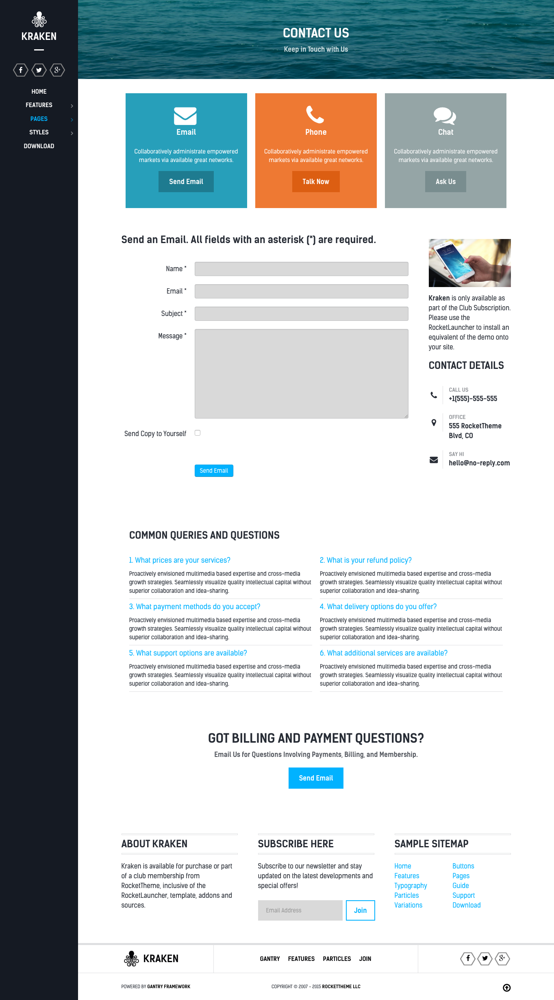
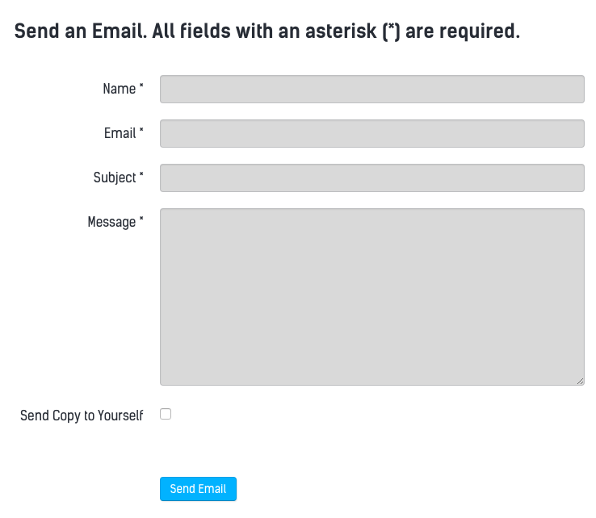
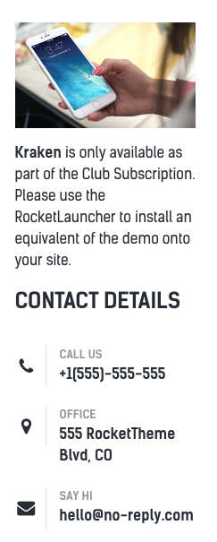
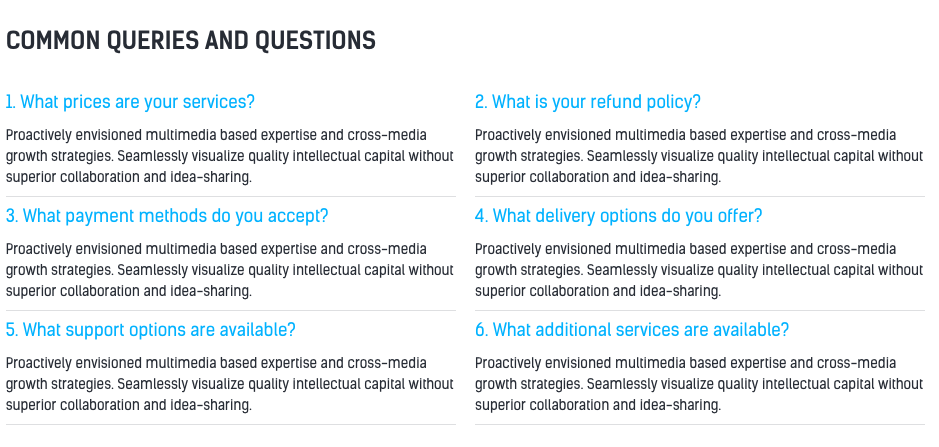
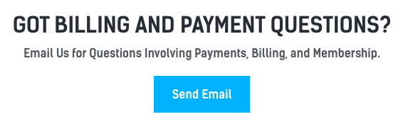

## Introduction

The **Contact** example page demonstrates how you can create a beautiful page with the Kraken template. Here is some information to help you replicate this page as it appears in the demo.

## Modules and Particles

Below is a brief rundown of the modules and particles used to make up the demo page.

:   1. **Header - Info List (particle)** [9%, 40%, se]
    2. **Above - Block Content (particle)** [14%, 10%, se]
    3. **Mainbar - Page Content** [26%, 9%, se]
    4. **Aside - Contact (particle)** [26%, 70%, se]
    5. **Extension - Info List (particle)** [60%, 10%, se]
    6. **Bottom - Info List (particle)** [77%, 30%, se]

1. [Header](#showcase-section)
2. [Above](#above-section)
3. [Mainbar](#mainbar-section)
4. [Aside](#aside-section)
5. [Extension](#extension-section)
6. [Bottom](#bottom-section)

## Header Section

This area of the page is an **Info List** particle. You will find the settings used in our demo below.

### Info List Particle

#### Gantry 5 Particle Module Details

| Field      | Setting             |
| :-----     | :-----              |
| Title      | `Contact - Header` |
| Show Title | Hide                |
| Position   | `header-a`          |
| Status     | Published           |

### Particle Settings

| Option                              | Setting                                |
| :----------                         | :----------                            |
| CSS Classes                         | `center`, `g-layercontent`, `noborder` |
| Title                               | Blank                                  |
| Intro                               | Blank                                  |
| Grid Column                         | 1 Column                               |
| Info Lists Item 1 Name              | `Contact Us`                           |
| Info Lists Item 1 Image             | Blank                                  |
| Info Lists Item 1 Image Location    | Left                                   |
| Info Lists Item 1 Text Style        | Header                                 |
| Info Lists Item 1 Image Style       | Compact                                |
| Info Lists Item 1 Description       | `Keep in Touch with Us`                |
| Info Lists Item 1 Tag               | Blank                                  |
| Info Lists Item 1 Sub Tag           | Blank                                  |
| Info Lists Item 1 Label             | Blank                                  |
| Info Lists Item 1 Link              | Blank                                  |
| Info Lists Item 1 Icon              | Blank                                  |
| Info Lists Item 1 Read More Classes | Blank                                  |

## Above Section

This area of the page is an **Block Content** particle. You will find the settings used in our demo below.

### Info List Particle

#### Gantry 5 Particle Module Details

| Field      | Setting                                  |
| :-----     | :-----                                   |
| Title      | `Contact - Email - Phone - Chat` |
| Show Title | Hide                                     |
| Position   | `above-a`                                |
| Status     | Published                                |

### Particle Settings

| Option                        | Setting                                                                        |
| :----------                   | :----------                                                                    |
| Image                         | Blank                                                                          |
| Headline                      | Blank                                                                          |
| Description                   | Blank                                                                          |
| Link                          | Blank                                                                          |
| Link Text                     | Blank                                                                          |
| CSS Classes                   | Blank                                                                          |
| Content Item 1 Name           | `Email`                                                                        |
| Content Item 1 Title          | `Email`                                                                        |
| Content Item 1 Icon           | `fa fa-envelope fa-3x`                                                         |
| Content Item 1 Image          | Blank                                                                          |
| Content Item 1 Sub title      | Blank                                                                          |
| Content Item 1 Description    | `Collaboratively administrate empowered markets via available great networks.` |
| Content Item 1 CSS Classes    | `center`, `box-blue`                                                           |
| Content Item 1 Button Label   | `Send Email`                                                                   |
| Content Item 1 Button Link    | `#`                                                                            |
| Content Item 1 Button Classes | `button-4`                                                                     |

## Mainbar Section

The **Mainbar** section is set to `60`% width and both the **Sidebar** and **Aside** sections are set to `20`%.

The page's content is sourced from a **Single Contact** menu item assigned to the outline. This creates the contact form as seen in our demo.

Settings used in our demo for each of these particles can be found below.

### Page Content

#### Particle Settings

| Field         | Setting        |
| :-----        | :-----         |
| Particle Name | `Page Content` |

#### Block Settings

| Field          | Setting |
| :-----         | :-----  |
| CSS ID         | Blank   |
| CSS Classes    | Blank   |
| Variations     | Blank   |
| Tag Attributes | Blank   |
| Block Size     | `100%`  |

## Aside Section

The **Aside** section is set to `20`% width.

This area of the page is an **Contact** particle. You will find the settings used in our demo below.

### Contact (Particle)

#### Particle Settings

| Field                | Setting             |
| :-----               | :-----              |
| Particle Name        | `Contact`           |
| CSS Classes          | Blank               |
| Title                | `Contact Details`   |
| Contact Item 1 Name  | `Call Us`           |
| Contact Item 1 Icon  | `fa fa-phone fa-fw` |
| Contact Item 1 Value | `+1(555)-555-555`   |
| Map Position         | Top                 |
| Maps                 | Blank               |

## Extension Section

The **Extension** section consists of an **Info List** particle assigned to the `extension-a` module position.

You will find the settings used in our demo below.

### Info List (Particle)

#### Particle Settings

| Field                            | Setting                                                                                                                                                                                 |
| :-----                           | :-----                                                                                                                                                                                  |
| Particle Name                    | `Info List`                                                                                                                                                                             |
| CSS Classes                      | Blank                                                                                                                                                                                   |
| Title                            | `Common Queries and Questions`                                                                                                                                                          |
| Description                      | Blank                                                                                                                                                                                   |
| Grid Column                      | 2 Columns                                                                                                                                                                               |
| Info Lists Item 1 Name           | `What prices are your services?`                                                                                                                                                        |
| Info Lists Item 1 Image          | Blank                                                                                                                                                                                   |
| Info Lists Item 1 Image Location | Left                                                                                                                                                                                    |
| Info Lists Item 1 Text Style     | Compact                                                                                                                                                                                 |
| Info Lists Item 1 Image Style    | Compact                                                                                                                                                                                 |
| Info Lists Item 1 Description    | `Proactively envisioned multimedia based expertise and cross-media growth strategies. Seamlessly visualize quality intellectual capital without superior collaboration and idea-sharing.` |
| Info Lists Item 1 Tag            | Blank                                                                                                                                                                                   |
| Info Lists Item 1 Sub Tag        | Blank                                                                                                                                                                                   |
| Info Lists Item 1 Label          | Blank                                                                                                                                                                                   |
| Info Lists Item 1 Link           | `#`                                                                                                                                                                                     |
| Info Lists Item 1 Icon           | Blank                                                                                                                                                                                   |
| Info Lists Item 1 CSS Classes    | Blank                                                                                                                                                                                   |

## Bottom Section

This area of the page is an **Info List** particle. You will find the settings used in our demo below.

### Info List Particle

#### Gantry 5 Particle Module Details

| Field      | Setting                                           |
| :-----     | :-----                                            |
| Title      | `About Us - We Always Try to Create a Difference` |
| Show Title | Hide                                              |
| Position   | `bottom-a`                                        |
| Status     | Published                                         |

#### Particle Settings

| Option                              | Setting                                                               |
| :----------                         | :----------                                                           |
| CSS Classes                         | `center`, `g-layercontent`                                            |
| Title                               | Blank                                                                 |
| Intro                               | Blank                                                                 |
| Grid Column                         | 1 Column                                                              |
| Info Lists Item 1 Name              | `Got Billing and Payment Questions?`                                  |
| Info Lists Item 1 Image             | Blank                                                                 |
| Info Lists Item 1 Image Location    | Left                                                                  |
| Info Lists Item 1 Text Style        | Header                                                                |
| Info Lists Item 1 Image Style       | Compact                                                               |
| Info Lists Item 1 Description       | `Email Us for Questions Involving Payments, Billing, and Membership.` |
| Info Lists Item 1 Tag               | Blank                                                                 |
| Info Lists Item 1 Sub Tag           | Blank                                                                 |
| Info Lists Item 1 Label             | `Send Email`                                                          |
| Info Lists Item 1 Link              | `http://www.rockettheme.com/joomla/templates/kraken`                 |
| Info Lists Item 1 Icon              | Blank                                                                 |
| Info Lists Item 1 Read More Classes | Blank                                                                 |

