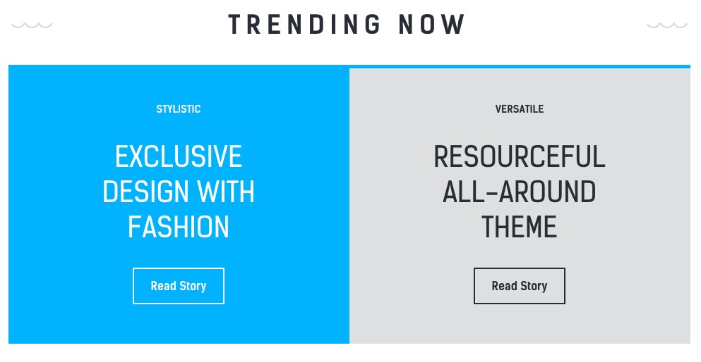
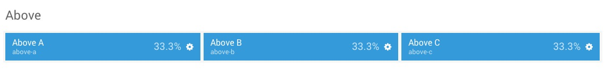
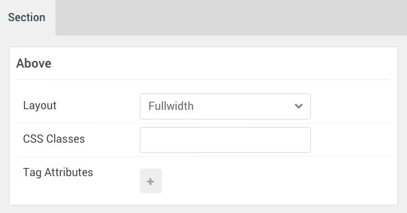
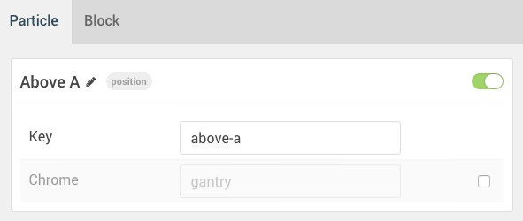
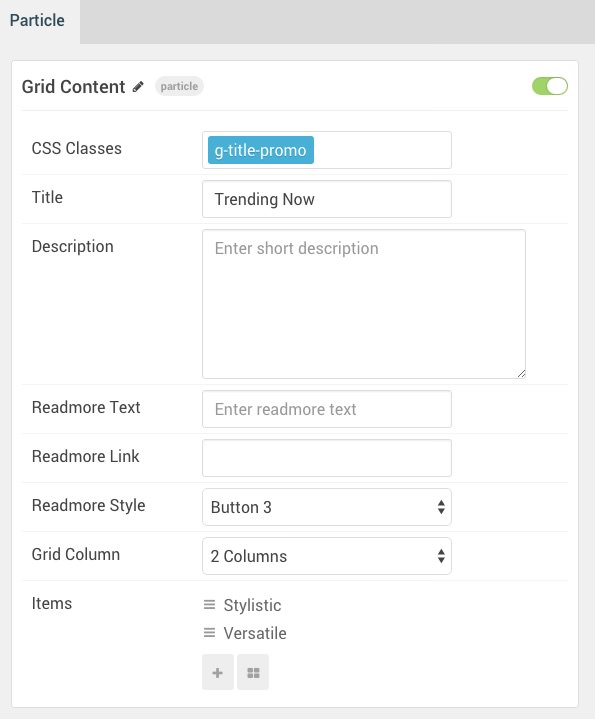

## Introduction

The **Above** section includes three module positions, `above-a`, `above-b`, and `above-c`. We are only using `above-a` from this section actively, so only it is rendering to the front end.

Here is a breakdown of the module(s) and particle(s) that appear in this section:

* [Above A (module position)](#above-a-(module-position))
    - [Grid Content (particle)](#gantry-5-particle-(promo-content))

## Section Settings

| Option         | Setting   |
|:---------------|:----------|
| Layout         | Fullwidth |
| CSS Classes    | Blank     |
| Tag Attributes | Blank     |

## Above A (module position)

#### Particle Settings

| Option | Setting   |
|:-------|:----------|
| Key    | `above-a` |
| Chrome | gantry    |

#### Block Settings

| Option         | Setting    |
|:---------------|:-----------|
| CSS ID         | Blank      |
| CSS Classes    | Blank      |
| Variations     | Blank      |
| Tag Attributes | Blank      |
| Block Size     | `33.3333%` |

### Assigned Module(s)

#### Gantry 5 Particle (Grid Content)

We added a **Grid Content** particle to the `above-a` position. This was done by creating a **Gantry 5 Particle** module and selecting the **Grid Content** particle in the module's settings.

You will find the particle settings used in this particle below:

##### Particle Settings

| Option                        | Setting                         |
|:------------------------------|:--------------------------------|
| CSS Classes                   | `g-title-promo`                 |
| Title                         | `Trending Now`                  |
| Description                   | Blank                           |
| Readmore Text                 | Blank                           |
| Readmore Link                 | Blank                           |
| Readmore Style                | Button 3                        |
| Grid Column                   | 2 Columns                       |
| Grid Item 1 Name              | `Stylistic`                     |
| Grid Item 1 Icon              | Blank                           |
| Grid Item 1 Image             | Blank                           |
| Grid Item 1 Title Class       | Style 1                         |
| Grid Item 1 SubTitle          | `Stylistic`                     |
| Grid Item 1 Title             | `Exclusive Design with Fashion` |
| Grid Item 1 Description       | Blank                           |
| Grid Item 1 Link Text         | `Read Story`                    |
| Grid Item 1 Link              | `#`                             |
| Grid Item 1 Link Button Style | Button 4                        |
