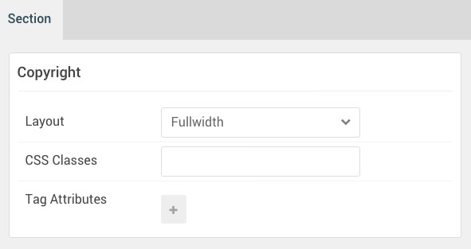

## Introduction

The **Copyright** section includes three particles, **Branding**, **Copyright**, and a **To Top** particle. These particles are created using the Layout Manager.

Here is a breakdown of the module(s) and particle(s) that appear in this section:

* [Branding (particle)](#gantry-5-particle-(branding))
* [Copyright (particle)](#gantry-5-particle-(copyright))
* [To Top (particle)](#gantry-5-particle-(to-top))

## Section Settings

| Option         | Setting   |
| :-----         | :-----    |
| Layout         | Fullwidth |
| CSS Classes    | Blank     |
| Tag Attributes | Blank     |

### Gantry 5 Particle (Branding)

We added a **Branding** particle to the first block. 

You will find the particle settings used in this particle below:

#### Particle Settings

| Option      | Setting                                                                                                                                             |
| :-----      | :-----                                                                                                                                              |
| Content     | `Powered by <a href="http://www.gantry.org/" title="Gantry Framework" class="g-powered-by">Gantry Framework</a>` |
| CSS Classes | `branding`                                                                                                                                          |

#### Block Settings

| Option         | Setting   |
| :-----         | :-----    |
| CSS ID         | Blank     |
| CSS Classes    | Blank     |
| Variations     | Blank     |
| Tag Attributes | Blank     |
| Fixed Size     | Unchecked |
| Block Size     | `25%`     |

### Gantry 5 Particle (Copyright)

We added a **Copyright** particle to the second block. 

You will find the particle settings used in this particle below:

#### Particle Settings

| Option            | Setting           |
| :-----            | :-----            |
| Start Year        | `2007`            |
| End Year          | `Now`             |
| Copyright Owner   | `RocketTheme LLC` |
| Owner Link        | Blank             |
| Owner Link Target | New Window        |
| CSS Classes       | Blank             |

#### Block Settings

| Option         | Setting   |
| :-----         | :-----    |
| CSS ID         | Blank     |
| CSS Classes    | Blank     |
| Variations     | Blank     |
| Tag Attributes | Blank     |
| Fixed Size     | Unchecked |
| Block Size     | `50%`     |

### Gantry 5 Particle (To Top)

We added a **To Top** particle to the third block.

You will find the particle settings used in this particle below:

#### Particle Settings

| Option             | Setting                               |
| :-----             | :-----                                |
| CSS Classes        | `totop`                               |
| Icon               | `fa fa-arrow-circle-o-up fa-2x`       |
| Text               | `To Top`                              |

#### Block Settings

| Option         | Setting   |
| :-----         | :-----    |
| CSS ID         | Blank     |
| CSS Classes    | Blank     |
| Variations     | Blank     |
| Tag Attributes | Blank     |
| Fixed Size     | Unchecked |
| Block Size     | `25%`     |