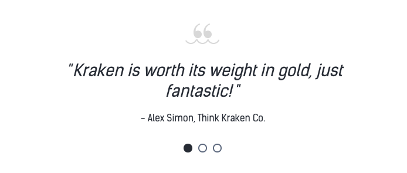
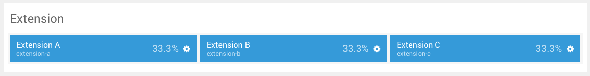
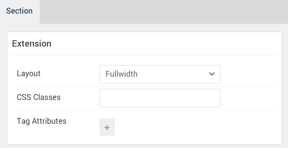
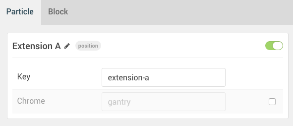
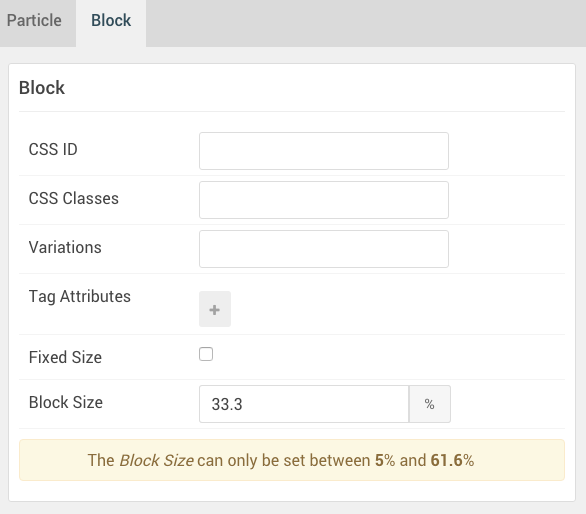
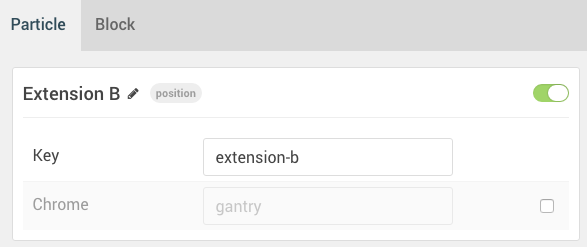
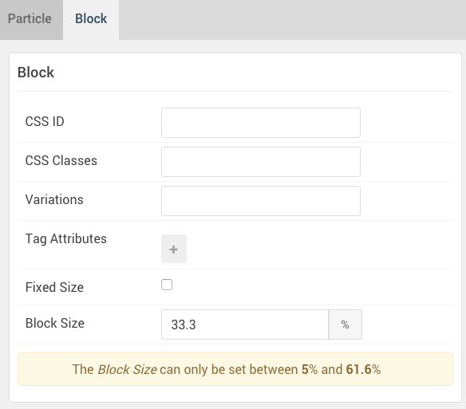
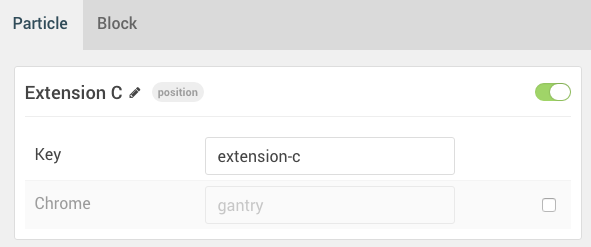
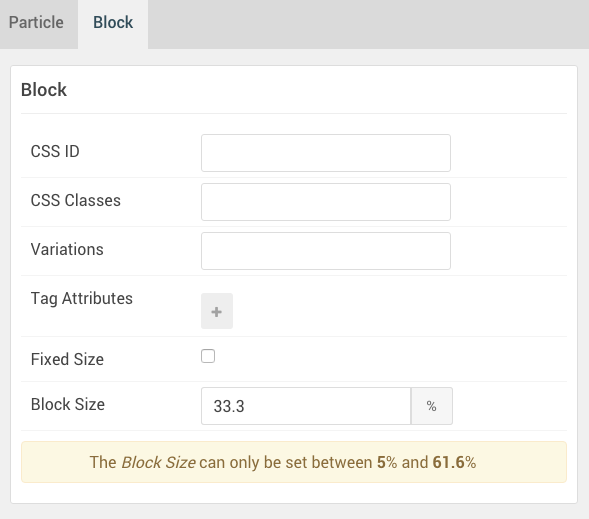

## Introduction

The **Extension** section includes three module positions, `extension-a`, `extension-b`, and `extension-c`. 

Here is a breakdown of the module(s) and particle(s) that appear in this section:

* [Extension A (module position)](#extension-a-(module-position))
    - [Swiper (particle)](#gantry-5-particle-(swiper))
* [Extension B (module position)](#extension-b-(module-position))
* [Extension C (module position)](#extension-c-(module-position))

## Section Settings

| Option         | Setting   |
| :-----         | :-----    |
| Layout         | Fullwidth |
| CSS Classes    | Blank     |
| Tag Attributes | Blank     |

## Extension A (module position)

#### Particle Settings

| Option | Setting     |
| :----- | :-----      |
| Key    | `extension-a` |
| Chrome | gantry      |

#### Block Settings

| Option         | Setting    |
| :-----         | :-----     |
| CSS ID         | Blank      |
| CSS Classes    | Blank      |
| Variations     | Blank      |
| Tag Attributes | Blank      |
| Block Size     | `33.3333%` |

### Assigned Module(s)

#### Gantry 5 Particle (Swiper)

We added a **Swiper** particle to the `extension-a` position. This was done by creating a **Gantry 5 Particle** module and selecting the **Swiper** particle in the module's settings. 

You will find the particle settings used in this particle below:

##### Particle Settings

| Option                    | Setting                                               |
| :-----                    | :-----                                                |
| Particle Name             | `Swiper`                                              |
| CSS Classes               | `g-swiper-testimonial`                                |
| Title                     | Blank                                                 |
| Element ID                | `swiper-4`                                            |
| Layout                    | Horizontal Slides                                     |
| Element Height            | 300px                                                 |
| Slide per View            | `2`                                                   |
| Swiper Item 1 Name        | `Item 01`                                             |
| Swiper Item 1 Image       | Blank                                                 |
| Swiper Item 1 SubTitle    | Blank                                                 |
| Swiper Item 1 Title       | `Kraken is worth its weight in gold, just fantastic!` |
| Swiper Item 1 Link        | Blank                                                 |
| Swiper Item 1 Link Text   | Blank                                                 |
| Swiper Item 1 Description | `- Alex Simon, Think Kraken Co.`                      |

## Extension B (module position)

#### Particle Settings

| Option | Setting       |
| :----- | :-----        |
| Key    | `extension-b` |
| Chrome | gantry        |

#### Block Settings

| Option         | Setting    |
| :-----         | :-----     |
| CSS ID         | Blank      |
| CSS Classes    | Blank      |
| Variations     | Blank      |
| Tag Attributes | Blank      |
| Block Size     | `33.3333%` |

## Extension C (module position)

#### Particle Settings

| Option | Setting      |
| :----- | :-----       |
| Key    | `extension-c` |
| Chrome | gantry       |

#### Block Settings

| Option         | Setting    |
| :-----         | :-----     |
| CSS ID         | Blank      |
| CSS Classes    | Blank      |
| Variations     | Blank      |
| Tag Attributes | Blank      |
| Block Size     | `33.3333%` |
