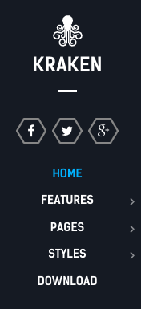
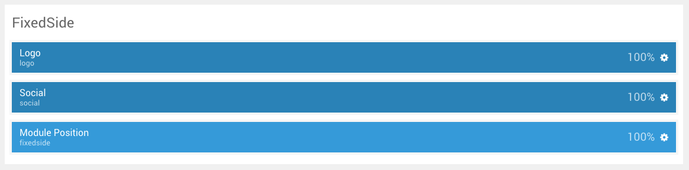
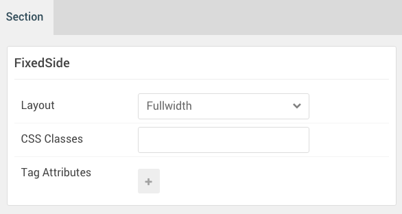
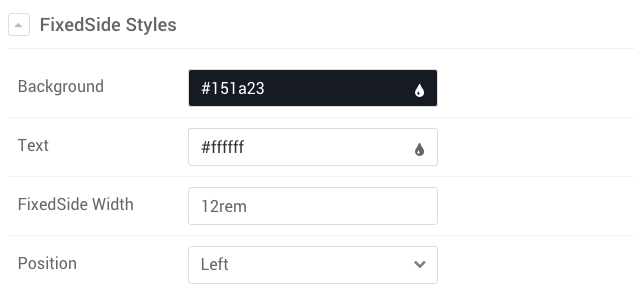
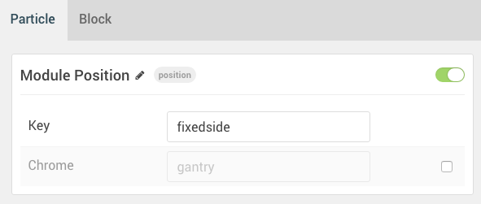
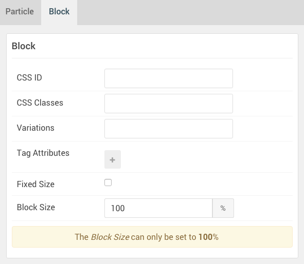
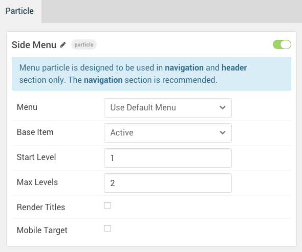

## Introduction

:   1. **Logo (Particle)** [10%, 20%, se]
    2. **Social (Particle)** [40%, 20%, se]
    3. **Side Menu (Particle)** [60%, 20%, se]

The **FixedSide** section includes two particles, each arranged in its own row in the section.

Here is a breakdown of the module(s) and particle(s) that appear in this section:

* [Logo (particle)](#logo-(particle))
* [Social (particle)](#social-(particle))
* [Module Position (fixedside)](#fixedside-(module-position))
    - [Side Menu (Particle)](#gantry-5-particle-(side-menu))

## Section Settings

| Option         | Setting   |
| :-----         | :-----    |
| Layout         | Fullwidth |
| CSS Classes    | Blank     |
| Tag Attributes | Blank     |

## Style Settings

The settings present in the **Style** administrative panels are 

| Option          | Setting   |
| :-----          | :-----    |
| Background      | `#151a23` |
| Text            | `#ffffff` |
| FixedSide Width | `12rem`   |
| Position        | Left      |

## Logo (particle)

#### Particle Settings

| Option        | Setting            |
| :-----        | :-----             |
| Particle Name | `Logo`             |
| URL           | Blank              |
| Rel           | Blank              |
| Image         | Custom             |
| Alt           | `Kraken`           |
| Text          | `Kraken`           |
| CSS Classes   | `g-fixedside-logo` |

#### Block Settings

| Option         | Setting   |
| :-----         | :-----    |
| CSS ID         | Blank     |
| CSS Classes    | Blank     |
| Variations     | Blank     |
| Tag Attributes | Blank     |
| Fixed Size     | Unchecked |
| Block Size     | `100%`    |

## Social (particle)

#### Particle Settings

| Option             | Setting               |
| :-----             | :-----                |
| CSS Classes        | `social`              |
| Title              | Blank                 |
| Target             | New Window            |
| Social Item 1 Name | `Twitter`             |
| Social Item 1 Icon | `fa fa-twitter fa-fw` |
| Social Item 1 Text | Blank                 |
| Social Item 1 Link | `#`                   |

#### Block Settings

| Option         | Setting   |
| :-----         | :-----    |
| CSS ID         | Blank     |
| CSS Classes    | Blank     |
| Variations     | Blank     |
| Tag Attributes | Blank     |
| Fixed Size     | Unchecked |
| Block Size     | `100%`    |

## FixedSide (module position)

#### Particle Settings

| Option | Setting     |
| :----- | :-----      |
| Key    | `fixedside` |
| Chrome | gantry      |

#### Block Settings

| Option         | Setting |
| :-----         | :-----  |
| CSS ID         | Blank   |
| CSS Classes    | Blank   |
| Variations     | Blank   |
| Tag Attributes | Blank   |
| Block Size     | `100%`  |

### Assigned Module(s)

#### Gantry 5 Particle (Side Menu)

We added a **Side Menu** particle to the `fixedside` position. This was done by creating a **Gantry 5 Particle** module and selecting the **Side Menu** particle in the module's settings. 

You will find the particle settings used in this particle below:

##### Particle Settings

| Option                      | Setting                                                                     |
| :-----                      | :-----                                                                      |
| Particle Name               | `Side Menu`                                                                 |
| Menu                        | Use Default Menu                                                            |
| Base Item                   | Active                                                                      |
| Start Level                 | `1`                                                                         |
| Max Levels                  | `2`                                                                         |
| Render Titles               | Unchecked                                                                   |
| Mobile Target               | Unchecked                                                                   |
