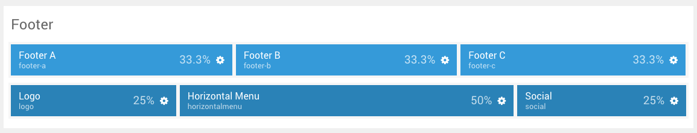
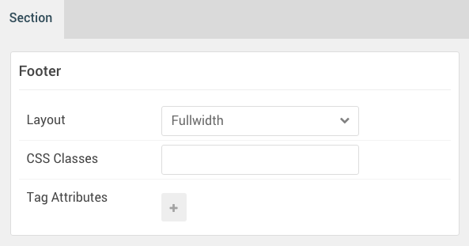

## Introduction

The **Footer** sections include three module positions, `footer-a`, `footer-b`, and `footer-c`. These module positions are created using the Layout Manager. There are also three particles present, detailed below.

Here is a breakdown of the module(s) and particle(s) that appear in this section:

* [Footer A (module position)](#footer-a-(module-position))
* [Footer B (module position)](#footer-b-(module-position))
* [Footer C (module position)](#footer-c-(module-position))
* [Logo (particle)](#logo-(particle))
* [Horizontal Menu (particle)](#horizontal-menu-(particle))
* [Social (particle)](#social-(particle))

## Section Settings

| Option         | Setting   |
| :-----         | :-----    |
| Section Width  | `100%`    |
| Layout         | Fullwidth |
| CSS Classes    | Blank     |
| Tag Attributes | Blank     |

## Footer A (module position)

#### Particle Settings

| Option | Setting    |
| :----- | :-----     |
| Key    | `footer-a` |
| Chrome | gantry     |

#### Block Settings

| Option         | Setting            |
| :-----         | :-----             |
| CSS ID         | Blank              |
| CSS Classes    | `g-title-bordered` |
| Variations     | Blank              |
| Tag Attributes | Blank              |
| Block Size     | `33.3%`            |

## Footer B (module position)

#### Particle Settings

| Option | Setting    |
| :----- | :-----     |
| Key    | `footer-b` |
| Chrome | gantry     |

#### Block Settings

| Option         | Setting            |
| :-----         | :-----             |
| CSS ID         | Blank              |
| CSS Classes    | `g-title-bordered` |
| Variations     | Blank              |
| Tag Attributes | Blank              |
| Block Size     | `33.3%`            |

## Footer C (module position)

#### Particle Settings

| Option | Setting    |
| :----- | :-----     |
| Key    | `footer-c` |
| Chrome | gantry     |

#### Block Settings

| Option         | Setting            |
| :-----         | :-----             |
| CSS ID         | Blank              |
| CSS Classes    | `g-title-bordered` |
| Variations     | Blank              |
| Tag Attributes | Blank              |
| Block Size     | `33.3%`            |

## Logo (particle)

#### Particle Settings

| Option        | Setting  |
| :-----        | :-----   |
| Particle Name | `Logo`   |
| URL           | Blank    |
| Rel           | Blank    |
| Image         | Custom   |
| Alt           | `Kraken` |
| Text          | `Kraken` |
| CSS Classes   | `g-logo` |

#### Block Settings

| Option         | Setting   |
| :-----         | :-----    |
| CSS ID         | Blank     |
| CSS Classes    | Blank     |
| Variations     | Blank     |
| Tag Attributes | Blank     |
| Fixed Size     | Unchecked |
| Block Size     | `25%`     |

## Horizontal Menu (particle)

#### Particle Settings

| Option           | Setting                  |
| :-----           | :-----                   |
| Particle Name    | `Horizontal Menu`        |
| CSS Classes      | Blank                    |
| Target Window    | New Window               |
| Social Item 1 Name | `Gantry`                 |
| Menu Item 1 Text | `Gantry`                 |
| Menu Item 1 Link | `http://www.gantry.org/` |

#### Block Settings

| Option         | Setting                  |
| :-----         | :-----                   |
| CSS ID         | Blank                    |
| CSS Classes    | `g-horizontalmenu-block` |
| Variations     | Center                   |
| Tag Attributes | Blank                    |
| Fixed Size     | Unchecked                |
| Block Size     | `50%`                    |

## Social (particle)

#### Particle Settings

| Option               | Setting                               |
| :-----               | :-----                                |
| Particle Name        | `Social`                              |
| CSS Classes          | `social`                              |
| Title                | Blank                                 |
| Social Item 1 Name   | `Facebook`                            |
| Social Item 1 Icon   | `fa fa-facebook fa-fw`                |
| Social Item 1 Text   | Blank                                 |
| Social Item 1 Link   | `http://www.facebook.com/RocketTheme` |
| Social Item 1 Target | New Window                            |

#### Block Settings

| Option         | Setting   |
| :-----         | :-----    |
| CSS ID         | Blank     |
| CSS Classes    | `social`  |
| Variations     | Center    |
| Tag Attributes | Blank     |
| Fixed Size     | Unchecked |
| Block Size     | `25%`     |