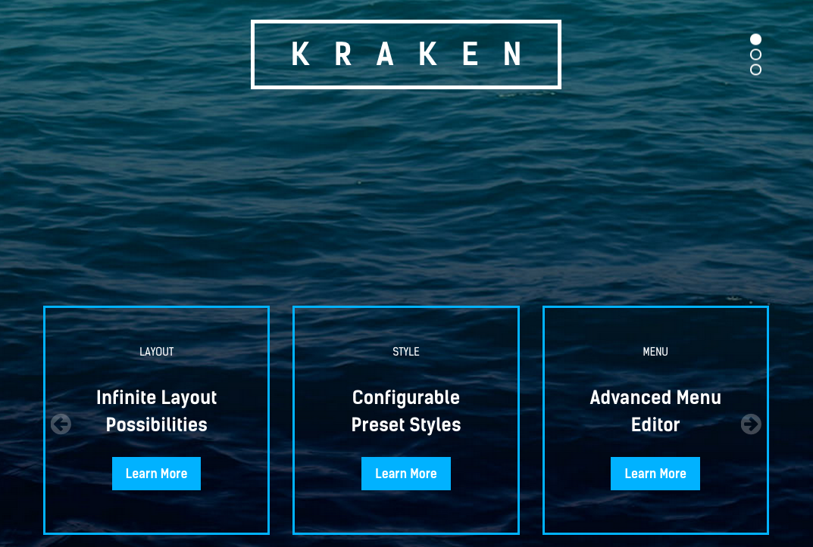
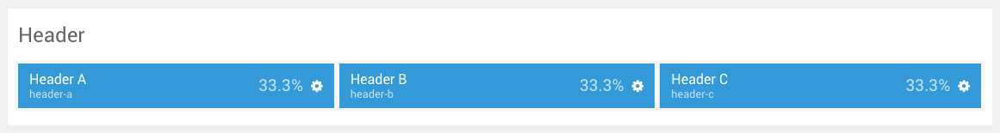
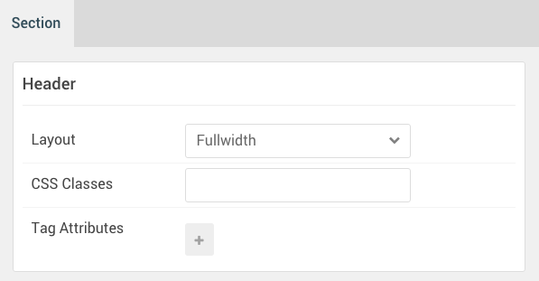

## Introduction

:   1. **Swiper (Particle)** [10%, 20%, se]
    2. **Swiper (Particle)** [60%, 5%, se]

The **Header** section includes three module positions, `header-a`, `header-b`, `header-c`. These module positions are created using the Layout Manager.

Here is a breakdown of the module(s) and particle(s) that appear in this section:

* [Header A (module position)](#header-a-(module-position))
    - [Swiper (particle)](#gantry-5-particle-(swiper))
    - [Swiper (Particle)](#gantry-5-particle-(swiper)-2)

## Section Settings

| Option         | Setting   |
|:---------------|:----------|
| Layout         | Fullwidth |
| CSS Classes    | Blank     |
| Tag Attributes | Blank     |

## Header A (module position)

#### Particle Settings

| Option | Setting    |
|:-------|:-----------|
| Key    | `header-a` |
| Chrome | gantry     |

#### Block Settings

| Option         | Setting    |
|:---------------|:-----------|
| CSS ID         | Blank      |
| CSS Classes    | Blank      |
| Variations     | Blank      |
| Tag Attributes | Blank      |
| Block Size     | `33.3333%` |

### Assigned Module(s)

#### Gantry 5 Particle (Swiper)

We added a **Swiper** particle to the `header-a` position. This was done by creating a **Gantry 5 Particle** module and selecting the **Swiper** particle in the module's settings.

>> There is a mobile version of this particle using the `visible-phone` CSS class which has differing options in order to make the particle appear slightly different.

You will find the particle settings used in this particle below:

##### Particle Settings

| Option                    | Setting                 |
|:--------------------------|:------------------------|
| Particle Name             | `Swiper`                |
| CSS Classes               | `center` `hidden-phone` |
| Title                     | Blank                   |
| Element ID                | `swiper-1`              |
| Layout                    | Vertical Sides          |
| Element Height            | `600px`                 |
| Slide Per View            | 2                       |
| Swiper Item 1 Name        | `Kraken`                |
| Swiper Item 1 Image       | Blank                   |
| Swiper Item 1 Subtitle    | Blank                   |
| Swiper Item 1 Title       | `Kraken`                |
| Swiper Item 1 Link        | Blank                   |
| Swiper Item 1 Link Text   | Blank                   |
| Swiper Item 1 Description | Blank                   |

#### Gantry 5 Particle (Swiper) 2

We added a second **Swiper** particle to the `header-a` position. This was done by creating a **Gantry 5 Particle** module and selecting the **Swiper** particle in the module's settings.

>> There is a mobile version of this particle using the `visible-phone` CSS class which has a single slide per view in order to make the particle appear slightly different.

You will find the particle settings used in this particle below:

##### Particle Settings

| Option                    | Setting                                         |
|:--------------------------|:------------------------------------------------|
| Particle Name             | `Swiper`                                        |
| CSS Classes               | `hidden-phone`                                  |
| Title                     | Blank                                           |
| Element ID                | `swiper-2`                                      |
| Layout                    | Carousel                                        |
| Element Height            | `200px`                                         |
| Slide Per View            | `3`                                             |
| Swiper Item 1 Name        | `Item 1`                                        |
| Swiper Item 1 Image       | Blank                                           |
| Swiper Item 1 Subtitle    | `Layout`                                        |
| Swiper Item 1 Title       | `Infinite Layout Possibilities`                 |
| Swiper Item 1 Link        | `features/overview`                             |
| Swiper Item 1 Link Text   | `Learn More` |
| Swiper Item 1 Description | Blank                                           |
