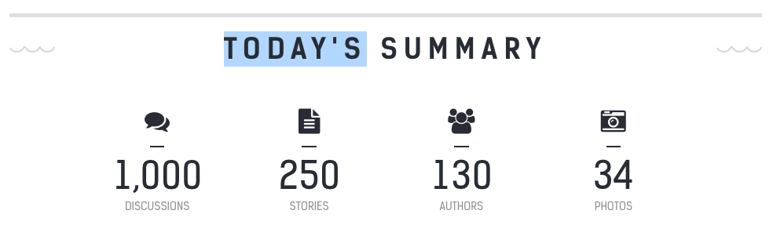
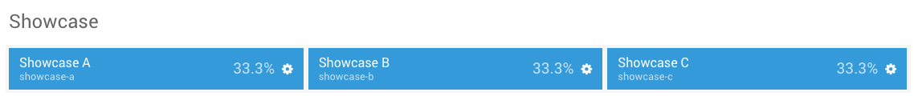
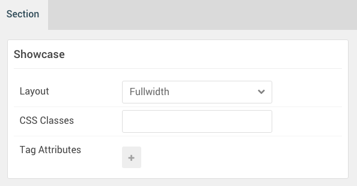
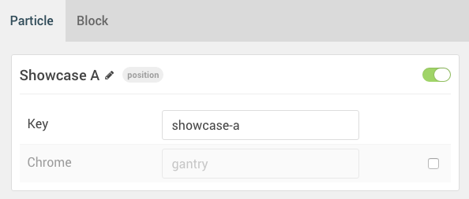
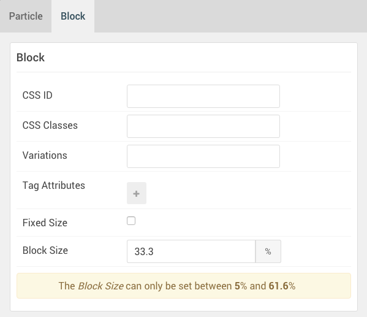
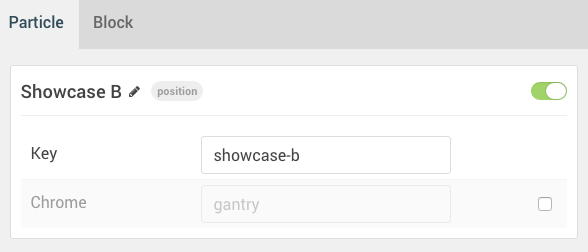
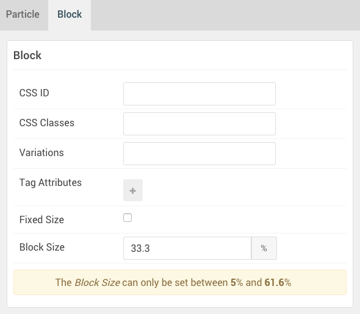

## Introduction

The **Showcase** section includes three module positions, `showcase-a`, `showcase-b`, and `showcase-c`. 

Here is a breakdown of the module(s) and particle(s) that appear in this section:

* [Showcase A (module position)](#showcase-a-(module-position))
    - [Grid Statistic (particle)](#gantry-5-particle-(grid-statistic))
* [Showcase B (module position)](#showcase-b-(module-position))
* [Showcase C (module position)](#showcase-c-(module-position))

## Section Settings

| Option         | Setting   |
| :-----         | :-----    |
| Layout         | Fullwidth |
| CSS Classes    | Blank     |
| Tag Attributes | Blank     |

## Showcase A (module position)

#### Particle Settings

| Option | Setting      |
| :----- | :-----       |
| Key    | `showcase-a` |
| Chrome | gantry       |

#### Block Settings

| Option         | Setting    |
| :-----         | :-----     |
| CSS ID         | Blank      |
| CSS Classes    | Blank      |
| Variations     | Blank      |
| Tag Attributes | Blank      |
| Block Size     | `33.3333%` |

### Assigned Module(s)

#### Gantry 5 Particle (Grid Statistic)

We added a **Grid Statistic** particle to the `showcase-a` position. This was done by creating a **Gantry 5 Particle** module and selecting the **Grid Statistic** particle in the module's settings. 

You will find the particle settings used in this particle below:

##### Particle Settings

| Option                                 | Setting                      |
| :-----                                 | :-----                       |
| CSS Classes                            | `g-title-promo`              |
| Title                                  | `Today's Summary`            |
| Description                            | Blank                        |
| Promo Text                             | Blank                        |
| Readmore Text                          | Blank                        |
| Readmore Link                          | Blank                        |
| Readmore Style                         | Button 3                     |
| Grid Column                            | 4 Columns                    |
| Grid Statistic Item 1 Name             | `1000 Discussions`           |
| Grid Statistic Item 1 Icon             | `fa fa-comments fa-fw fa-2x` |
| Grid Statistic Item 1 Statistic Number | `1000`                       |
| Grid Statistic Item 1 Statistic Text   | `Discussions`                |

## Showcase B (module position)

#### Particle Settings

| Option | Setting      |
| :----- | :-----       |
| Key    | `showcase-b` |
| Chrome | gantry       |

#### Block Settings

| Option         | Setting    |
| :-----         | :-----     |
| CSS ID         | Blank      |
| CSS Classes    | Blank      |
| Variations     | Blank      |
| Tag Attributes | Blank      |
| Block Size     | `33.3333%` |

## Showcase C (module position)

#### Particle Settings

| Option | Setting      |
| :----- | :-----       |
| Key    | `showcase-c` |
| Chrome | gantry       |

#### Block Settings

| Option         | Setting    |
| :-----         | :-----     |
| CSS ID         | Blank      |
| CSS Classes    | Blank      |
| Variations     | Blank      |
| Tag Attributes | Blank      |
| Block Size     | `33.3333%` |
