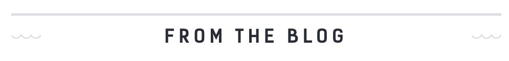
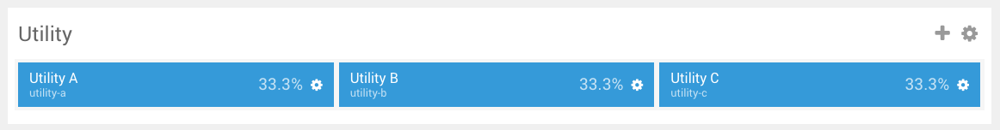
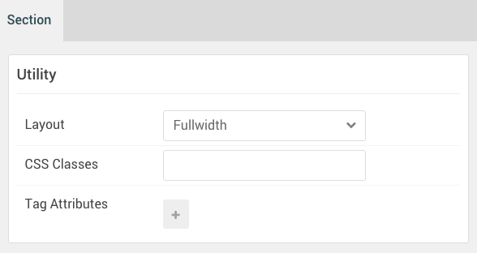
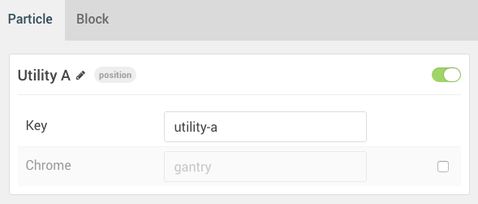
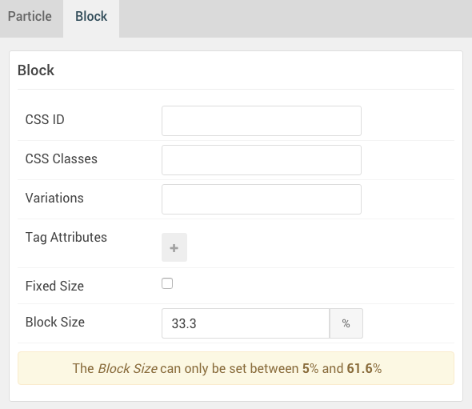
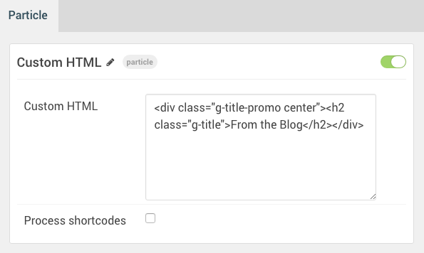

## Introduction

The **Utility** section includes three module positions, `utility-a`, `utility-b`, and `utility-c`.

Here is a breakdown of the module(s) and particle(s) that appear in this section:

* [Utility A (module position)](#utility-a-(module-position))
    - [Custom HTML (particle)](#gantry-5-particle-(custom-html))

## Section Settings

| Option         | Setting   |
|:---------------|:----------|
| Layout         | Fullwidth |
| CSS Classes    | Blank     |
| Tag Attributes | Blank     |

## Utility A (module position)

#### Particle Settings

| Option | Setting     |
|:-------|:------------|
| Key    | `utility-a` |
| Chrome | gantry      |

#### Block Settings

| Option         | Setting    |
|:---------------|:-----------|
| CSS ID         | Blank      |
| CSS Classes    | Blank      |
| Variations     | Blank      |
| Tag Attributes | Blank      |
| Block Size     | `33.3333%` |

### Assigned Module(s)

#### Gantry 5 Particle (Custom HTML)

We added a **Custom HTML** particle to the `utility-a` position. This was done by creating a **Gantry 5 Particle** module and selecting the **Custom HTML** particle in the module's settings.

You will find the particle settings used in this particle below:

##### Particle Settings

| Option             | Setting                                                                          |
|:-------------------|:---------------------------------------------------------------------------------|
| Particle Name      | `Custom HTML`                                                                    |
| Custom HTML        | `
<h2 class="g-title">From the Blog</h2>
` |
| Process Shortcodes | Unchecked                                                                        |
