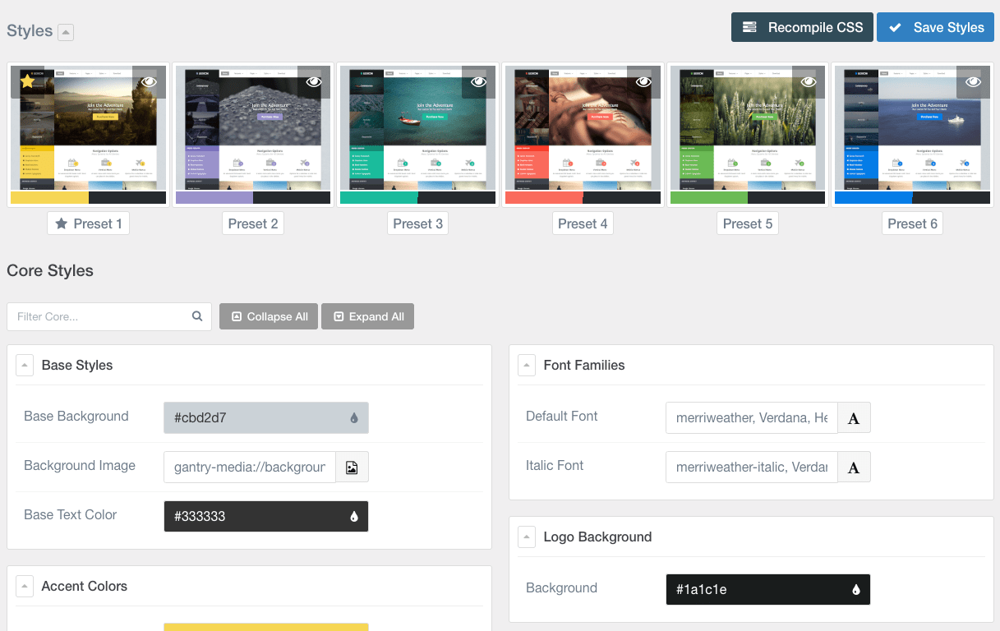

Template Style Settings
-----

One of the most important aspects of any Gantry template is its ability to be easily customized using the settings presets in the Styles tab within the Gantry 5 administrator. These settings can be adjusted by navigating to **Administration -> Lexicon Template**. To replicate the demo, the styling changes are being made in the **Styles** tab.

Most of the settings under **Styles** are adjusted automatically with the selection of a template preset. You can set presets using the **Presets** options located at the top of the **Styles** admin panel.

Once you have selected a Preset, these options can be further adjusted to match the demo. Keep in mind that the Style indicated here relates to the template Style in this menu. More information about how Styles work can be found in our [Gantry documentation](http://docs.gantry.org/gantry5/configure/styles).

In our demo, we utilized **Preset 1**.