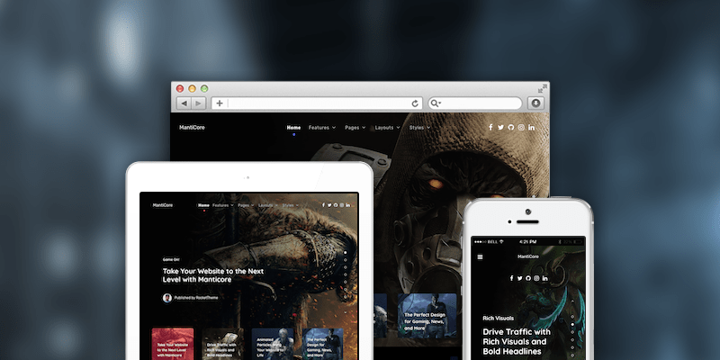
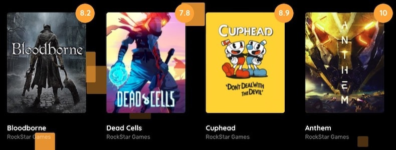
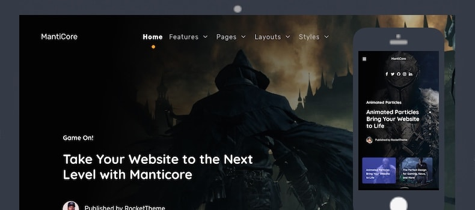
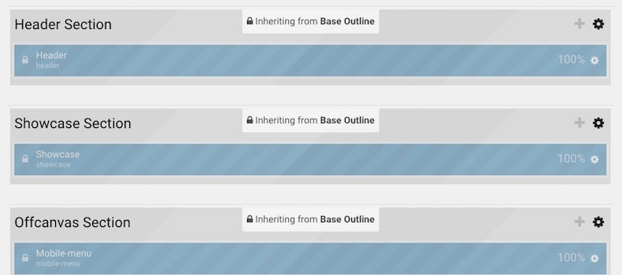

Introduction
-----

Manticore is a fresh new take on news and magazine-style design for the world of gaming and entertainment. Incredible new background slideshow with particles that let you review the latest releases and share videos of your recent adventures with Manticore!

Requirements
-----

* Apache 2.2+ or Microsoft IIS 7
* PHP 5.4+ (PHP 5.5+ Recommended)
* MySQL 5.1+
* Joomla 3.8+

>> NOTE: Gantry v5.4.26+ is required for Manticore to work correctly. For more details on the Gantry Framework, please visit its [Dedicated Website](http://gantry.org).

Key Features
-----

### Included Particles

* Block Content
* Branding
* Copyright
* Custom HTML
* Date
* Featured Videos
* Grid Statistic
* Heading
* Image Grid
* Info List
* Joomla Articles
* Latest News
* Logo / Image
* Logos
* Menu
* Mobile Menu
* Newsletter
* Particles
* Popup Module
* Pricing Table
* Promo
* Recent Reviews
* Search
* Simple Content
* Simple Counter
* Simple Menu
* Slideshow
* Social
* Testimonials
* To Top
* Top Rated
* Upcoming Games
* Video

### Template Features

* Responsive Layout
* 4 Preset Styles
* Particles JS
* Block Variations
* Custom Typography
* Unlimited Positions
* Popup Module
* Custom Particles
* Social Icons
* Mobile Menu
* Coming Soon Page
* Font Awesome Icons

### Gantry Core Features

* YAML-based Configuration
* Twig Templating
* Powerful Particle System
* Visual Menu Editor
* MegaMenu Support
* Off-Canvas Panel
* Ajax Admin
* Layout Manager
* Inheritance System
* Fluid Width Option
* Fixed Width Option
* SCSS Support
* Sophisticated Fields
* Unlimited Undo/Redo
* Styles Panel

## Typography

Typography is an important instrument in not only the site design, but how your content is portrayed and utilized by your visitors. Therefore, Manticore offers a rich selection of elegant typography to provide focus to varying content types.

## Responsive

Manticore is a responsive template which means it adapts to the viewing device's width, such as mobile, tablet or desktop. Mobile modes have a unique menu to aid usability. Support classes can also be used to display or hide various types of content for each device.

## Inheritance

Manticore takes full advantage of Gantry’s new inheritance system, making it easier than ever to configure and manage your website through synced particles, atoms, sections, and layouts. Save time by using inheritance to avoid repetitive changes!
