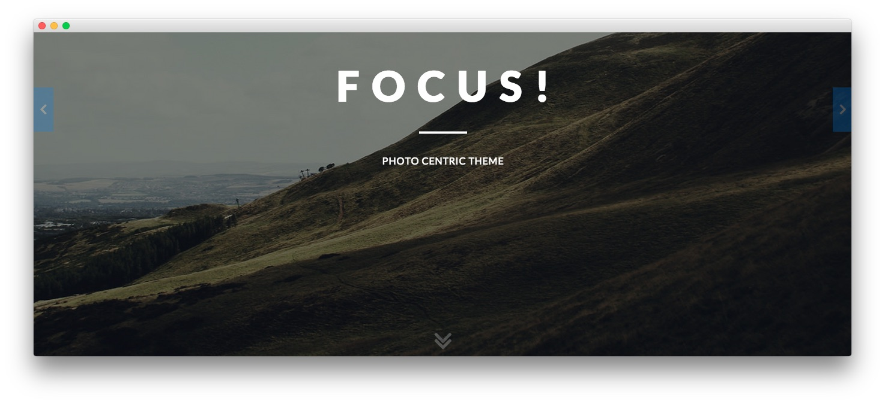

Introduction
-----

Myriad is the first Club template to be ported from Gantry 4 to Gantry 5. Myriad centers around photography, providing an elegantly designed, visual space for the display of full width gallery items and slideshows. The structure allows for the promotion of images, whilst maintaining a refined style for more conservative appearances.

New to Gantry 5?
-----
If you are new to Gantry 5, a good place to start would be our [dedicated Gantry documentation](http://docs.gantry.org).

As a Joomla user, you are most likely accustomed to editing modules when working with our Gantry 4 templates. While our RocketLauncher package contains modules for our subpages, the Home page content is specifically found in the template's Layout. This can be found via your Joomla administrator -> Extensions -> Templates - > Home -> Layout. Click on any of the cog icons on the Particles to edit the content.

To understand more how the Layout manager works, please [click here](http://docs.gantry.org/gantry5/configure/layout-manager).

Requirements
-----
* PHP 7.1+
* Curl
* OpenSSL Libraries
* Multibyte String Support

>> NOTE: Gantry v5.4.19+ is required for Myriad to work correctly. For more details on the Gantry Framework, please visit its [Dedicated Website](http://gantry.org).

Key Features
-----

### Included Particles

* Animate on Scroll
* Branding
* Case Studies
* Contact
* Content List
* Copyright
* Custom HTML
* Date
* Fixed Header
* Features Slider
* Joomla Content
* Headlines
* Horizontal Menu
* Image Grid
* Info List
* Lists
* Login
* Logo
* Menu
* Mobile Menu
* Newsletter
* Promo Image
* Search
* Simple Counter
* Social
* Strips Slider
* Tab Image
* Testimonials
* To Top 
* Video

### Template Features

* Responsive Layout
* 6 Preset Styles
* Custom Typography
* Unlimited Positions
* Custom Particles
* Mobile Menu
* Coming Soon Page
* Font Awesome Icons 

### Gantry Core Features

* YAML-based Configuration
* Twig Templating
* Powerful Particle System
* Visual Menu Editor
* MegaMenu Support
* Off-Canvas Panel
* Ajax Admin
* Layout Manager
* Template Inheritance
* Fluid Width Option
* Fixed Width Option
* SCSS Support
* Sophisticated Fields
* Unlimited Undo/Redo
* Styles Panel

## Content Animations

The template makes uses of animated effects to add depth and character to content, without compromising on usability and professionalism. A series of bounce and slide effects are built into Myriad, as triggered by scroll events, with an option to disable them.

## Color Chooser

Myriad has an extensive Color Chooser in the template manager to provide intricate controls for each section, inclusive of overlay type, text color, background color, as well as accent colors. Edit preexisting or create new presets.

## Responsive

Myriad is a responsive template which means it adapts to the viewing device's width, such as mobile, tablet or desktop. Mobile modes have a unique menu to aid usability. Support classes can also be used to display or hide various types of content for each device.
