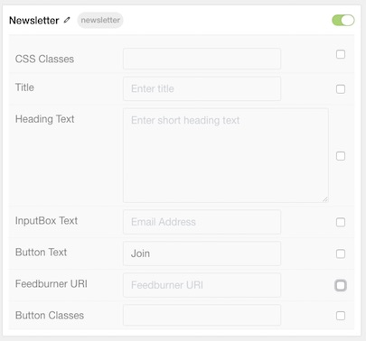

## Introduction

The **Newsletter** particle enables users to sign up for your newsletter. It is powered by [Feedburner](http://feedburner.google.com/).

Here are the topics covered in this guide:

* [Configuration](#configuration)
    - [Main Options](#main-options)

## Configuration

### Main Options 

| Option         | Description                                                                                                                          |
| :-----         | :-----                                                                                                                               |
| CSS Classes    | Set the CSS class(es) you would like to have apply at the particle level.                                                            |
| Title          | Add a title to your particle that will appear on the front end.                                                                      |
| Heading Text   | An extra line for text.                                                                                                              |
| InputBox Text  | Enter text you wish to appear in the input box users will enter their email address in.                                              |
| Button Text    | Add text to your submit button.                                                                                                      |
| Feedburner URI | Enter the URI for your newsletter from Feedburner.                                                                                   |
| Button Classes | Enable CSS class(es) in your submit button.                                                                                          |