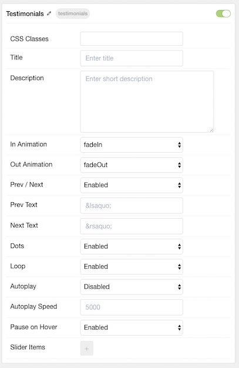
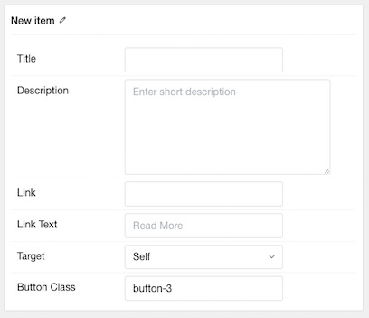

## Introduction

The **Testimonial** particle gives you the ability to display testimonials for your brand in a clean, modern way. This includes an author, title, image, and quote.

Here are the topics covered in this guide:

* [Configuration](#configuration)
    - [Main Options](#main-options)
    - [Item Options](#item-options)

## Configuration

### Main Options 

These options affect the main area of the particle, and not the individual items within.

| Option         | Description                                                                                 |
| :-----         | :-----                                                                                      |
| Particle Name  | Enter the name you would like to assign to the particle. This only appears in the back end. |
| CSS Classes    | Enter the CSS class(es) you want to use in the content of the particle.                     |
| Title          | Enter a title for the particle.                                                             |
| Description    | Enter a short introduction to appear in the particle above the testimonies.                 |
| In Animation   | Select an animation for items to move in with.                                              |
| Out Animation  | Select an animation for items to move out with.                                             |
| Prev / Next    | Prev/next navigation.                                                                       |
| Prev Text      | Text for the previous navigation.                                                           |
| Next Text      | Text for the next navigation.                                                               |
| Dots           | Dots-style navigation.                                                                      |
| Loop           | **Enable** or **Disable** looping.                                                          |
| Autoplay       | **Enable** or **Disable** autoplay.                                                         |
| Autoplay Speed | Set the autoplay speed (in milliseconds)                                                    |
| Pause on Hover | **Enable** or **Disable** pause on hover.                                                   |

### Item Options

These items make up the individual featured items in the particle.

| Option            | Description                                                                                       |
| :-----            | :-----                                                                                            |
| Item Name         | Enter the name you would like to assign to the item. This only appears in the back end.           |
| Testimonial Style | Select between two different styles of testimonial display: **Standard** and **Alternative**.     |
| Image             | Select an image to appear next to the testimony. This is generally a profile photo of its author. |
| Content           | Enter the quote of the testimony.                                                                 |
| Author            | The name of the author goes here.                                                                 |
| Company           | The name of the company or author's job title goes here.                                          |
| Link              | A link to the author's website or social media link can go here.                                  |

