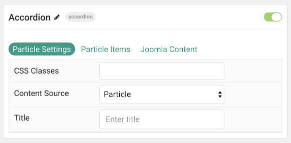
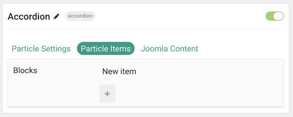
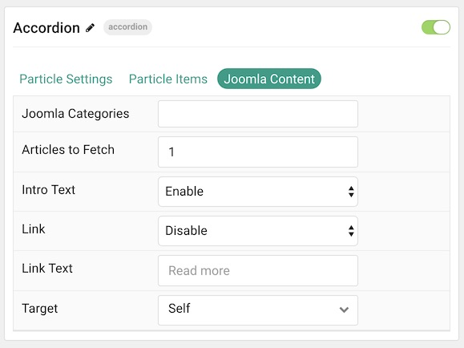
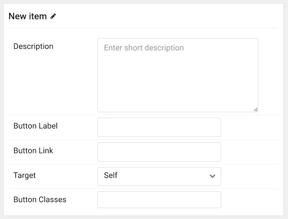

## Introduction

The **Accordion** particle enables you to display one or more items in a single column.

Here are the topics covered in this guide:

* [Configuration](#configuration)
    - [Main Options](#main-options)
        + [Particle Settings](#tab-a---particle-settings)
        + [Particle Items](#tab-b---particle-items)
        + [Joomla Content](#tab-c---joomla-content)
    - [Item Options](#item-options)

### Main Options 

#### Tab A - Particle Settings

| Option         | Description                                                           |
| :-----         | :-----                                                                |
| CSS Classes    | Sets the CSS class for the content of the particle.                   |
| Content Source | Choose between **Particle** and **Joomla** as your content source. |
| Title          | Sets the title of the particle, as it will appear on the front end.   |

#### Tab B - Particle Items

This tab enables you to create items that appear in the particle. It is useful if you choose the **Particle** content source.

#### Tab C - Joomla Content

This tab is where you configure how Joomla content appears as items in the particle. It is useful if you choose the **Joomla** content source.

| Option            | Description                                                                 |
| :-----            | :-----                                                                      |
| Joomla Categories | Select the categories of articles this particle will display.               |
| Articles to Fetch | Select the number of articles you would like the particle to fetch.         |
| Intro Image       | **Enable** or **Disable** the display of the article(s) featured image.     |
| Intro Text        | **Enable** or **Disable** the display of the article(s) intro text.         |
| Display Content   | **Enable** or **Disable** the display of the article(s) content or excerpt. |
| Link              | **Enable** or **Disable** the linking of the article(s).                    |
| Link Text         | Enter the text you wish to have displayed as the read more link.            |
| Target            | Select **Self** or **New Window** as the target for the link.               |

### Item Options

These items only appear on the front end if you select **Particle** as the **Content Source**.

| Option         | Description                                                               |
| :-----         | :-----                                                                    |
| Description    | Enables you to enter a descriptive paragraph to be displayed in the item. |
| Button Label   | Enter a text label that will appear as the link in the item.              |
| Button Link    | Set a link you would like the item to connect to.                         |
| Target         | Choose a target (self or new window) for the link.                        |
| Button Classes | Enter any CSS class(es) you would like to have apply to the button link.  |
