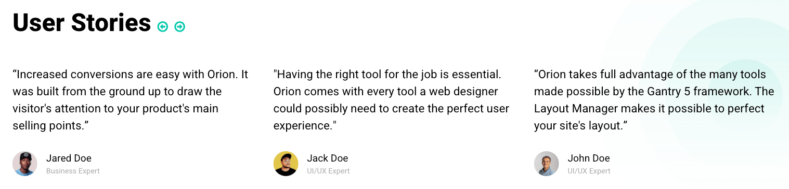
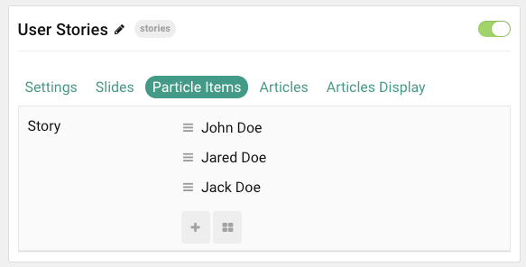
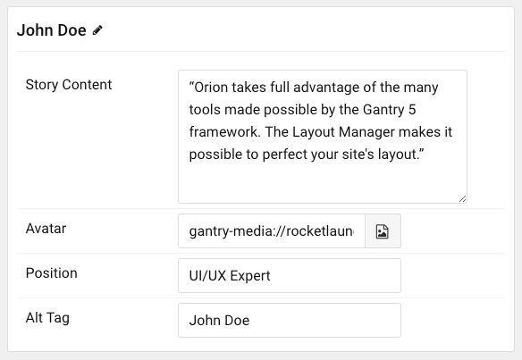
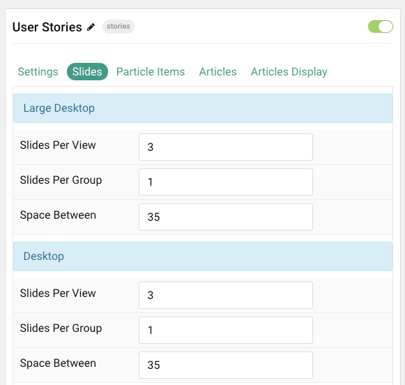
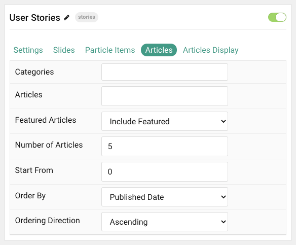

## Introduction

The **User Stories** particle is a great way to display testimonials and other quotes from users, fans, etc.

Here are the topics covered in this guide:

* [Configuration](#configuration)
    - [Main Options](#settings)
    - [Item Options](#particle-item-options)
    - [Slides](#slides)
    - [Articles](#articles)
    - [Display](#display)

## Configuration

### Settings 

These options affect the main area of the particle, and not the individual items within.

| Option           | Description                                                                                         |
| :-----           | :-----                                                                                              |
| Particle Name    | This is the name of the particle used for back end management. It does not appear on the front end. |
| Content Source   | Choose between **Particle** and **Joomla** as the content source.                                   |
| Prev / Next      | **Enable** or **Disable** the prev / next navigation.                                               |
| Autoplay         | **Enable** or **Disable** autoplay.                                                                 |
| Autoplay Timeout | Set the time between each transition during autoplay.                                               |
| Loop             | **Enable** or **Disable** looping.                                                                  |
| Speed            | Set the transition speed between slides.                                                            |
| Centered         | **Enable** or **Disable** centered slides.                                                          |
| Touch Move       | **Enable** or **Disable** touch-based control of slide movements.                                   |
| Title            | Enter a title to appear on the front end.                                                           |

### Particle Item Options

These items make up the individual featured items in the particle. Items in this section will only appear if **Particle** is selected as the **Content Source**.

| Option        | Description                                                                          |
| :-----        | :-----                                                                               |
| Item Name     | This is the name of the item. This also appears as the author name in the front end. |
| Story Content | Enter any text content you want to appear in the item.                               |
| Avatar        | Select an image to appear in the item.                                               |
| Position      | Enter a title or position related to the author.                                     |
| Alt Tag       | Enter alt tag content for the avatar.                                                |

### Slides

The **Slides** tab gives you control over how many slides appear for different experiences. It also includes control over the spacing between slides.

| Option           | Description                                    |
| :-----           | :-----                                         |
| Slides Per View  | Select a number of slides to appear per view.  |
| Slides Per Group | Select a number of slides to appear per group. |
| Space Between    | Enter a space (in px) to exist between slides. |

### Articles

| Option             | Description                                                                                                     |
| :----------------- | :-------------------------------------------------------------------------------------------------------------- |
| Categories         | Select the categories of articles this particle will display.                                                   |
| Articles           | Select the number of articles you would like the particle to fetch.                                             |
| Featured Articles  | Choose how Featured Articles should be filtered. Choose between **Include**, **Exclude**, or **Only Featured**. |
| Number of Articles | Enter the maximum number of articles to display.                                                                |
| Start From         | Enter offset specifying the first article to return. The default is '0' (the first article).                    |
| Order By           | Choose the type of factor to order by.                                                                          |
| Ordering Direction | Choose between **Ascending** and **Descending** as the article ordering method.                                 |

### Display

This section configures how articles are displayed.

| Option          | Description                                                                                        |
| :-----------    | :------------------------------------------------------------------------------------------------- |
| Article Text    | Select the article text to appear in each item.                                                    |
| Text Limit      | Set a limit (in characters) of article text to appear in the item.                                 |
| Text Formatting | Choose to display **Plain Text** or **HTML** in the article text.                                  |
| Author          | **Show** or **Hide** the Author information.                                                       |
| Author Image    | Choose the part of the article to pull the image from.                                             |
