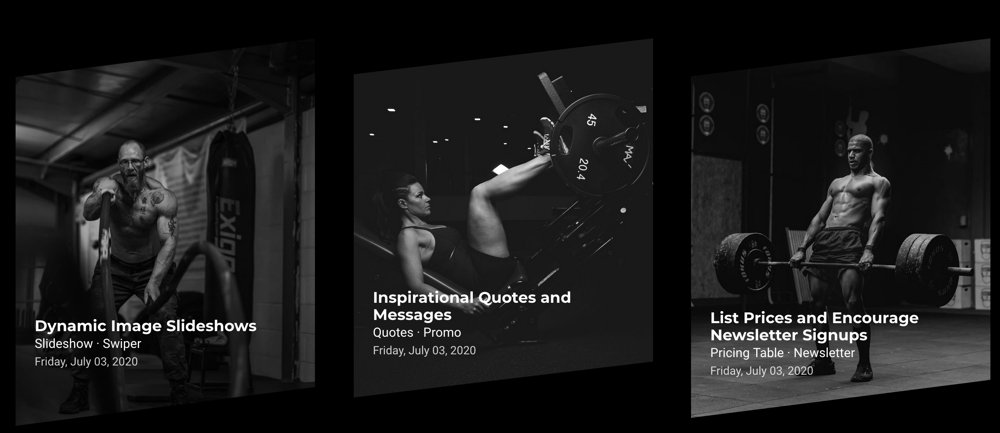
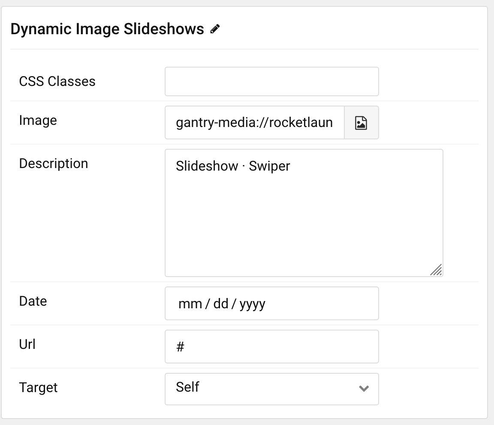
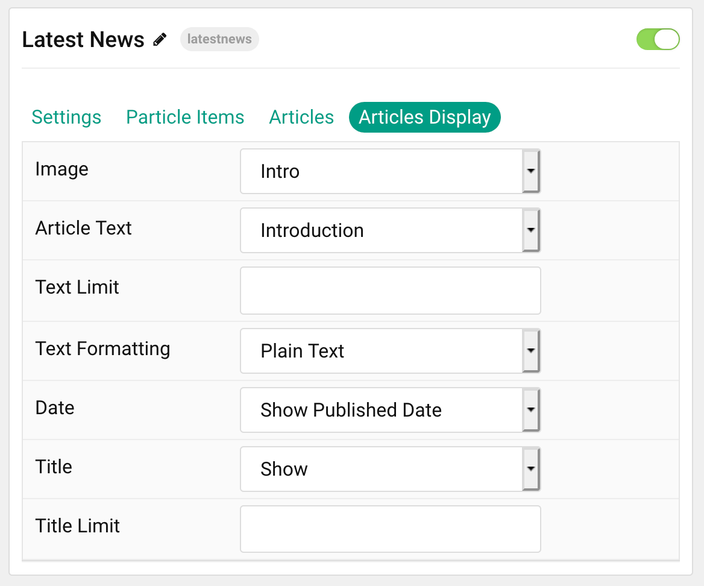

## Introduction

The **Latest News** particle displays your latest articles or featured content, along with images and text. You can vary the way these items appear, making them more appealing to the eye and magazine-like.

Here are the topics covered in this guide:

- [Introduction](#introduction)
- [Configuration](#configuration)
  - [Settings](#settings)
  - [Particle Item Options](#particle-item-options)
  - [Articles](#articles)
  - [Display](#display)

## Configuration

### Settings

These options affect the main area of the particle, and not the individual items within.

| Option            | Description                                                                                         |
| :-------------    | :-------------------------------------------------------------------------------------------------- |
| Particle Name     | This is the name of the particle used for back end management. It does not appear on the front end. |
| Content Source    | Choose whether to have content load from particle items or the CMS.                                 |
| CSS Classes       | Enter any CSS class(es) you wish to have apply to the particle.                                     |
| Title             | Set a title for the particle.                                                                       |
| Upper Title       | Enter a title to appear above the main title.                                                       |
| "All Items" Label | Enter a label to display items from all categories.                                                 |
| Selected          | Choose the nav item to be selected by default on page load.                                         |
| Pattern           | Enable or Disable the pattern feature for the particle.                                             |
| Images Clip Path  | If enabled, all images will have the clip path applied at the bottom.                               |
| Date Format       | Select the date format to be displayed.                                                             |
| Grid Column       | Set the number of columns items appear in.                                                          |

### Particle Item Options

These items make up the individual featured items in the particle.

| Option      | Description                                                                      |
| :---------- | :------------------------------------------------------------------------------- |
| Item Name   | This is the name of the item. This appears as the item's title on the front end. |
| Image       | Set an image to appear in the item.                                              |
| Description | Enter a text description for the item.                                           |
| Date        | Enter a date to appear with the item.                                            |
| URL         | Enter a URL you would like the item to link to.                                  |
| Target      | Select a target window for the URL to open through.                              |

### Articles

| Option             | Description                                                                                                     |
| :----------------- | :-------------------------------------------------------------------------------------------------------------- |
| Categories         | Select the categories of articles this particle will display.                                                   |
| Articles           | Select the number of articles you would like the particle to fetch.                                             |
| Featured Articles  | Choose how Featured Articles should be filtered. Choose between **Include**, **Exclude**, or **Only Featured**. |
| Number of Articles | Enter the maximum number of articles to display.                                                                |
| Start From         | Enter offset specifying the first article to return. The default is '0' (the first article).                    |
| Order By           | Choose the type of factor to order by.                                                                          |
| Ordering Direction | Choose between **Ascending** and **Descending** as the article ordering method.                                 |

### Display

This section configures how articles are displayed.

| Option          | Description                                                                                                  |
| :-----          | :-----                                                                                                       |
| Image           | Select which image in an article should be displayed.                                                        |
| Article Text    | Choose between showing the **Introduction** or **Full Article** text to display. You can also **Hide** text. |
| Text Limit      | Set a limit (in characters) of the article's text to appear.                                                 |
| Text Formatting | Select between **Plain Text** and **HTML** text formatting.                                                  |
| Date            | Choose which date (if any) to show with each item.                                                           |
| Title           | Choose whether or not the title of an article should be shown.                                               |
| Title Limit     | Set a character limit for titles.                                                                            |