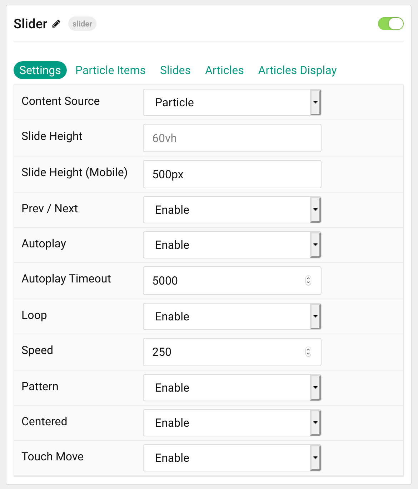
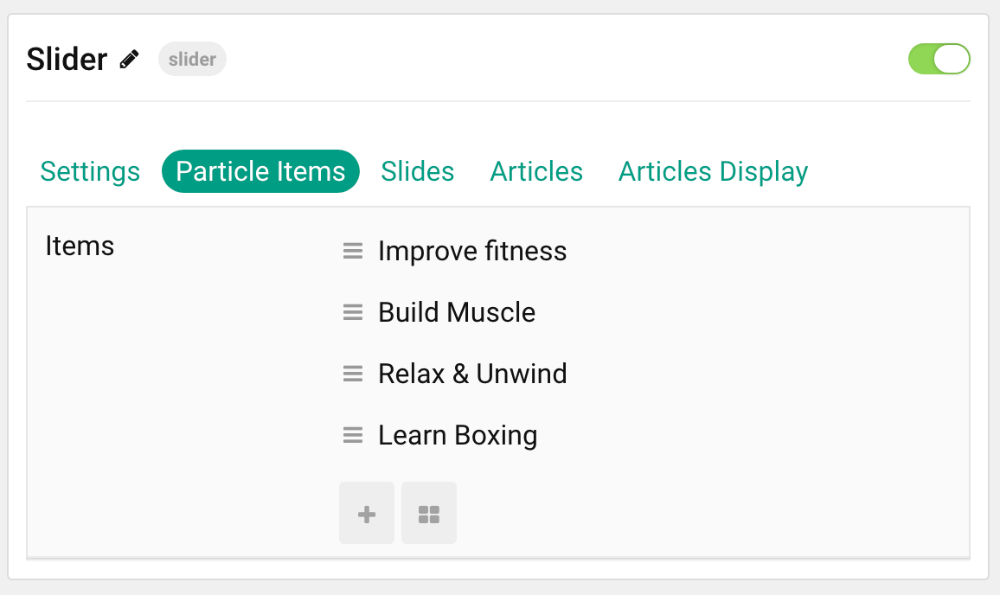
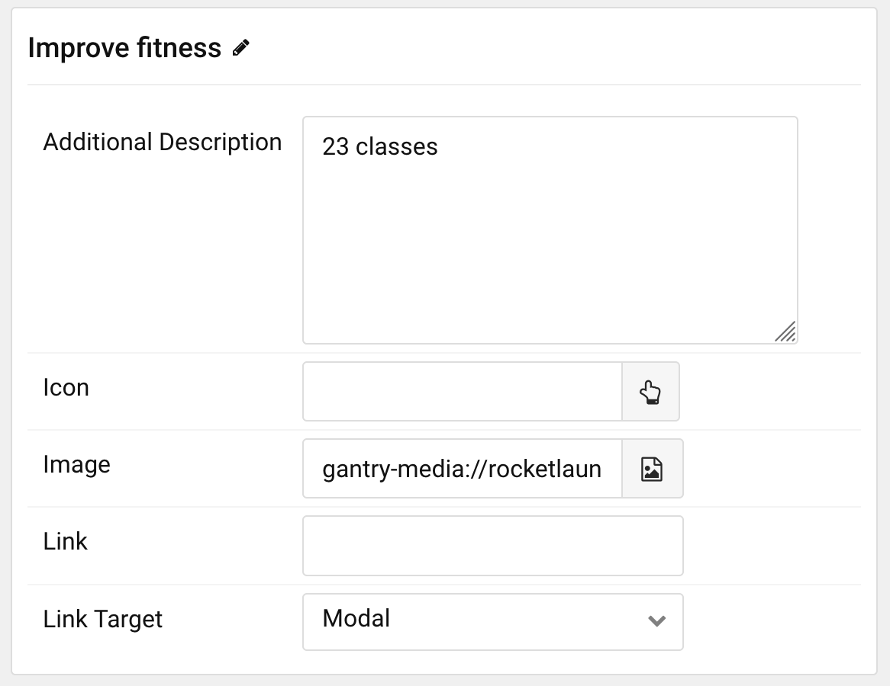
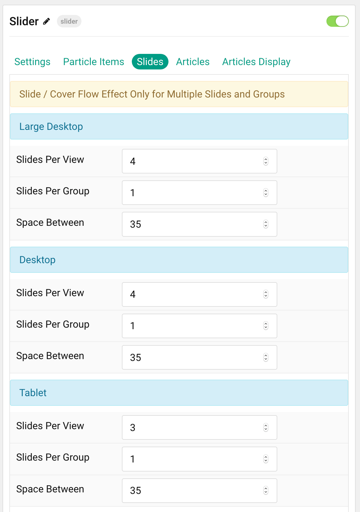

## Introduction

The **Slider** particle is a great way to display images in your website.

Here are the topics covered in this guide:

* [Configuration](#configuration)
    - [Main Options](#settings)
    - [Item Options](#particle-item-options)
    - [Articles](#articles)
    - [Display](#display)

## Configuration

### Settings 

These options affect the main area of the particle, and not the individual items within.

| Option                | Description                                                                                         |
| :-----                | :-----                                                                                              |
| Particle Name         | This is the name of the particle used for back end management. It does not appear on the front end. |
| Content Source        | Choose between **Particle** and **Joomla** as the Content Source.                                   |
| Slide Height          | Set the slide height.                                                                               |
| Slide Height (Mobile) | Set the slide height on mobile devices.                                                             |
| Prev / Next           | **Enable** or **Disable** the prev / next navigation.                                               |
| Autoplay              | **Enable** or **Disable** autoplay.                                                                 |
| Autoplay Timeout      | Set the time between each transition during autoplay.                                               |
| Loop                  | **Enable** or **Disable** looping.                                                                  |
| Speed                 | Set the transition speed between slides.                                                            |
| Pattern               | **Enable** or **Disable** the pattern.                                                              |
| Centered              | **Enable** or **Disable** centered slides.                                                          |
| Touch Move            | **Enable** or **Disable** touch-based control of slide movements.                                   |

### Particle Item Options

These items make up the individual featured items in the particle. Items in this section will only appear if **Particle** is selected as the **Content Source**.

| Option                 | Description                                                      |
| :-----                 | :-----                                                           |
| Item Name              | This is the name of the item. This only appears in the back end. |
| Additional Description | Enter a text description to add to the item.                     |
| Icon                   | Select a Font Awesome icon for the item.                         |
| Image                  | Select an image to appear in the slide.                          |
| Link                   | Enter a URL you would like the item to link to.                  |
| Link Target            | Choose the target tab you would like the URL to open to.         |

### Slides

The **Slides** tab gives you control over how many slides appear for different experiences. It also includes control over the spacing between slides.

| Option           | Description                                    |
| :-----           | :-----                                         |
| Slides Per View  | Select a number of slides to appear per view.  |
| Slides Per Group | Select a number of slides to appear per group. |
| Space Between    | Enter a space (in px) to exist between slides. |

### Articles

| Option             | Description                                                                                                     |
| :-----             | :-----                                                                                                          |
| Categories         | Select the categories of articles this particle will display.                                                   |
| Articles           | Select the number of articles you would like the particle to fetch.                                             |
| Featured Articles  | Choose how Featured Articles should be filtered. Choose between **Include**, **Exclude**, or **Only Featured**. |
| Number of Articles | Enter the maximum number of articles to display.                                                                |
| Start From         | Enter offset specifying the first article to return. The default is '0' (the first article).                    |
| Order By           | Choose the type of factor to order by.                                                                          |
| Ordering Direction | Choose between **Ascending** and **Descending** as the article ordering method.                                 |

### Display

This section configures how articles are displayed.

| Option          | Description                                                                         |
| :-----          | :-----                                                                              |
| Image           | Display the image assigned to the article's **Intro**, **Full** or **None**.        |
| Article Text    | Choose whether to display the **Introduction**, **Full Title**, or **Hide** (none). |
| Text Limit      | Enter the number of characters you wish to limit the text displayed to.             |
| Text Formatting | Choose between plain text and HTML.                                                 |
| Title           | **Show** or **Hide** the article's title.                                           |
| Title Limit     | Enter the maximum number of characters in the title to display.                     |
| Link            | Show or Hide the link to the page.                                                  |
| Title Target    | Choose whether to have the link open in a new tab or the same tab.                  |
