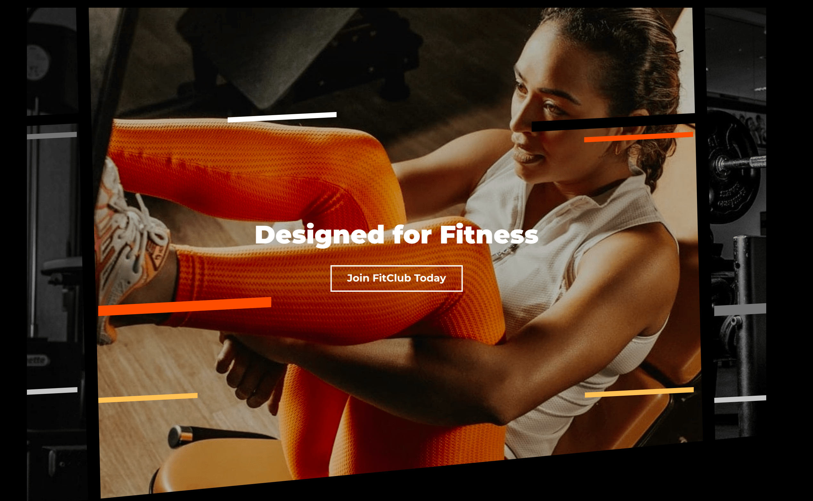
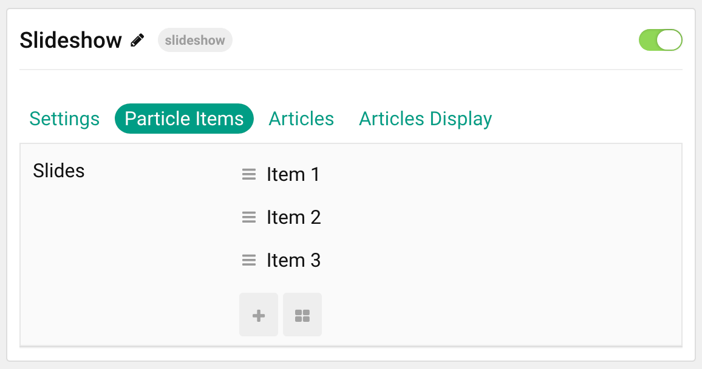

## Introduction

The **Slideshow** particle creates beautiful image slideshows that work perfectly at the top of your page.

Here are the topics covered in this guide:

- [Introduction](#introduction)
- [Configuration](#configuration)
  - [Settings](#settings)
  - [Particle Item Options](#particle-item-options)
  - [Articles](#articles)
  - [Display](#display)

## Configuration

### Settings

These options affect the main area of the particle, and not the individual items within. You can set the title of the particle, as well as give it an introductory paragraph here.

| Option                | Description                                                                                                     |
| :------               | :------                                                                                                         |
| Particle Name         | This is the name of the particle used for back end management. It does not appear on the front end.             |
| Content Source        | Choose between **Particle** and **Joomla** as the content source for the particle.                              |
| Pattern               | **Enable** or **Disable** the pattern feature of the particle.                                                  |
| Slide Height          | Set the minimal height of each slide.                                                                           |
| Slide Height (Mobile) | Set the minimal height of each slide on mobile devices.                                                         |
| Prev / Next           | **Enable** or **Disable** the Prev / Next navigation. Arrows will not appear unless they are actually required. |
| Dots                  | **Enable** or **Disable** dot navigation.                                                                       |
| Autoplay              | **Enable** or **Disable** autoplay for the particle.                                                            |
| Autoplay Timeout      | Set the time (in milliseconds) between slides in autoplay mode.                                                 |
| Loop                  | **Enable** or **Disable** looping slides.                                                                       |
| Speed                 | Set the transition speed (in milliseconds).                                                                     |
| Touch Move            | **Enable** or **Disable** touch movements.                                                                      |
| Effect                | Choose a slideshow effect. Options include: **Slide** or **Fade**.                                              |

### Particle Item Options

These items make up the individual featured items in the particle. Items in this section will only appear if **Particle** is selected as the **Content Source**.

| Option                 | Description                                                                                 |
| :-----------------     | :------------------------------------------------------------------------------------------ |
| Item Name              | This is the name of the item. It is used only for backend organization and does not appear. |
| CSS Classes            | Enter any CSS class(es) you wish to have apply to the item.                                 |
| Image                  | Select an image to appear in the particle.                                                  |
| BG Horizontal Position | Choose between **Left**, **Center**, and **Right** for the background position.             |
| BG Vertical Position   | Choose between **Top**, **Center**, and **Bottom** for the background position.             |
| Main Title             | Enter a larger main title to appear on the front end.                                       |
| Button Text            | Enter the text to appear in the button.                                                     |
| Button Link            | Enter a URL the button will send users to.                                                  |
| Button Classes         | Enter any CSS class(es) you want to have apply to the button.                               |
| Button Link Target     | Enter a target window for the link.                                                         |

### Articles

| Option             | Description                                                                                                     |
| :----------------- | :-------------------------------------------------------------------------------------------------------------- |
| Categories         | Select the categories of articles this particle will display.                                                   |
| Articles           | Select the number of articles you would like the particle to fetch.                                             |
| Featured Articles  | Choose how Featured Articles should be filtered. Choose between **Include**, **Exclude**, or **Only Featured**. |
| Number of Articles | Enter the maximum number of articles to display.                                                                |
| Start From         | Enter offset specifying the first article to return. The default is '0' (the first article).                    |
| Order By           | Choose the type of factor to order by.                                                                          |
| Ordering Direction | Choose between **Ascending** and **Descending** as the article ordering method.                                 |

### Display

This section configures how articles are displayed.

| Option       | Description                                                                                        |
| :----------- | :------------------------------------------------------------------------------------------------- |
| Image        | Choose between the **Intro**, **Full**, or no image to display with each item.                     |
| Title        | **Show** or **Hide** the article's title.                                                          |
| Title Limit  | Enter the maximum number of characters in the title to display.                                    |
| Button Link  | **Show** or **Hide** the Title link.                                                               |
| Button Label | Enter the text to appear in the button.                                                            |
| Link Target  | Choose whether to have the link open in a new tab or the same tab.                                 |
