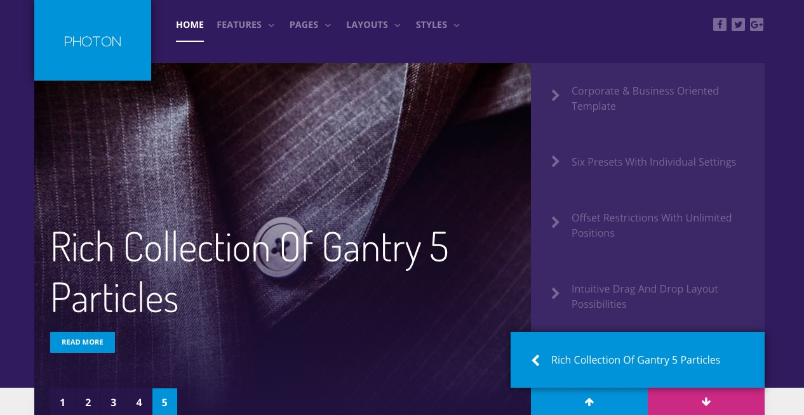

Introduction
-----

Photon features a bold, elegant theme that blends dynamic content elements while maintaining a level of simplicity that is the hallmark of modern design. Powered by Gantry 5, Photon is extremely easy to configure with limitless versatility.

Requirements
-----

* Apache 2.2+ or Microsoft IIS 7
* PHP 7.1+ 
* MySQL 5.1+
* Joomla 3.4+

>> NOTE: Gantry v5.2.6+ is required for Photon to work correctly. For more details on the Gantry Framework, please visit its [Dedicated Website](http://gantry.org).

Key Features
-----

* Responsive Layout
* 6 Preset Styles
* Block Variations
* Custom Typography
* Unlimited Positions
* Popup Module
* Custom Particles
* Social Icons
* Mobile Menu
* Coming Soon Page
* Font Awesome Icons 
* Gantry Core Features
* YAML-based Configuration
* Twig Templating
* Powerful Particle System
* Visual Menu Editor
* MegaMenu Support
* Off-Canvas Panel
* Ajax Admin
* Layout Manager
* Theme Inheritance
* Fluid Width Option
* Fixed Width Option
* SCSS Support
* Sophisticated Fields
* Unlimited Undo/Redo

## Particles

The template features an extensive and diverse catalog of particles, to enrich your site content. New with Photon is the News Slider particle, alongside template integrated enhancements for preexisting particle types.

## Menu

Built into Gantry 5 is a dynamic dropdown menu system, with multiple columns and inline module and particle support. Configure the menu from an intuitive dropdown menu interface, allowing for the swift creation of complex menus.

## Responsive

Photon is a responsive template which means it adapts to the viewing device's width, such as mobile, tablet or desktop. Mobile modes have a unique menu to aid usability. Support classes can also be used to display or hide various types of content for each device.
