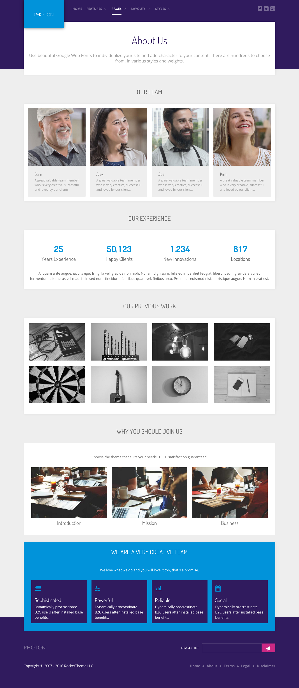
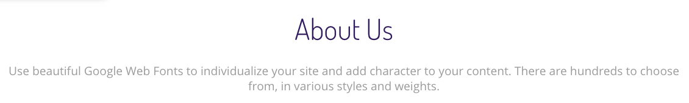
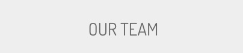
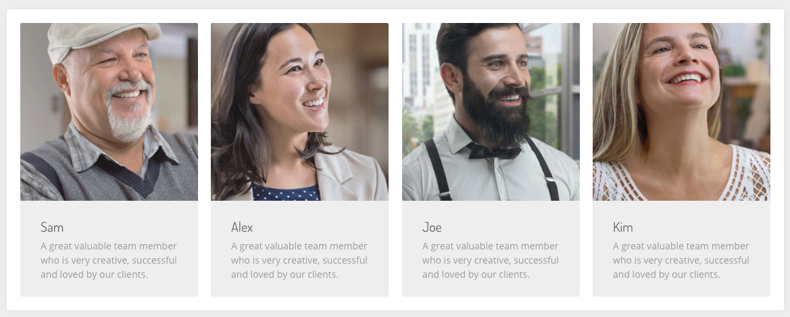
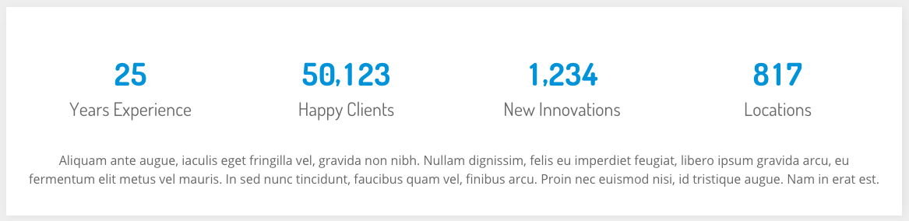
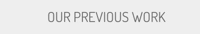
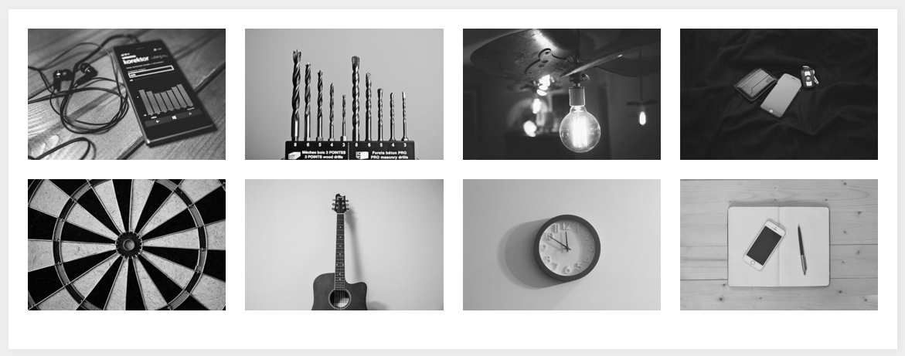
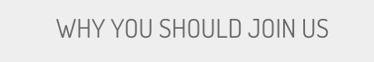
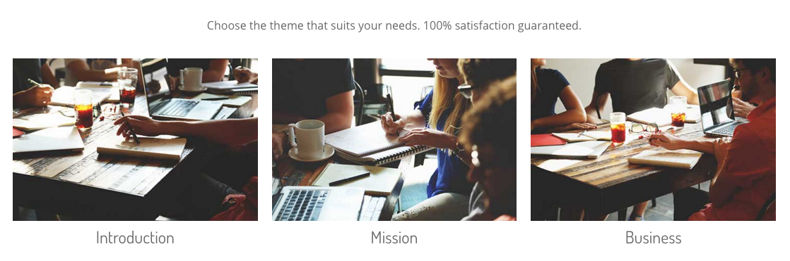
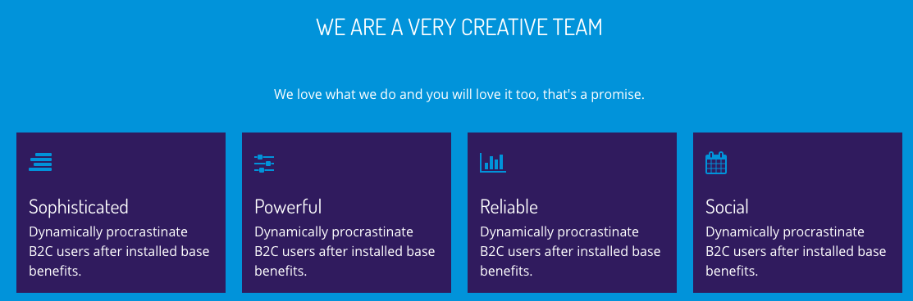

# Introduction

The **About Us** example page demonstrates how you can create a beautiful page with the Photon template. Here is some information to help you replicate this page as it appears in the demo.

# Modules and Particles

Below is a brief rundown of the modules and particles used to make up the demo page.

:   1. **Header** Simple Content (particle) [7%, 40%, se]
    2. **ShowcaseBanner** Custom HTML (particle) [20%, 7%, se]
    3. **Showcase** Mosaic Grid (particle) [38%, 7%, se]
    4. **UtilityBanner** Custom HTML (particle) [45%, 7%, se]
    5. **Utility** Grid Statistic (particle) [64%, 25%, se]
    6. **FeatureBanner** Block Content (particle) [80%, 8%, se]
    7. **Feature** Image Grid (particle) [50%, 50%, se]
    8. **MainBanner** Custom HTML (particle) [80%, 8%, se]
    9. **Main** Block Content (particle) [80%, 8%, se]
    10. **Extension** Block Content (particle) [80%, 8%, se]

* [Header](#header-section)
* [ShowcaseBanner](#showcasebanner-section)
* [Showcase](#showcase-section)
* [UtilityBanner](#utilitybanner-section)
* [Utility](#utility-section)
* [FeatureBanner](#featurebanner-section)
* [Feature](#feature-section)
* [MainBanner](#mainbanner-section)
* [Main](#main-section)
* [Extension](#extension-section)

# Header Section

This area of the page is a **Simple Content** particle. You will find the settings used in our demo below.

## Section Settings

| Field          | Setting |
| :-----         | :-----  |
| Layout         | Boxed   |
| CSS Classes    | Blank   |
| Tag Attributes | Blank   |

## Particle Settings

| Option                   | Setting                                                                                                                                                          |
| :-----                   | :-----                                                                                                                                                           |
| Particle Name            | `Simple Content`                                                                                                                                                 |
| CSS Classes              | `center`                                                                                                                                                         |
| Title                    | Blank                                                                                                                                                            |
| Item 1 Name              | `About Us`                                                                                                                                                       |
| Item 1 Layout Style      | Header                                                                                                                                                           |
| Item 1 Created Date      | Blank                                                                                                                                                            |
| Item 1 Content Title     | `About Us`                                                                                                                                                       |
| Item 1 Author            | Blank                                                                                                                                                            |
| Item 1 Leading Content   | `Use beautiful Google Web Fonts to individualize your site and add character to your content. There are hundreds to choose from, in various styles and weights.` |
| Item 1 Main Content      | Blank                                                                                                                                                            |
| Item 1 Read More Label   | Blank                                                                                                                                                            |
| Item 1 Read More Link    | Blank                                                                                                                                                            |
| Item 1 Read More Classes | Blank                                                                                                                                                            |
| Item 1 Target            | Self                                                                                                                                                             |

## Block Settings

| Option         | Setting   |
| :-----         | :-----    |
| CSS ID         | Blank     |
| CSS Classes    | Blank     |
| Variations     | Blank     |
| Tag Attributes | Blank     |
| Fixed Size     | Unchecked |
| Block Size     | `100%`    |

# ShowcaseBanner Section

This area of the page is a **Custom HTML** particle. You will find the settings used in our demo below.

## Section Settings

| Field          | Setting |
| :-----         | :-----  |
| Layout         | Boxed   |
| CSS Classes    | Blank   |
| Tag Attributes | Blank   |

## Particle Settings

| Option             | Setting       |
| :-----             | :-----        |
| Particle Name      | `Custom HTML` |
| Process Twig       | Blank         |
| Process Shortcodes | Blank         |

**Custom HTML**

~~~ .html
<h3 class="g-title nomarginbottom nopaddingbottom">Our Team</h3>
~~~

## Block Settings

| Option         | Setting                            |
| :-----         | :-----                             |
| CSS ID         | Blank                              |
| CSS Classes    | `nomarginbottom` `nopaddingbottom` |
| Variations     | Blank                              |
| Tag Attributes | Blank                              |
| Fixed Size     | Unchecked                          |
| Block Size     | `100%`                             |

# Showcase Section

This area of the page is an **Mosaic Grid** particle. You will find the settings used in our demo below.

## Section Settings

| Field          | Setting |
| :-----         | :-----  |
| Layout         | Boxed   |
| CSS Classes    | Blank   |
| Tag Attributes | Blank   |

## Particle Settings

| Option                    | Setting                                                                                   |
| :-----                    | :-----                                                                                    |
| Particle Name             | `Mosaic Grid`                                                                             |
| CSS Classes               | Blank                                                                                     |
| Title                     | Blank                                                                                     |
| Grid Columns              | 4 Columns                                                                                 |
| Item 1 Name               | `Sam`                                                                                     |
| Item 1 Style              | Style 1                                                                                   |
| Item 1 Image              | Custom                                                                                    |
| Item 1 Title Label        | `Sam`                                                                                     |
| Item 1 Title Link         | Blank                                                                                     |
| Item 1 Title Link Target  | Self                                                                                      |
| Item 1 Description        | `A great valuable team member who is very creative, successful and loved by our clients.` |
| Item 1 Animations         | `g-mosaicgrid-zoom`                                                                       |
| Item 1 Button Label       | Blank                                                                                     |
| Item 1 Button Link        | Blank                                                                                     |
| Item 1 Button Link Target | Self                                                                                      |
| Item 1 Button Classes     | Blank                                                                                     |
| Item 1 Tag                | Blank                                                                                     |
| Item 1 Tag Icons          | Blank                                                                                     |

## Block Settings

| Option         | Setting   |
| :-----         | :-----    |
| CSS ID         | Blank     |
| CSS Classes    | Blank     |
| Variations     | Blank     |
| Tag Attributes | Blank     |
| Fixed Size     | Unchecked |
| Block Size     | `100%`    |

# UtilityBanner Section

This area of the page is a **Custom HTML** particle. You will find the settings used in our demo below.

## Section Settings

| Field          | Setting |
| :-----         | :-----  |
| Layout         | Boxed   |
| CSS Classes    | Blank   |
| Tag Attributes | Blank   |

## Particle Settings

| Option             | Setting       |
| :-----             | :-----        |
| Particle Name      | `Custom HTML` |
| Process Twig       | Blank         |
| Process Shortcodes | Blank         |

**Custom HTML**

~~~ .html
<h3 class="g-title nomarginbottom nopaddingbottom">Our Experience</h3>
~~~

## Block Settings

| Option         | Setting                            |
| :-----         | :-----                             |
| CSS ID         | Blank                              |
| CSS Classes    | `nomarginbottom` `nopaddingbottom` |
| Variations     | Blank                              |
| Tag Attributes | Blank                              |
| Fixed Size     | Unchecked                          |
| Block Size     | `100%`                             |

# Utility Section

This area of the page is an **Grid Statistic** particle. You will find the settings used in our demo below.

## Section Settings

| Field          | Setting                   |
| :-----         | :-----                    |
| Layout         | Fullwidth (Boxed Content) |
| CSS Classes    | Blank                     |
| Tag Attributes | Blank                     |

## Particle Settings

| Option                  | Setting                                                                                                                                                                                                                                                                                               |
| :-----                  | :-----                                                                                                                                                                                                                                                                                                |
| Particle Name           | `Grid Statistic`                                                                                                                                                                                                                                                                                      |
| CSS Classes             | `center`                                                                                                                                                                                                                                                                                              |
| Title                   | Blank                                                                                                                                                                                                                                                                                                 |
| Description             | Blank                                                                                                                                                                                                                                                                                                 |
| Readmore Text           | Blank                                                                                                                                                                                                                                                                                                 |
| Readmore Link           | Blank                                                                                                                                                                                                                                                                                                 |
| Readmore Style          | Button 3                                                                                                                                                                                                                                                                                              |
| Footer Description      | `Aliquam ante augue, iaculis eget fringilla vel, gravida non nibh. Nullam dignissim, felis eu imperdiet feugiat, libero ipsum gravida arcu, eu fermentum elit metus vel mauris. In sed nunc tincidunt, faucibus quam vel, finibus arcu. Proin nec euismod nisi, id tristique augue. Nam in erat est.` |
| Grid Column             | 4 Columns                                                                                                                                                                                                                                                                                             |
| Item 1 Name             | `Item 1`                                                                                                                                                                                                                                                                                              |
| Item 1 Statistic Number | `25`                                                                                                                                                                                                                                                                                                  |
| Item 1 Statistic Text   | `Years Experience`                                                                                                                                                                                                                                                                                    |

## Block Settings

| Option         | Setting   |
| :-----         | :-----    |
| CSS ID         | Blank     |
| CSS Classes    | Blank     |
| Variations     | Blank     |
| Tag Attributes | Blank     |
| Fixed Size     | Unchecked |
| Block Size     | `100%`    |

# FeatureBanner Section

This area of the page is a **Custom HTML** particle. You will find the settings used in our demo below.

## Section Settings

| Field          | Setting |
| :-----         | :-----  |
| Layout         | Boxed   |
| CSS Classes    | Blank   |
| Tag Attributes | Blank   |

## Particle Settings

| Option             | Setting       |
| :-----             | :-----        |
| Particle Name      | `Custom HTML` |
| Process Twig       | Blank         |
| Process Shortcodes | Blank         |

**Custom HTML**

~~~ .html
<h3 class="g-title nomarginbottom nopaddingbottom">Our Previous Work</h3>
~~~

## Block Settings

| Option         | Setting                            |
| :-----         | :-----                             |
| CSS ID         | Blank                              |
| CSS Classes    | `nomarginbottom` `nopaddingbottom` |
| Variations     | Blank                              |
| Tag Attributes | Blank                              |
| Fixed Size     | Unchecked                          |
| Block Size     | `100%`                             |

# Feature Section

This area of the page is an **Image Grid** particle. You will find the settings used in our demo below.

## Section Settings

| Field          | Setting |
| :-----         | :-----  |
| Layout         | Boxed   |
| CSS Classes    | Blank   |
| Tag Attributes | Blank   |

## Particle Settings

| Option             | Setting      |
| :-----             | :-----       |
| Particle Name      | `Image Grid` |
| CSS Classes        | Blank        |
| Title              | Blank        |
| Description        | Blank        |
| Grid Column        | 4 Columns    |
| Album Name         | `clients`    |
| Item 1 Name        | `Image 1`    |
| Item 1 Promo Image | Custom       |
| Item 1 Caption     | `Image 1`    |

## Block Settings

| Option         | Setting   |
| :-----         | :-----    |
| CSS ID         | Blank     |
| CSS Classes    | Blank     |
| Variations     | Blank     |
| Tag Attributes | Blank     |
| Fixed Size     | Unchecked |
| Block Size     | `100%`    |

# FeatureBanner Section

This area of the page is a **Custom HTML** particle. You will find the settings used in our demo below.

## Section Settings

| Field          | Setting |
| :-----         | :-----  |
| Layout         | Boxed   |
| CSS Classes    | Blank   |
| Tag Attributes | Blank   |

## Particle Settings

| Option             | Setting       |
| :-----             | :-----        |
| Particle Name      | `Custom HTML` |
| Process Twig       | Blank         |
| Process Shortcodes | Blank         |

**Custom HTML**

~~~ .html
<h3 class="g-title nomarginbottom nopaddingbottom">Why You Should Join Us</h3>
~~~

## Block Settings

| Option         | Setting                            |
| :-----         | :-----                             |
| CSS ID         | Blank                              |
| CSS Classes    | `nomarginbottom` `nopaddingbottom` |
| Variations     | Blank                              |
| Tag Attributes | Blank                              |
| Fixed Size     | Unchecked                          |
| Block Size     | `100%`                             |

# Main Section

This area of the page is a **Block Content** particle. You will find the settings used in our demo below.

## Section Settings

| Field          | Setting |
| :-----         | :-----  |
| Layout         | Boxed   |
| CSS Classes    | Blank   |
| Tag Attributes | Blank   |

## Particle Settings

| Option              | Setting                                                                 |
| :-----              | :-----                                                                  |
| Particle Name       | `Block Content`                                                         |
| CSS Classes         | `center` `g-blockcontent-spacing`                                       |
| Title               | Blank                                                                   |
| Icon                | Blank                                                                   |
| Image               | Blank                                                                   |
| Headline            | Blank                                                                   |
| Description         | `Choose the theme that suits your needs. 100% satisfaction guaranteed.` |
| Button Label        | Blank                                                                   |
| Button Link         | Blank                                                                   |
| Button Classes      | Blank                                                                   |
| Target              | Self                                                                    |
| Item 1 Name         | `Introduction`                                                          |
| Item 1 Title        | `Introduction`                                                          |
| Item 1 Icon         | Blank                                                                   |
| Item 1 Image        | Custom                                                                  |
| Item 1 RokBox Image | Blank                                                                   |
| Item 1 Caption      | Blank                                                                   |
| Item 1 Subtitle     | Blank                                                                   |
| Item 1 Description  | Blank                                                                   |
| CSS Classes         | `nopaddingall`                                                          |
| Button Label        | Blank                                                                   |
| Button Link         | Blank                                                                   |
| Button Classes      | Blank                                                                   |
| Target              | Self                                                                    |

## Block Settings

| Option         | Setting   |
| :-----         | :-----    |
| CSS ID         | Blank     |
| CSS Classes    | Blank     |
| Variations     | Blank     |
| Tag Attributes | Blank     |
| Fixed Size     | Unchecked |
| Block Size     | `100%`    |

# Extension Section

This area of the page is a **Block Content** particle. You will find the settings used in our demo below.

## Section Settings

| Field          | Setting |
| :-----         | :-----  |
| Layout         | Boxed   |
| CSS Classes    | Blank   |
| Tag Attributes | Blank   |

## Particle Settings

| Option              | Setting                                                                                    |
| :-----              | :-----                                                                                     |
| Particle Name       | `Block Content`                                                                            |
| CSS Classes         | `title-center` `g-blockcontent-spacing`                                                    |
| Title               | `We are a very creative team`                                                              |
| Icon                | Blank                                                                                      |
| Image               | Blank                                                                                      |
| Headline            | Blank                                                                                      |
| Description         | `
We love what we do and you will love it too, that's a promise.
` |
| Button Label        | Blank                                                                                      |
| Button Link         | Blank                                                                                      |
| Button Classes      | Blank                                                                                      |
| Target              | Self                                                                                       |
| Item 1 Name         | `Sophisticated`                                                                            |
| Item 1 Title        | `Sophisticated`                                                                            |
| Item 1 Icon         | `fa fa-align-right`                                                                        |
| Item 1 Image        | Blank                                                                                      |
| Item 1 RokBox Image | Blank                                                                                      |
| Item 1 Caption      | Blank                                                                                      |
| Item 1 Subtitle     | Blank                                                                                      |
| Item 1 Description  | `Dynamically procrastinate B2C users after installed base benefits.`                       |
| CSS Classes         | `box3`                                                                                     |
| Button Label        | Blank                                                                                      |
| Button Link         | Blank                                                                                      |
| Button Classes      | Blank                                                                                      |
| Target              | Self                                                                                       |

## Block Settings

| Option         | Setting   |
| :-----         | :-----    |
| CSS ID         | Blank     |
| CSS Classes    | Blank     |
| Variations     | Blank     |
| Tag Attributes | Blank     |
| Fixed Size     | Unchecked |
| Block Size     | `100%`    |