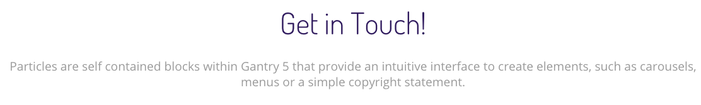
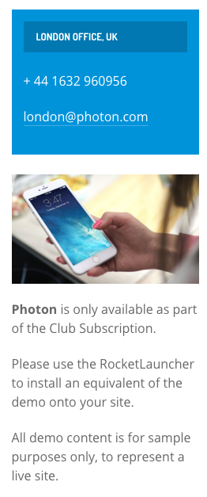
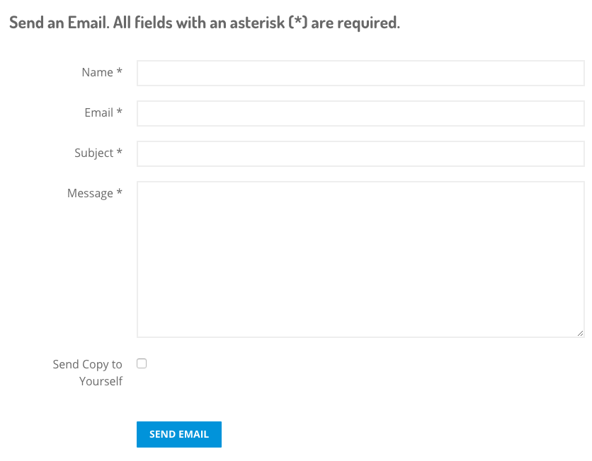
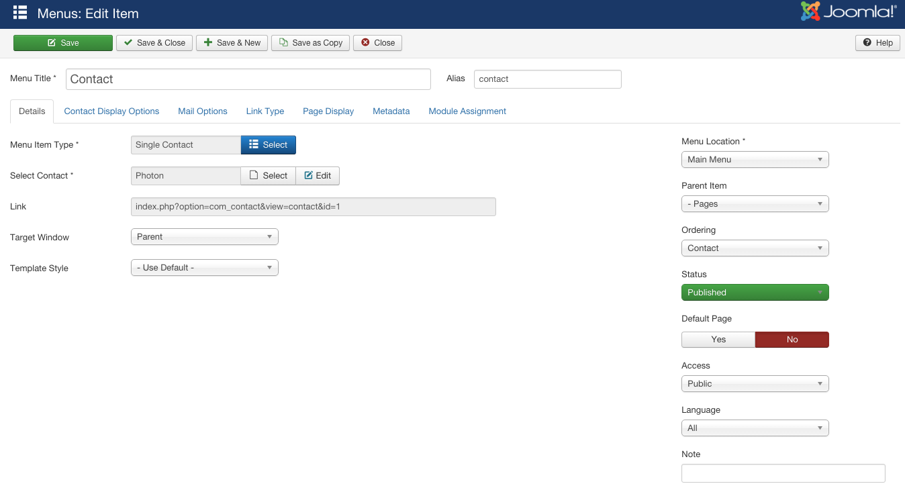

## Introduction

The **Contact** example page demonstrates how you can create a beautiful page with the Photon template. Here is some information to help you replicate this page as it appears in the demo.

## Modules and Particles

Below is a brief rundown of the modules and particles used to make up the demo page.

:   1. **Header** Info List (particle) [9%, 35%, se]
    2. **Aside** Custom HTML (particle) [30%, 73%, se]
    3. **Aside** Custom HTML (module) [45%, 73%, se]

* [Header](#header-section)
* [Aside](#aside-section)
* [Contact Form](#contact-form)

# Header Section

This area of the page is an **Info List** particle. You will find the settings used in our demo below.

## Section Settings

| Field          | Setting                   |
| :-----         | :-----                    |
| Layout         | Fullwidth (Boxed Content) |
| CSS Classes    | Blank                     |
| Tag Attributes | Blank                     |

## Particle Settings

| Option                   | Setting                              |
| :-----                   | :-----                               |
| Particle Name            | `Get in Touch!`                      |
| CSS Classes              | `g-layercontent` `noborder` `center` |
| Title                    | Blank                                |
| Intro                    | Blank                                |
| Grid Column              | 1 Column                             |
| Item 1 Name              | `Get in Touch!`                      |
| Item 1 Icon              | Blank                                |
| Item 1 Icon Location     | Left                                 |
| Item 1 Image             | Blank                                |
| Item 1 Image Location    | Left                                 |
| Item 1 Text Style        | Header                               |
| Item 1 Image Style       | Compact                              |
| Item 1 Description       | `Tell us about your project!`        |
| Item 1 Tag               | Blank                                |
| Item 1 Sub Tag           | Blank                                |
| Item 1 Label             | Blank                                |
| Item 1 Link              | Blank                                |
| Item 1 Button Icon       | Blank                                |
| Item 1 Read More Classes | Blank                                |
| Item 1 Target            | Self                                 |

## Block Settings

| Option         | Setting   |
| :-----         | :-----    |
| CSS ID         | Blank     |
| CSS Classes    | Blank     |
| Variations     | Blank     |
| Tag Attributes | Blank     |
| Fixed Size     | Unchecked |
| Block Size     | `100%`    |

# Aside Section

:	1. **Custom HTML (particle)** [5%, 10%, se]
	2. **Custom HTML (module)** [40%, 10%, se]

This area of the page is a **Custom HTML** particle and a **Custom HTML** module. The **Custom HTML** particle and the **Custom HTML** module were both assigned to the **aside-a** module position, placed in the **Aside** section. You will find the settings used in our demo below.

## Custom HTML (Particle)

### Section Settings

| Field          | Setting |
| :-----         | :-----  |
| Layout         | Boxed   |
| CSS Classes    | Blank   |
| Tag Attributes | Blank   |

### Section Block Settings

| Field          | Setting        |
| :-----         | :-----         |
| CSS ID         | Blank          |
| CSS Classes    | `equal-height` |
| Variations     | Blank          |
| Tag Attributes | Blank          |
| Fixed Size     | Unchecked      |
| Block Size     | `20%`          |

### Particle Settings

| Option             | Setting       |
| :-----             | :-----        |
| Particle Name      | `Custom HTML` |
| Process Twig       | Blank         |
| Process Shortcodes | Blank         |

**Custom HTML**

~~~ .html
<h2 class="g-title">London Office, UK </h2>

+ 44 1632 960956

<a href="mailto:london@photon.com" class="email">london@photon.com</a>
.

All demo content is for sample purposes only, to represent a live site.

~~~

### Block Settings

| Option         | Setting        |
| :-----         | :-----         |
| CSS ID         | Blank          |
| CSS Classes    | `equal-height` |
| Variations     | Blank          |
| Tag Attributes | Blank          |
| Fixed Size     | Unchecked      |
| Block Size     | `100%`         |

## Custom HTML (Module)

The **Custom HTML** module was assigned to the **aside-a** module position, placed in the **Aside** section. Here is the content body of the **Custom HTML** module.

~~~ .html

<strong>Photon</strong> is only available as part of the Club Subscription.

Please use the RocketLauncher to install an equivalent of the demo onto your site.

All demo content is for sample purposes only, to represent a live site.

~~~

# Contact Form

The contact form featured in the page is generated by Joomla. All you need to do to set this up is to create the page as a **Single Contact** menu item. You can see how this item is configured in the screen shot below. 

