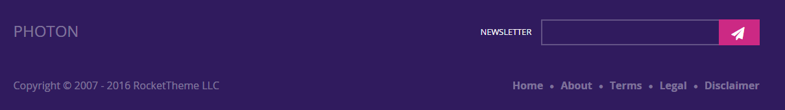
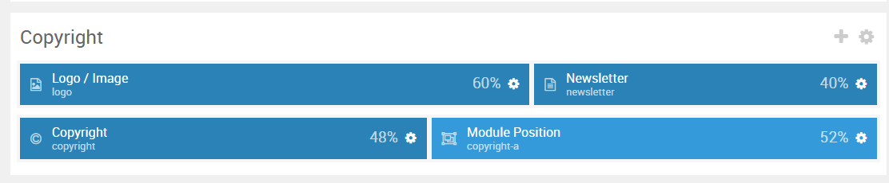
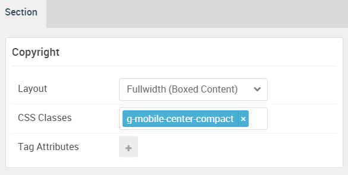

## Introduction

:	1. **Logo / Image (Particle)** [5%, 1%, se]
	2. **Newsletter (Particle)** [5%, 60%, se]
	3. **Copyright (Particle)** [65%, 1%, se]
	4. **Custom HTML (Particle)** [65%, 60%, se]

The **Copyright** section includes four particles: **Logo / Image**, **Newsletter**, **Copyright**, and a **Custom HTML** particle assigned to the **copyright-a** module position.

Here is a breakdown of the module(s) and particle(s) that appear in this section:

* [Logo / Image (particle)](#logo-image-(particle))
* [Newsletter (particle)](#copyright-(particle))
* [Copyright (particle)](#to-top-(particle))
* [Custom HTML (particle)](#custom-html-(particle))

## Section Settings

| Option           | Setting                   |
| :--------------- | :----------               |
| Layout           | Fullwidth (Boxed Content) |
| CSS Classes      | `g-mobile-center-compact` |
| Tag Attributes   | Blank                     |

## Logo Image (Particle)

### Particle Settings

| Option        | Setting         |
| :-----        | :-----          |
| Particle Name | `Logo / Image`  |
| URL           | Blank           |
| Image         | Blank           |
| Text          | `Photon`        |
| CSS Classes   | `g-footer-logo` |

### Block Settings

| Option         | Setting   |
| :-----         | :-----    |
| CSS ID         | Blank     |
| CSS Classes    | Blank     |
| Variations     | Blank     |
| Tag Attributes | Blank     |
| Fixed Size     | Unchecked |
| Block Size     | `60%`     |

## Copyright (Particle)

### Particle Settings

| Option         | Setting      |
| :-----         | :-----       |
| Particle Name  | `Newsletter` |
| CSS Classes    | Blank        |
| Width          | Full Width   |
| Layout         | Square       |
| Style          | Blank        |
| Title          | Blank        |
| Heading Text   | Blank        |
| Side Text      | `Newsletter` |
| InputBox Text  | Blank        |
| Button Icon    | `fa fa-send` |
| Button Text    | `Join`       |
| Feedburner URI | Blank        |
| Button Classes | Blank        |

### Block Settings

| Option         | Setting   |
| :-----         | :-----    |
| CSS ID         | Blank     |
| CSS Classes    | Blank     |
| Variations     | Blank     |
| Tag Attributes | Blank     |
| Fixed Size     | Unchecked |
| Block Size     | `40%`     |

## Copyright (Particle)

### Particle Settings

| Option          | Setting           |
| :-----          | :-----            |
| Particle Name   | `Copyright`       |
| Start Year      | `2007`            |
| End Year        | `now`             |
| Copyright Owner | `RocketTheme LLC` |

### Block Settings

| Option         | Setting       |
| :-----         | :-----        |
| CSS ID         | Blank         |
| CSS Classes    | `g-copyright` |
| Variations     | Blank         |
| Tag Attributes | Blank         |
| Fixed Size     | Unchecked     |
| Block Size     | `48%`         |

## Custom HTML (Particle)

The **Custom HTML** particle is a **Gantry 5 Particle** module placed within the **extension-a** module position. Adding a particle to a module position can be done by creating a **Gantry 5 Particle** module, adding the particle using the settings found in the section below, and assigning it to the position.

### Module Position Particle Settings

#### Particle Settings

| Option        | Setting          |
| :-----        | :-----           |
| Particle Name | `FP Extension A` |
| Key           | `copyright-a`    |
| Chrome        | `gantry`         |

#### Block Settings

| Option         | Setting                        |
| :-----         | :-----                         |
| CSS ID         | Blank                          |
| CSS Classes    | `nomarginleft` `nopaddingleft` |
| Variations     | Blank                          |
| Tag Attributes | Blank                          |
| Fixed Size     | Unchecked                      |
| Block Size     | `52%`                          |

### Custom HTML Particle Settings

#### Particle Settings

| Option             | Setting       |
| :-----             | :-----        |
| Particle Name      | `Custom HTML` |
| Process Twig       | Unchecked     |
| Process Shortcodes | Unchecked     |

**Custom HTML**

~~~ .html

<ul class="nomarginall g-bottom-menu align-right">
<li><a href="index.php">Home</a> </li>
<li><a href="#"><i class="fa fa-circle"></i> About</a></li>
<li><a href="#"><i class="fa fa-circle"></i> Terms</a></li>
<li><a href="#"><i class="fa fa-circle"></i> Legal</a></li>
<li><a href="#"><i class="fa fa-circle"></i> Disclaimer</a></li>
</ul>

~~~