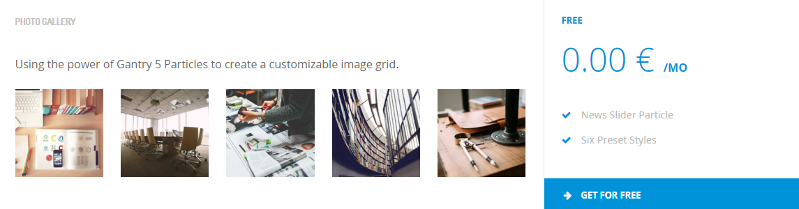
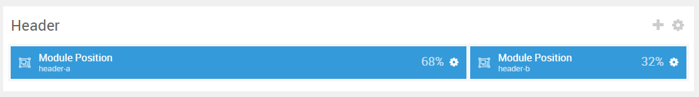
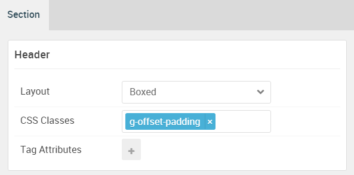

## Introduction

The **Header** section includes two particles assigned to the **header-a** and **header-b** module positions.

Here is a breakdown of the module(s) and particle(s) that appear in this section:

* [Image Grid (particle)](#image-grid-(particle))
* [Pricing Table (particle)](#pricing-grid-(particle))

## Section Settings

| Option           | Setting            |
| :--------------- | :----------        |
| Layout           | Boxed              |
| CSS Classes      | `g-offset-padding` |
| Tag Attributes   | Blank              |

## Image Grid (Particle) 1

The **Image Grid** particle is a **Gantry 5 Particle** module placed within the **header-a** module position. Adding a particle to a module position can be done by creating a **Gantry 5 Particle** module, adding the particle using the settings found in the section below, and assigning it to the position.

### Module Position Particle Settings

#### Particle Settings

| Option        | Setting       |
| :-----        | :-----        |
| Particle Name | `FP Header A` |
| Key           | `header-a`    |
| Chrome        | `gantry`      |

#### Block Settings

| Option         | Setting   |
| :-----         | :-----    |
| CSS ID         | Blank     |
| CSS Classes    | Blank     |
| Variations     | Blank     |
| Tag Attributes | Blank     |
| Fixed Size     | Unchecked |
| Block Size     | `68%`     |

### Image Grid Particle Settings

#### Particle Settings

| Option             | Setting                                                                      |
| :-----             | :-----                                                                       |
| Particle Name      | `Image Grid`                                                                 |
| CSS Classes        | Blank                                                                        |
| Title              | `Photo Gallery`                                                              |
| Description        | `Using the power of Gantry 5 Particles to create a customizable image grid.` |
| Grid Columns       | 5 Columns                                                                    |
| Album Name         | Blank                                                                        |
| Item 1 Name        | `New Item`                                                                   |
| Item 1 Promo Image | Custom                                                                       |
| Item 1 Caption     | Blank                                                                        |

## Pricing Table (Particle)

The **Pricing Table** particle is a **Gantry 5 Particle** module placed within the **header-b** module position. Adding a particle to a module position can be done by creating a **Gantry 5 Particle** module, adding the particle using the settings found in the section below, and assigning it to the position.

### Module Position Particle Settings

#### Particle Settings

| Option        | Setting       |
| :-----        | :-----        |
| Particle Name | `FP Header B` |
| Key           | `header-b`    |
| Chrome        | `gantry`      |

#### Block Settings

| Option         | Setting                  |
| :-----         | :-----                   |
| CSS ID         | Blank                    |
| CSS Classes    | Blank                    |
| Variations     | `No Margin` `No Padding` |
| Tag Attributes | Blank                    |
| Fixed Size     | Unchecked                |
| Block Size     | `32%`                    |

### Pricing Table Particle Settings

#### Particle Settings

| Option                 | Setting                |
| :-----                 | :-----                 |
| Particle Name          | `Pricing Table`        |
| CSS Classes            | Blank                  |
| Title                  | Blank                  |
| Header Text            | Blank                  |
| Footer Text            | Blank                  |
| Grid Column            | 1 Column               |
| Item 1 Name            | `Free`                 |
| Item 1 Accent Color    | Accent Color 1         |
| Item 1 Custom Color    | Blank                  |
| Item 1 CSS Classes     | Blank                  |
| Item 1 Ribbon Text     | Blank                  |
| Item 1 Icon            | Blank                  |
| Item 1 Price           | `0.00 €`               |
| Item 1 Period          | `/mo`                  |
| Item 1 Description     | Blank                  |
| Item 1 Button Label    | `Get For Free`         |
| Item 1 Button Link     | `#`                    |
| Item 1 Button Classes  | Blank                  |
| Subitem 1 Name         | `News Slider Particle` |
| Subitem 1 Text         | `News Slider Particle` |
| Subitem 1 Item Classes | Blank                  |