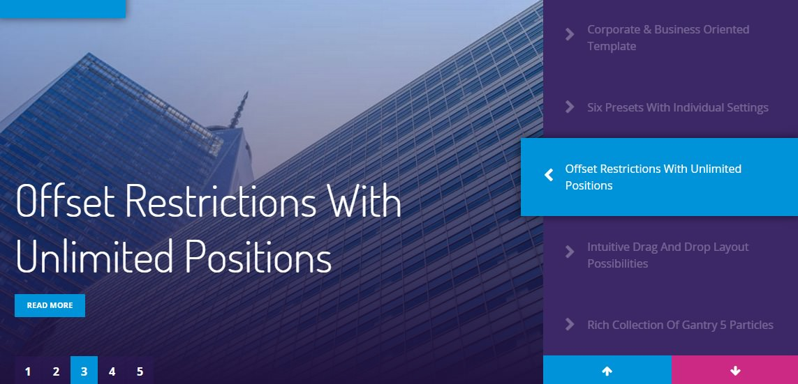
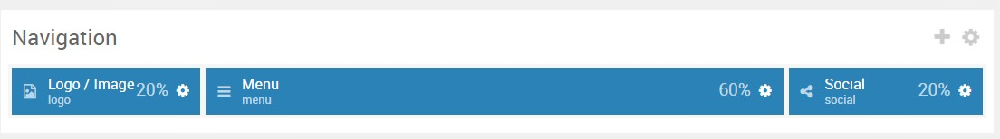
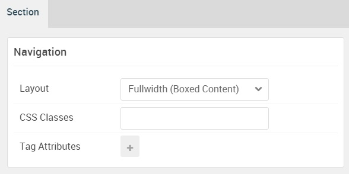

## Introduction

:   1. **OffSidebar Toggle (Particle)** [10%, 2%, se]
    2. **Logo (Particle)** [10%, 40%, se]
    3. **Social (Particle)** [10%, 88%, se]

The **Navigation** section includes three particles, **OffSidebar Toggle**, **Logo**, and **Social**.

Here is a breakdown of the module(s) and particle(s) that appear in this section:

* [OffSidebar Toggle (particle)](#offsidebar-toggle-(particle))
* [Logo (Particle)](#logo-(particle))
* [Social (Particle)](#social-(particle))

## Section Settings

| Option           | Setting                   |
| :--------------- | :----------               |
| Layout           | Fullwidth (Boxed Content) |
| CSS Classes      | Blank                     |
| Tag Attributes   | Blank                     |

## OffSidebar Toggle (Particle)

### Particle Settings

| Option      | Setting            |
| :-----      | :-----             |
| CSS Classes | Blank              |
| Toggle Icon | `fa fa-bars fa-fw` |
| Type        | Slide Down         |

### Block Settings

| Option         | Setting        |
| :-----         | :-----         |
| CSS ID         | Blank          |
| CSS Classes    | `hidden-phone` |
| Variations     | Blank          |
| Tag Attributes | Blank          |
| Fixed Size     | Unchecked      |
| Block Size     | `20%`          |

## Logo (Particle)

### Particle Settings

| Option      | Setting   |
| :-----      | :-----    |
| URL         | Blank     |
| Image       | Blank     |
| Text        | `Photon` |
| CSS Classes | `g-logo`  |

### Block Settings

| Option         | Setting   |
| :-----         | :-----    |
| CSS ID         | Blank     |
| CSS Classes    | `center`  |
| Variations     | Blank     |
| Tag Attributes | Blank     |
| Fixed Size     | Unchecked |
| Block Size     | `60%`     |

## Social (Particle)

### Particle Settings

| Option      | Setting                               |
| :-----      | :-----                                |
| CSS Classes | `align-right`                         |
| Title       | Blank                                 |
| Target      | New Window                            |
| Item 1 Name | `Facebook`                            |
| Item 1 Icon | `fa fa-facebook fa-fw`                |
| Item 1 Text | Blank                                 |
| Item 1 Link | `http://www.facebook.com/RocketTheme` |

### Block Settings

| Option         | Setting        |
| :-----         | :-----         |
| CSS ID         | Blank          |
| CSS Classes    | `hidden-phone` |
| Variations     | Blank          |
| Tag Attributes | Blank          |
| Fixed Size     | Unchecked      |
| Block Size     | `20%`          |